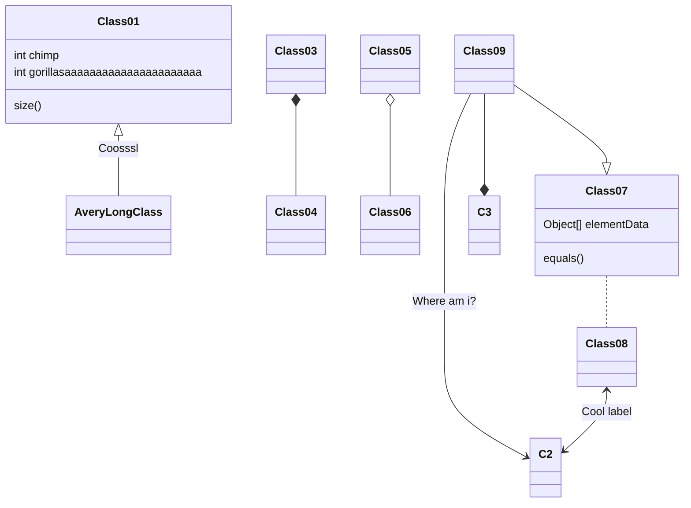
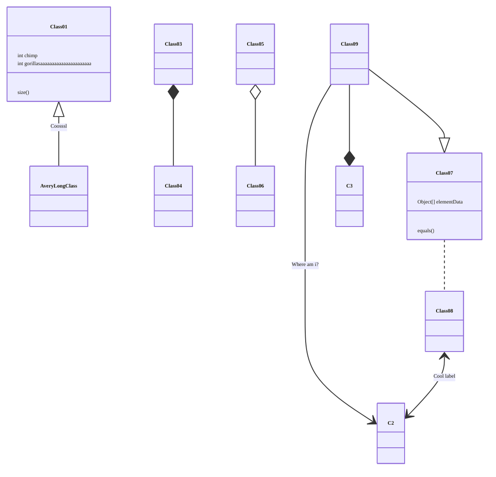
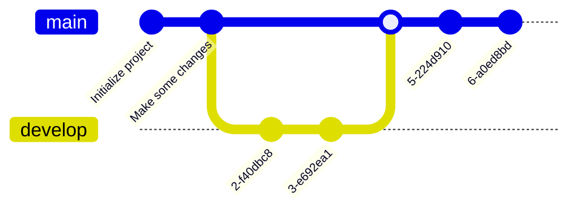

+++

title = "Basi di Linux, parte prima"
description = "Corso Linux Base @SCM Group"
outputs = ["Reveal"]
aliases = [
    "/guide/"
]

+++

# BASI DI LINUX, PARTE PRIMA

## [Danilo Pianini](mailto:danilo.pianini@unibo.it)

### Compiled {}

---

## Il sistema operativo

Strato software che si occupa di gestire l'hardware,
la memoria, e i permessi,
permettendo l'esecuzione concorrente di più programmi.


Tanenbaum, Modern Operating Systems 3 e, (c) 2008 Prentice-Hall, Inc. All rights reserved. 0-13-6006639

---

## Il sistema operativo come mezzo di astrazione

Il sistema operativo nasconde i dettagli di basso livello
dell'hardware, fornendo un'interfaccia più semplice


Tanenbaum, Modern Operating Systems 3 e, (c) 2008 Prentice-Hall, Inc. All rights reserved. 0-13-6006639

---

## Kernel space e user space

I sistemi operativi moderni consentono due macro-livelli di esecuzione:
* in **kernel mode**, il software ha accesso diretto all'hardware e a tutte le risorse del sistema
* in **user mode**, il software ha accesso limitato, e deve passare per delle apposite chiamate (system call) per accedere alle risorse

Sistemi operativi diversi possono fare scelte diverse su cosa fa parte del kernel e cosa no.

* Nei sistemi a *microkernel*, il kernel contiene solo le funzionalità essenziali (scheduling, gestione memoria, comunicazione intra-processo), mentre tutto il resto (inclusi i device driver) eseguono in user mode.
  * Alta sicurezza (un errore in un driver non compromette il sistema).
* Nei sistemi *monolitici*, anche servizi accessori come i driver, il file system, e la rete eseguono in kernel mode
  * Maggiore efficienza (meno overhead per le system call).
  * Più difficile da mantenere e debuggare.
* Nei sistemi *ibridi*, solo alcuni servizi accessori eseguono in kernel mode (ad esempio solo i device driver, ma non la gestione della rete).

---

## Famiglie di sistemi operativi


---

## UNIX, POSIX, Linux, GNU, distribuzioni

**UNIX** (da UNICS, "**Un**iplexed **I**nformation **C**omputing **S**ystem") è un *sistema operativo* sviluppato negli anni '70 da AT&T.

**POSIX** (**P**ortable **O**perating **S**ystem **I**nterface)
è uno *standard* che definisce l'interfaccia di programmazione per sistemi operativi UNIX-like.
Sistemi operativi che rispettano POSIX sono detti *POSIX-compliant*
(ad esempio, Mac OS è POSIX-Compliant a partire dalla versione 10.5).

**Linux** <i class="fa-brands fa-linux"></i> è un *kernel* (non un sistema operativo completo) sviluppato da Linus Torvalds nel 1991.

**GNU/Linux** è l'insieme del kernel Linux e degli strumenti GNU (compilatore C, librerie, utility binarie, eccetera),
che *insieme costituiscono un sistema operativo*. Sebbene non certificato POSIX, aderisce in larga parte allo standard.

Una **Distribuzione Linux** (
<i class="fa-brands fa-ubuntu"></i>, 
<i class="fa-brands fa-debian"></i>,
<i class="fa-brands fa-suse"></i>,
<i class="fa-brands fa-redhat"></i>,
<i class="fa-brands fa-centos"></i>,
<i class="fa-brands fa-fedora"></i>,
Arch,
Gentoo...
) è l'insieme di Linux, di strumenti di contorno (solitamente GNU o BusyBox), e di software aggiuntivo (gestore di pacchetti, ambiente desktop, eccetera) che viene distribuito come un'unità.

---

## Filosofia UNIX

* *"everything is a file" (or a process)*
* il *file system* è un albero
* il sistema è fatto da tanti piccoli programmi che fanno *una cosa* sola, *bene*
* i programmi possono essere combinati mettendo l'output di uno come input di un altro (piping)
* un *linguaggio di scripting* permette di combinare i programmi in workflow complessi o di comandare il sistema interattivamente tramite una *shell*

---

## Permessi UNIX

Le *risorse* (file e processi) sono associate a un *utente* e a un *gruppo*.

Sia utenti che gruppi sono identificati da un nome alfanumerico e da un identificativo numerico.

Gli accessi a *file* UNIX sono quindi regolati da tre tipi di permessi: **lettura**, **scrittura**, ed **esecuzione**.
Ciascuno di questi è associato a tre entità: *il proprietario* del file, *il gruppo proprietario*, e *tutti gli altri utenti*.

Esiste un utente detto **root** che ha accesso *totale* al sistema.

---

## Il file system UNIX

A differenza di <i class="fa-brands fa-windows"></i>,
UNIX non associa delle "lettere di unità" alle partizioni.

Il file system UNIX è *un unico albero*, con radice `/`,
vedremo poi in che modo possono essere gestiti più dispositivi senza costruire nuove radici.

I percorsi dei file sono separati da `/` (a differenza di <i class="fa-brands fa-windows"></i>, che usa `\`).

I percorsi dei file possono essere *assoluti* (partono da `/`) o *relativi* (partono dalla directory corrente).
Ad esempio, `/home/user/documents/file.txt` è un percorso assoluto, mentre `documents/file.txt` è un percorso relativo.

Nei percorsi UNIX, `.` rappresenta la directory corrente, e `..` rappresenta la directory padre.

I file il cui nome comincia con `.` sono considerati *nascosti*.

Il file system UNIX è *tipicamente case-sensitive*: `file.txt`, `File.txt`, e `FILE.TXT` sono tre file diversi
(mentre su <i class="fa-brands fa-windows"></i> sarebbero considerati lo stesso file).
Si noti che esistono eccezioni:
per ragioni di compatibilità, il file system di
<i class="fa-brands fa-apple"></i>
è case-insensitive di default.


---

## Il terminale

Programma che permette di interagire con il S.O. mediante comandi impartiti in modalità testuale, usate:
* per **automatizzare** le operazioni
* per **velocizzare** le operazioni (scrivere un comando è spesso molto più veloce di andare a fare click col mouse in giro per lo schermo)
* per fare operazioni complesse con pochi semplici comandi
* non tutti i software sono dotati di interfaccia grafica
* alcune opzioni di configurazione del sistema operativo restano accessibili solo via linea di comando
  *  (anche su <i class="fa-brands fa-windows"></i>: ad esempio i comandi per associare le estensioni ad un eseguibile)

---

## <i class="fa-brands fa-linux"></i><i class="fa-brands fa-apple"></i> Sistemi *nix (Linux, MacOS X, FreeBSD, Minix...)

### Nei sistemi UNIX-like esistono vari tipi di interpreti, chiamati shell
Alcuni esempi
* Bourne shell (sh)
  * Prima shell sviluppata per UNIX (1977)
* C-Shell (csh)
  * Sviluppata da Bill Joy per BSD
* Bourne Again Shell (bash)
  * Parte del progetto GNU, è un super set di Bourne shell
* ZSH, Fish, e altri terminali di ultima generazione
  * Altamente personalizzabili
  * Molto flessibili
  * Autocompletamento avanzato e contestualità
  * ZSH è default su <i class="fa-brands fa-apple"></i>, seppur con configurazione minimale
  * La shell che vedrete sul sistema del docente è ZSH con configurazione personalizzata

Panoramica delle differenze: http://www.faqs.org/faqs/unix-faq/shell/shell-differences/

---

## <i class="fa-brands fa-windows"></i> Sistemi Windows

L'interprete comandi storico è rappresentato dal programma `cmd.exe` (`C:\Windows\System32\cmd.exe`)
* Eredita sintassi e funzionalità della maggior parte dei comandi del vecchio MSDOS

Versioni recenti hanno introdotto **PowerShell**, basato su .NET e C#

Da Windows 10 è possibile installare Linux dentro Windows usando **Windows Subsystem for Linux (WSL2)**
* Può essere un modo ragionevole di avere shell Unix in ambiente Windows

---

## Manipolazione di base del file system

### Directory corrente: `pwd`

All'apertura, e in qualunque momento, il terminale si trova in una *directory* (cartella) del file system.

Normalmente, alla sua apertura, si trova nella *home directory* dell'utente.

Possiamo sempre sapere in che directory ci troviamo con il comando `pwd` (print working directory).

```console
$ pwd                                                  
/home/danysk/LocalProjects
```

---

## Manipolazione di base del file system

### Elencare il contenuto della directory corrente: `ls`

Il comando `ls` (list) permette di elencare il contenuto della directory corrente.

```console
$ ls
LICENSE     assets  config.toml  layouts        resources  shared-slides  themes
archetypes  build   content      renovate.json  scm.md     static
```

Di default, *omette i file nascosti*, che possono essere visualizzati con l'opzione `-a` (all).

```console
$ ls -a
.        .gitignore        LICENSE     config.toml    resources      themes
..       .gitmodules       archetypes  content        scm.md
.git     .hugo_build.lock  assets      layouts        shared-slides
.github  .mergify.yml      build       renovate.json  static
```

Notate che appaiono anche le directory `.` e `..` che rappresentano rispettivamente la directory corrente e la directory padre.

---

## Manipolazione di base del file system

### Visione dettagliata: opzione `-l` di `ls`

L'opzione `-l` di `ls` mostra anche permessi, dimensione e data di ultima modifica di ogni elemento.

```console
$ ls -l
total 60
-rw-r--r--  1 danysk danysk 11344 Aug  5 11:19 LICENSE
drwxr-xr-x  2 danysk danysk  4096 Aug  5 11:19 archetypes
drwxr-xr-x  2 danysk danysk  4096 Aug  5 11:19 assets
drwxr-xr-x  8 danysk danysk  4096 Aug  5 11:58 build
-rw-r--r--  1 danysk danysk  1842 Aug  5 11:27 config.toml
drwxr-xr-x  3 danysk danysk  4096 Aug  5 11:58 content
drwxr-xr-x  4 danysk danysk  4096 Aug  5 11:19 layouts
-rw-r--r--  1 danysk danysk   124 Aug  5 11:19 renovate.json
drwxr-xr-x  3 danysk danysk  4096 Aug  5 11:45 resources
-rw-------  1 danysk danysk  2807 Aug  5 11:33 scm.md
drwxr-xr-x 10 danysk danysk  4096 Aug  5 11:26 shared-slides
drwxr-xr-x  2 danysk danysk  4096 Aug  5 11:19 static
drwxr-xr-x  3 danysk danysk  4096 Aug  5 11:19 themes
```

---

## Manipolazione di base del file system

### Capire i permessi

I permessi sono rappresentati da 10 caratteri, divisi in 4 gruppi:
* il *primo* carattere indica il *tipo* di file (`d`: directory, `-`: file, `l`: link simbolico)
* i successivi *tre gruppi* di *tre caratteri* indicano i permessi per, rispettivamente, il proprietario, il gruppo, e tutti gli altri utenti

{}{}

{}{}
Esempi:
* `drwxr-xr-x` directory scrivibile da owner e visibile a tutti
* `-rw-------` file accessibile e modificabile solo da owner
* `-rwxr-xr-x` file eseguibile da tutti, modificabile da owner
* `-rwxrwxrwx` file eseguibile e modificabile da tutti
{}{}

I permessi sono anche detti *ottali*,
perché possono essere rappresentati come un numero in base 8
(cifre da zero a 7)
ottenuto concatenando i permessi dei tre gruppi.

---

## Manipolazione di base del file system

### Formato ottale dei permessi

{}{}


Esempi:
* `rw-------` $\Rightarrow$ `600`
* `rwxr-xr-x` $\Rightarrow$ `755`
* `rwxrwxrwx` $\Rightarrow$ `777`
* `rw-r--r--` $\Rightarrow$ `644`
* `rw-rw-rw-` $\Rightarrow$ `666`
{}{}

| Permesso    | Valore ottale | Valore binario |
|-------------|---------------|----------------|
| `---`       | 0             | 000            |
| `--x`       | 1             | 001            |
| `-w-`       | 2             | 010            |
| `-wx`       | 3             | 011            |
| `r--`       | 4             | 100            |
| `r-x`       | 5             | 101            |
| `rw-`       | 6             | 110            |
| `rwx`       | 7             | 111            |

{}{}

---

## Manipolazione di base del file system

### Dimensioni più comprensibili: opzione `-h` di `ls`

L'opzione `-h` di `ls` mostra la dimensione in formato "human-readable",
e funziona solo assieme a `-l`.

```console
$ ls -lh
total 60K
-rw-r--r--  1 danysk danysk  12K Aug  5 11:19 LICENSE
drwxr-xr-x  2 danysk danysk 4,0K Aug  5 11:19 archetypes
drwxr-xr-x  2 danysk danysk 4,0K Aug  5 11:19 assets
drwxr-xr-x  8 danysk danysk 4,0K Aug  5 11:58 build
-rw-r--r--  1 danysk danysk 1,8K Aug  5 11:27 config.toml
drwxr-xr-x  3 danysk danysk 4,0K Aug  5 11:58 content
drwxr-xr-x  4 danysk danysk 4,0K Aug  5 11:19 layouts
-rw-r--r--  1 danysk danysk  124 Aug  5 11:19 renovate.json
drwxr-xr-x  3 danysk danysk 4,0K Aug  5 11:45 resources
-rw-------  1 danysk danysk 2,8K Aug  5 11:33 scm.md
drwxr-xr-x 10 danysk danysk 4,0K Aug  5 11:26 shared-slides
drwxr-xr-x  2 danysk danysk 4,0K Aug  5 11:19 static
drwxr-xr-x  3 danysk danysk 4,0K Aug  5 11:19 themes
```

---

## Manipolazione di base del file system

### Dettagli completi: `ls -ahl`

le tre opzioni `a`, `l`, ed `h` possono (e solitamente sono) utilizzate all'unisono.

```console
$ ls -alh
total 88K
drwxr-xr-x  13 danysk danysk 4,0K Aug  5 12:05 .
drwxr-xr-x 108 danysk danysk 4,0K Aug  5 11:19 ..
drwxr-xr-x   9 danysk danysk 4,0K Aug  6 11:57 .git
drwxr-xr-x   3 danysk danysk 4,0K Aug  5 11:19 .github
-rw-r--r--   1 danysk danysk   65 Aug  5 11:19 .gitignore
-rw-r--r--   1 danysk danysk  217 Aug  5 11:19 .gitmodules
-rw-r--r--   1 danysk danysk    0 Aug  5 11:45 .hugo_build.lock
-rw-r--r--   1 danysk danysk   24 Aug  5 11:19 .mergify.yml
-rw-r--r--   1 danysk danysk  12K Aug  5 11:19 LICENSE
drwxr-xr-x   2 danysk danysk 4,0K Aug  5 11:19 archetypes
drwxr-xr-x   2 danysk danysk 4,0K Aug  5 11:19 assets
drwxr-xr-x   8 danysk danysk 4,0K Aug  5 11:58 build
-rw-r--r--   1 danysk danysk 1,8K Aug  5 11:27 config.toml
drwxr-xr-x   3 danysk danysk 4,0K Aug  5 11:58 content
drwxr-xr-x   4 danysk danysk 4,0K Aug  5 11:19 layouts
-rw-r--r--   1 danysk danysk  124 Aug  5 11:19 renovate.json
drwxr-xr-x   3 danysk danysk 4,0K Aug  5 11:45 resources
-rw-------   1 danysk danysk 2,8K Aug  5 11:33 scm.md
drwxr-xr-x  10 danysk danysk 4,0K Aug  5 11:26 shared-slides
drwxr-xr-x   2 danysk danysk 4,0K Aug  5 11:19 static
drwxr-xr-x   3 danysk danysk 4,0K Aug  5 11:19 themes
```

---

## Manipolazione di base del file system

### modifica della working directory: `cd`

È possibile spostarsi da una directory all'altra con il comando `cd` (change directory),
che prende un solo argomento: il percorso della directory di destinazione,
relativo o assoluto.
Se non viene specificato un percorso, `cd` porta alla home directory dell'utente corrente
(directory identificata anche dal simbolo speciale `~`).

```console
$ pwd
/home/danysk/LocalProjects
$ cd myFolder
$ pwd
/home/danysk/LocalProjects/myFolder
```

Dato che `..` è la directory padre,
è possibile tornare alla directory precedente con `cd ..`

```console
$ pwd
/home/danysk/LocalProjects/myFolder
$ cd ..
$ pwd
/home/danysk/LocalProjects
```

---

## Manipolazione di base del file system

### Aggiornamento della data di ultima modifica: `touch`

Il comando `touch` permette di aggiornare la data di ultima modifica di un file al momento corrente.

```console
$ ls -l
-rw-r--r--  1 danysk danysk  12K Aug  5 11:19 LICENSE
$ date
2024-08-06T14:25:21 CEST
$ touch LICENSE
$ ls -l
-rw-r--r--  1 danysk danysk  12K Aug  6 14:25 LICENSE
```

L'utilizzo più comune di `touch`, però, è la creazione di un file vuoto: è sufficiente "toccare" un file che non esiste.

```console
$ ls -alh
total 8,0K
drwxr-xr-x  2 danysk danysk 4,0K Aug  6 14:29 .
drwxr-xr-x 14 danysk danysk 4,0K Aug  6 14:28 ..
$ touch mynewfile
$ ls -alh
total 8,0K
drwxr-xr-x  2 danysk danysk 4,0K Aug  6 14:29 .
drwxr-xr-x 14 danysk danysk 4,0K Aug  6 14:28 ..
-rw-r--r--  1 danysk danysk    0 Aug  6 14:29 mynewfile
```

---

## Manipolazione di base del file system

### Costruzione di nuove directory: `mkdir`

Il comando `mkdir` (make directory) permette di creare una nuova directory.
Prende in ingresso un solo argomento: il percorso della directory da creare.

Il comando è in grado di creare anche directory annidate, se viene specificata l'opzione `-p`.

```console
$ ls -alh
total 8,0K
drwxr-xr-x  2 danysk danysk 4,0K Aug  6 14:30 .
drwxr-xr-x 14 danysk danysk 4,0K Aug  6 14:28 ..
$ mkdir ciao
$ mkdir -p pippo/pluto/paperino
$ ls -alh
total 16K
drwxr-xr-x  4 danysk danysk 4,0K Aug  6 14:32 .
drwxr-xr-x 14 danysk danysk 4,0K Aug  6 14:28 ..
drwxr-xr-x  2 danysk danysk 4,0K Aug  6 14:32 ciao
drwxr-xr-x  3 danysk danysk 4,0K Aug  6 14:32 pippo
```

---

## Manipolazione di base del file system

### Copia di file e directory: `cp`

Il comando `cp` (copy) permette di copiare file e directory.
Prende due argomenti: il percorso del file o della directory da copiare, e il percorso di destinazione.
Nel caso in cui si voglia copiare una directory, è necessario specificare l'opzione `-r` (recursive).

### Rimozione di file e directory: `rm`

Il comando `rm` (remove) permette di rimuovere file e directory.
Prende un numero arbitrario di argomenti, e li rimuove.
Per rimuovere una directory ed i suoi contenuti, è necessario specificare l'opzione `-r` (recursive).


### Rinominare (spostare) file e directory: `mv`

Il comando `mv` (move) permette di rinominare file e directory
(equivalente a spostarli in un'altra posizione).
Prende due argomenti: il percorso del file o della directory da rinominare, e il percorso di destinazione.

---

## Wildcards

Le *wildcards* sono caratteri speciali che permettono di specificare insiemi di file o directory, indicando che al loro posto può essere sostituito un qualunque carattere.

* `?` -- un singolo carattere, escluso `/`
* `*` -- una sequenza di zero o più caratteri, escluso `/`
* `**` -- **non standard**: dipendentemente dalla shell,
potrebbe essere disattivata (è il caso di `bash` ed `sh`),
e quindi equivalente a `*`
(perché una sequenza di zero o più caratteri seguita da una sequenza di zero o più caratteri è essa stessa una sequenza di zero o più caratteri),
oppure indicare che nella sequenza è incluso il carattere `/`,
ossia che la ricerca avviene ricorsivamente (è il caso di `zsh`).

---

## Strumenti di base del terminale

### Pulizia dello schermo: `clear`

Il comando `clear` permette di pulire il terminale, spostando in alto la schermata.

### Storia dei comandi: `history` e ricerca: <kbd>Ctrl</kbd><kbd>R</kbd>

Le shell UNIX mantengono una storia dei comandi eseguiti.
Consultare la storia è molto utile,
consente di richiamare velocemente comandi eseguiti in precedenza.
Ciascuna shell salva la storia per ogni utente su un file nascosto nella home directory (`.bash_history` per `bash`, `.zhistory` per `zsh`).

Indipendentemente da quale file la contiene,
la storia può essere visualizzata con il comando `history`.

Inoltre, è possibile cercare rapidamente nella storia con <kbd>Ctrl</kbd><kbd>R</kbd> (reverse search). Gli ultimi comandi possono essere scorsi con <kbd><i class="fa-solid fa-arrow-up"></i></kbd> (previous) e <kbd><i class="fa-solid fa-arrow-down"></i></kbd> (next).

---

## Standard input, output, ed error

I programmi UNIX comunicano con l'ambiente esterno attraverso tre canali standard,
di cui uno in input e due in output:
* **standard input** (`stdin`), per comandi lanciati da terminale, di default è l'input che viene dato da tastiera al terminale dopo il lancio del programma
* **standard output** (`stdout`), per comandi lanciati da terminale, di default è il testo che appare sul terminale stesso
* **standard error** (`stderr`), usato per i messaggi di errore; di default configurato come standard errror (stampa a terminale)

### Teletypewriter: il terminale come file

In realtà, i tre canali sono *file*:
poiché il terminale stesso è modellato come *device file*
(d'altronde, in UNIX, tutto è un file o un processo).
Il file che rappresenta il terminale può essere recuperato col comando `tty` (teletype),
e su <i class="fa-brands fa-linux"></i> è tipicamente `/dev/pts/N` (con `N` numero intero positivo che rappresenta l'identificativo del terminale).

Di default, `stdin`, `stdout` e `stderr` sono associati al device file del terminale che li ha lanciati.

---

## Standard input, output, ed error

### Redirezione base

Attraverso la *redirezione* è possibile far puntare i canali a file diversi da quello originale:

* `>` redirige `stdout` verso l'inizio di un file (ossia, lo sovrascrive)
* `>>` redirige `stdout` verso la fine di un file (ossia, aggiunge elementi in coda)
* `<` redirige `stdin` da un file

### Redirezione di stream specifici

Abbiamo visto che `>` e `>>` redirigono `stdout`,
ma come possiamo redirigere `stderr`?

In realtà, l'operatore di redirezione `>` è un'abbreviazione per `1>`: la redirezione comincia con il numero del file descriptor dello stream da ridirezionare.
Ognuno degli stream standard ha un file descriptor associato:
* `0` per `stdin`
* `1` per `stdout`
* `2` per `stderr`

Dunque `0<` equivale a `<`, `1>` equivale a `>`, e `2>` redirige `stderr`.

Se si volesse che un comando salvasse i messaggi di errore su error.log, e i messaggi di output su output.log, si potrebbe fare così:

```console
my_command > output.log 2> error.log
```

---

## Standard input, output, ed error

### Redirezione unione

L'operatore `>&` permette di unire assieme due canali di output,
redirezionandone uno su un altro.


È possibile, ad esempio, redirigere `stderr` verso `stdout` con `2>&1`,
ad esempio perché si vuole che entrambi appaiano in un solo file di log:

```console
my_command > output.log 2>&1
```

diversamente, lo stream di errore resterebbe agganciato al device file del terminale!

### Piping

L'operatore `|` permette di concatenare due comandi, facendo sì che l'output di uno diventi l'input dell'altro.

Scrivendo, ad esempio, `ls | my_command`, l'output di `ls` diventa l'input di `my_command`, come se l'avessimo avviato ed avessimo messo in input la stringa prodotta da `ls`.

*Nota*: `|` collega input e output, non passa degli argomenti!

---

## Interazione con la shell

### Stampa di un messaggio: `echo`

Il comando `echo` permette di stampare un messaggio a schermo.
Prende un numero arbitrario di argomenti, e li stampa separati da uno spazio.

Il comando è molto utile per inizializzare file con un certo contenuto, oppure per aggiungere un messaggio a un file di log.


### Concatenazione di file: `cat`

Il comando `cat` (concatenate) permette di concatenare file.
Prende un numero arbitrario di argomenti, e li restituisce concatenati in uscita.

Il comando è molto utile per visualizzare il contenuto di un file.

```console
$ echo "Hello, world!" > hello.txt
$ cat hello.txt
Hello, world!
$ echo "Hello, world! 2" >> hello.txt
$ cat hello.txt
Hello, world!
Hello, world! 2
```

---

## Interazione con la shell

### Paginazione di un file: `less`

Il comando `less` permette di visualizzare un file a schermo, paginato, ossia,
mostrando una pagina alla volta e permettendo di scorrere avanti e indietro.

Si esce dalla modalità di visualizzazione premendo <kbd>Q</kbd>.

### Intestazione di un file: `head`

Il comando `head` permette di visualizzare le prime 10 righe di un file.

Il comportamento può essere modificato con l'opzione `-n`, che permette di specificare il numero di righe da visualizzare.

### Coda di un file: `tail`

Il comando `tail` permette di visualizzare le ultime 10 righe di un file.

Anche in questo caso, il comportamento può essere modificato con l'opzione `-n`.

Inoltre, `tail` permette di "seguire" un file,
ossia di visualizzare le righe che vengono aggiunte in tempo reale.
La modalità "fetch" di `tail` è attivata con l'opzione `-f`.

---

## Analisi e ricerca nel file system

### Dimensione di una directory: `du`

Il comando `du` (disk usage) permette di calcolare la dimensione di una directory e dei suoi contenuti.

Prende un numero arbitrario di argomenti, e restituisce la dimensione di ciascuno di essi.

L'opzione `-h` permette di visualizzare la dimensione in formato "human-readable".

### Ricerca di file e directory: `find`

Il comando `find` permette di cercare file nel file system.

Prende un numero arbitrario di argomenti, e restituisce i file che soddisfano i criteri di ricerca specificati.

L'opzione `-name` permette di cercare file per nome.

L'opzione `-type` permette di cercare file per tipo.

#### Esempi

```console
$ find /home/utente -type f -name "documento.txt" # Cerca un file col nome esatto "documento.txt"
$ find /home/utente -type d -name "progetti" # Cerca una directory col nome esatto "progetti"
$ find /home/utente -type f -name "*.txt" # Cerca tutti i file con estensione .txt (si possono usare i glob!)
```

---

## Analisi e ricerca nel file system

### Ricerca del file che implementa un comando: `which`

Il comando `which` permette di trovare il percorso di un eseguibile.

Prende un numero arbitrario di argomenti,
e per ciascuno restituisce il percorso dell'eseguibile che implementa il comando specificato
(se esiste).

```console
$ which cat echo intellij-idea-ultimate-edition pippo
/usr/bin/cat
echo: shell built-in command
/usr/bin/intellij-idea-ultimate-edition
pippo not found
```


---

## Terminare input e processi da terminale

Se un processo resta in attesa sul terminale,
i casi più comuni sono:
1. il processo è in attesa di input
2. il processo è sospeso in una sleep
3. il processo è in un loop che non termina

### Inviare una end-of-file

Nel primo caso, si può inviare un carattere speciale detto
`EOF` (end-of-file) per terminare l'input.

Per farlo, premere <kbd>Ctrl</kbd><kbd>D</kbd>

### Inviare un segnale `SIGINT`

Nel secondo e terzo caso, si può inviare un segnale di interruzione (`SIGINT`) che richiede al processo di terminare.

Il segnale si invia premendo <kbd>Ctrl</kbd><kbd>C</kbd>

---

## Filtri UNIX

In UNIX, i processi che lavorano su input e producono output sono chiamati *filtri*.

Il loro utilizzo tipico è quello di essere usati in *catene*,
separate da `|` (pipe),
per trasformare l'output di un comando precedente.

### Filtraggio di base con `grep`

Un esempio di filtro è `grep`, che permette di filtrare righe di testo in base a un pattern.

`grep` prende un pattern da cercare in input, e restituisce le righe che contengono il pattern.

```console
$ cat commedia.txt | grep Caron 
  E 'l duca lui: "Caron, non ti crucciare:
  Caron dimonio, con occhi di bragia,
e però, se Caron di te si lagna,
```

* L'opzione `-v` permette di invertire il filtro, mostrando le righe che non contengono il pattern.
* L'opzione `-n` permette di mostrare il numero di riga.
* L'opzione `-c` permette di mostrare il numero di occorrenze.

Ad esempio, possiamo scoprire quante righe nel della Divina Commedia non contengono nè la lettera `s` nè la lettera `t`
(si noti che il comando è case-sensitive):

```console
$ grep -v s < commedia.txt | grep -v t | grep -v S | grep -v T -c
559
```

`grep` supporta il filtraggio utilizzando [Espressioni Regolari (regex)](https://it.wikipedia.org/wiki/Espressione_regolare#Espressioni_regolari_tradizionali_di_UNIX), che non copriamo in questo corso.

---

## Filtri UNIX

### Trasformazione di output in argomenti: `xargs`

Il comando `xargs` permette di trasformare l'output di un comando in *argomenti* di un altro.

Per questo viene utilizzato spesso in combinazione con `find`.

#### Esempio

Stampa a schermo del contenuto di tutti i file che si chiamano info.log nella home directory dell'utente e nelle sue sottodirectory:

```console
$ find ~ -type f -name "info.log" | xargs cat
```

---

## Esercizio

Data una directory in `/log/my_app` con struttura non nota,
stampare tutte le righe di tutti i file `.log` che contengono la parola `ERROR`.

{}
Suggerimento: usare `find` e `cat` con `grep`.
{}

{}
```console
$ find /log/my_app -type f -name "*.log" | xargs cat | grep ERROR
```
{}

---

## Manualistica e informazioni

Ricordarsi a memoria comandi e opzioni è difficile,
specialmente quando non vengono utilizzati quotidianamente.

Per questo, è importante sapere come ottenere informazioni sui comandi e sulle opzioni.
Fortunatamente, UNIX ha un sistema di manualistica integrato.

### Cosa fa un comando? `whatis`

Il comando `whatis` permette di ottenere una descrizione molto breve di un comando.

```console
$ whatis ls
ls (1)               - list directory contents
$ whatis whatis
whatis (1)           - display one-line manual page descriptions
```

### Manuale completo: `man`

Il comando `man` permette di visualizzare il manuale completo di un comando.

### Ricerca di comandi: `apropos`

Data una parola chiave, il comando `apropos` permette di cercare comandi che la contengono
(cercando nei titoli dei manuali).

---

## Utenti, gruppi, e permessi

Come abbiamo visto,
in UNIX ogni file e processo ha un utente "owner",
ed ogni file e directory ha, in aggiunta dei permessi di lettura, scrittura, ed esecuzione
per possessore, gruppo possessore, e per tutti gli altri.

Riuscire a manipolare gruppi, utenti, e permessi è quindi fondamentale per gestire un sistema UNIX.

### Chi è loggato? `who`

Il comando `who` permette di ottenere la lista degli utenti loggati nel sistema.

### Cambiare il possessore di un file: `chown`

Il comando `chown` (change owner) permette di cambiare il possessore di un file.

L'opzione `-R` permette di cambiare il possessore di una directory e di tutti i suoi contenuti.

Utilizzo: `chown [opzioni] nuovo_possessore file`

---

## Utenti, gruppi, e permessi

### Cambiare permessi: `chmod`

{}{}

Abbiamo visto in precedenza come sono strutturati i permessi di un file, e ne abbiamo visto la rappresentazione *ottale*.

Il comando `chmod` (change mode) permette di cambiare questi permessi (ammesso che l'utente abbia diritti di scrittura sul file in esame).

{}{}


{}{}

Utilizzo: `chmod [opzioni] permessi_ottali file`

L'opzione `-R` permette di cambiare i permessi di una directory e di tutti i suoi contenuti.

**NOTA:** per le cartelle, il permesso di esecuzione è necessario per poterla attraversare.

#### Esempi:

* Rendere un file eseguibile da chiunque: `chmod 777 file`
* Rendere un file eseguibile da tutti e scrivibile solo da owner: `chmod 755 file`
* Rendere il file leggibile e scrivibile solo da owner: `chmod 600 file`


---

## Utenti, gruppi, e permessi

### Privilege escalation: `sudo`

Il comando `sudo` (superuser do) permette di eseguire un comando come un altro utente (di default, `root`).

Perché un utente possa usare `sudo`, deve essere incluso nel file `/etc/sudoers` (o in un file incluso da esso).

A meno che non sia configurato diversamente in `/etc/sudoers`, `sudo` richiede la password dell'utente corrente.

È possibile anche lanciare un terminale come utente `root` con `sudo -i`.

Da questo momento, negli specchietti col codice il simbolo `$` indicherà comandi lanciati da un utente normale,
mentre `#` indicherà che il comando è eseguito come `root`
(e quindi o è premesso da `sudo`, oppure è eseguito in un terminale privilegiato).

---

## Utenti, gruppi, e permessi

### Creare un nuovo utente: `useradd`

Il comando `useradd` permette di creare un nuovo utente.
Utilizzo: `useradd [opzioni] nome_utente`

L'opzione `-m` permette di creare la home directory per l'utente, copiandola da `/etc/skel`.

L'opzione `-G` permette di aggiungere l'utente a uno o più gruppi, separati da `,` (senza spazi).

L'opzione `-s` permette di specificare la shell di default per l'utente.

#### Esempio:

Creazione di un utente `pluto`, appartenente ai gruppi
`lp` (stampanti),
`audio` (audio),
`docker` (uso di Docker),
e `wheel` (amministratori),
con shell di default `bash`
e home directory popolata a partire dal contenuto di `/etc/skel`:

```console
# useradd -m -G lp,audio,docker,wheel -s /bin/bash pluto
```

---

## Utenti, gruppi, e permessi

### Settare o cambiare la password di un utente: `passwd`

Alla creazione, un utente non ha una password,
il che significa che non può fare il login.

Per alcuni utenti "di servizio" (come `nobody` o `daemon`) questo è desiderabile,
ma per account che richiedono un effettivo login è necessario settare una password.

Il comando `passwd` permette di settare o cambiare la password di un utente.
Il comando prende un solo argomento opzionale,
che è il nome dell'utente di cui cambiare la password.
Se viene omesso, `passwd` cambia la password dell'utente corrente.

Per cambiare la password di un utente, è necessario essere `root` o l'utente stesso.

`passwd` chiederà la vecchia password (se l'utente è diverso da `root`),
e poi chiederà due volte la nuova password,
cambiandola solo se le due corrispondono.

---

## Utenti, gruppi, e permessi

### Impersonificare un utente: `su`

Il comando `su` (switch user) permette di impersonare un altro utente.

Il comando prende un solo argomento, che è il nome dell'utente da impersonare.
Se viene omesso, `su` impersona l'utente `root`.

`su` chiederà la password dell'utente da impersonare,
a meno che l'utente corrente sia `root`,
quindi, aprirà un nuovo terminale con l'utente impersonato.

### Chi sono? `whoami`

Dacchè è possibile impersonare altri utenti,
potrebbe essere non chiaro chi sia l'utente corrente.

Il comando `whoami` permette di ottenere il nome dell'utente corrente.

---

Dato che tutto è un file, *anche i dispositivi sono rappresentati come file*, e sono *"montati"* in una directory del file system.

### Identificatore di processo: PID

Ogni processo in un sistema UNIX-like ha un identificatore numerico univoco, chiamato **PID** (Process IDentifier).

Il PID è un numero intero positivo, e viene assegnato in ordine crescente ad ogni processo che viene creato.

Il PID del processo corrente può essere ottenuto con il comando `echo $$`.

---

immagine con struttura file system

---

* Utenti e gruppi
    * usermod
    * visudo

Processi, segnali, e loro gestione
    * PID
    * ps
    * top e htop
    * backgrounding (& e ^Z)
    * kill
    * killall

* Secure Shell
    * ssh
-    * autenticazione a chiavi assimetriche
-    * ssh-keygen
-    * il demone ssh
-    * ssh.conf e sshd.conf
    * scp
    * filezilla

Rudimenti di programmazione bash
    * variabili
    * script, shebang line
    * condizionali (if, until)
    * iterazione (for, while)
    * sort
    * sed

### Parte 2 -- Martina Baiardi

- Basic Linux Networking
  - LAN vs WAN
  - ISO OSI
- Layer 2
  - mac address
  - Loopback interface
  - Ethernet/Wi-Fi interfaces
- Layer 3
  - TCP/IPv4 addresses
    - format
    - netmasks
  - DHCP
  - NAT
  - DNS
  - NTP
  - Network manager
- Network configuration
    - ip command
    - systemd/networkd
    - nmcli command
    - /etc/network/interfaces
    - ping command
    - traceroute
    - nslookup
    - netstat
    - configurazione rete tramite dhcp
    - configurazione rete WPA2/WPA3
        - wpa_cli command
- Network tools
  - /etc/hosts
  - curl
  - wget

## Strumenti per analisi processi
- Foreground and Background processes
- Process states
- load average
- ps command
- top/htop command
- kill command

## Strumenti per analisi risorse di sistema

## Log di sistema
- log rotate e gestione dei log di systemctl (size, persistence time)
- /var/log
- journalctl


* Gestione di file systems
    * df
    * montaggio e smontaggio di partizioni (mount, umount)

## Utilizzo periferiche (es: porte USB) su Linux
- Rintracciare dispositivi esterni
- montare il percorso di tali dispositivi
- lsusb
- lspci

https://info-ee.surrey.ac.uk/Teaching/Unix/


# Short guide to Markdown slides

---

# Headers

# H1
## H2
### H3
#### H4

---

# Text

normal text

`inline code`

*italic*

**bold**

**_emphasized_**

*__emphasized alternative__*

~~strikethrough~~

[link](http://www.google.com)

---

# Lists and enums

1. First ordered list item
1. Another item
    * Unordered sub-list.
    * with two items
        * another sublist
            1. With a sub-enum
            1. yay!
1. Actual numbers don't matter, just that it's a number
  1. Ordered sub-list
1. And another item.

---

# Inline images


---

## Fallback to shortcodes for resizing

Autoresize specifying

* `max-w` (percent of parent element width) and/or `max-h` (percent of viewport height) as max sizes , and
* `width` and/or `height` as *exact* sizes (as percent of viewport size)



---

## Multi-column slide

{}{}
Column 1
{}{}
Column 2
{}{}

---

## Tick and Cross

{} This is something good {}
{} This is something good {}

---

## Chart.js


{
    type: 'bar',
    data: {
        labels: ['Red', 'Blue', 'Yellow', 'Green', 'Purple', 'Orange'],
        datasets: [{
            label: 'Bar Chart',
            data: [12, 19, 18, 16, 13, 14],
            backgroundColor: [
                'rgba(255, 99, 132, 0.2)',
                'rgba(54, 162, 235, 0.2)',
                'rgba(255, 206, 86, 0.2)',
                'rgba(75, 192, 192, 0.2)',
                'rgba(153, 102, 255, 0.2)',
                'rgba(255, 159, 64, 0.2)'
            ],
            borderColor: [
                'rgba(255, 99, 132, 1)',
                'rgba(54, 162, 235, 1)',
                'rgba(255, 206, 86, 1)',
                'rgba(75, 192, 192, 1)',
                'rgba(153, 102, 255, 1)',
                'rgba(255, 159, 64, 1)'
            ],
            borderWidth: 1
        }]
    },
    options: {
        maintainAspectRatio: false,
        scales: {
            yAxes: [{
                ticks: {
                    beginAtZero: true
                }
            }]
        }
    }
}


---

## FontAwesome

<i class="fa-solid fa-mug-hot"></i>
<i class="fa-solid fa-lemon"></i>
<i class="fa-solid fa-flask"></i>
<i class="fa-solid fa-apple-whole"></i>
<i class="fa-solid fa-bacon"></i>
<i class="fa-solid fa-beer-mug-empty"></i>
<i class="fa-solid fa-pepper-hot"></i>

---

## Bootstrap 1

<div class="card w-100" >
  
  <div class="card-body">
    <h5 class="card-title">Card title</h5>
    <p class="card-text">Some quick example text to build on the card title and make up the bulk of the card's content.</p>
    <a href="#" class="btn btn-primary">Go somewhere</a>
  </div>
</div>

---

## Bootstrap 2

<button type="button" class="btn btn-primary">Primary</button>
<button type="button" class="btn btn-secondary">Secondary</button>
<button type="button" class="btn btn-success">Success</button>
<button type="button" class="btn btn-danger">Danger</button>
<button type="button" class="btn btn-warning">Warning</button>
<button type="button" class="btn btn-info">Info</button>
<button type="button" class="btn btn-light">Light</button>
<button type="button" class="btn btn-dark">Dark</button>

<button type="button" class="btn btn-link">Link</button>

---

## Low res, plain markdown


---

## Hi res, plain markdown


---

## Low res, default



---

## Hi res, default



---

## Low res, enlarged horizontally



---

## Low res, enlarged vertically



---

## Hi res, reduced horizontally



---

## Hi res, reduced vertically



---

## Hi res, reducing maximum expansion horizontally



---

## Hi res, reducing maximum expansion vertically



---



# Large images as background
## (May affect printing)

---



# Also available with blur and custom transitions
## (May affect printing)

---

# $$\LaTeX{}$$


Inline equations like $E=mc^2$

$$\frac{n!}{k!(n-k)!} = \binom{n}{k}$$

---

# Code snippets


```kotlin
val x = pippo
```

```go
package main

import "fmt"

func main() {
    fmt.Println("Hello world!")
}
```

---

# Tables

Colons can be used to align columns.

| Tables        | Are           | Cool  |
| ------------- |:-------------:| -----:|
| col 3 is      | right-aligned | $1600 |
| col 2 is      | centered      |   $12 |
| zebra stripes | are neat      |    $1 |

There must be at least 3 dashes separating each header cell.
The outer pipes (|) are optional, and you don't need to make the
raw Markdown line up prettily. You can also use inline Markdown.

---

# Quotes

> Multiple
> lines
> of
> a
> single
> quote
> get
> joined

> Very long one liners of Markdown text automatically get broken into a multiline quotation, which is then rendered in the slides.

---

# Fragments

* 
* 
* 

---

# Graphs via Gravizo


  digraph G {
    aize ="4,4";
    main [shape=box];
    main -> parse [weight=8];
    parse -> execute;
    main -> init [style=dotted];
    main -> cleanup;
    execute -> { make_string; printf}
    init -> make_string;
    edge [color=red];
    main -> printf [style=bold,label="100 times"];
    make_string [label="make a string"];
    node [shape=box,style=filled,color=".7 .3 1.0"];
    execute -> compare;
  }


---

# Graphs via mermaid.js



---


# Graphs via mermaid.js with options




---
# Graphs via mermaid.js 2


---

# Graphs via mermaid.js 3



---

# Keystrokes

<kbd>Ctrl</kbd> + <kbd>Alt</kbd> + <kbd>Del</kbd>

---

# Import shared slides

<!-- write-here "shared-slides/devops/devops-intro.md" -->
<!-- end-write -->
