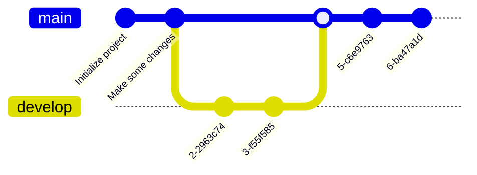

+++

title = "Guide for writing markdown slides"
description = "A Hugo theme for creating Reveal.js presentations"
outputs = ["Reveal"]
aliases = [
    "/guide/"
]

+++

# BASI DI LINUX, PARTE PRIMA

## [Danilo Pianini](mailto:danilo.pianini@unibo.it)

### Compiled {}

---

## Il sistema operativo

Strato software che si occupa di gestire l'hardware,
la memoria, e i permessi,
permettendo l'esecuzione concorrente di più programmi.


Tanenbaum, Modern Operating Systems 3 e, (c) 2008 Prentice-Hall, Inc. All rights reserved. 0-13-6006639

---

## Il sistema operativo come mezzo di astrazione

Il sistema operativo nasconde i dettagli di basso livello
dell'hardware, fornendo un'interfaccia più semplice


Tanenbaum, Modern Operating Systems 3 e, (c) 2008 Prentice-Hall, Inc. All rights reserved. 0-13-6006639

---

## Kernel space e user space

I sistemi operativi moderni consentono due macro-livelli di esecuzione:
* in **kernel mode**, il software ha accesso diretto all'hardware e a tutte le risorse del sistema
* in **user mode**, il software ha accesso limitato, e deve passare per delle apposite chiamate (system call) per accedere alle risorse

Sistemi operativi diversi possono fare scelte diverse su cosa fa parte del kernel e cosa no.

* Nei sistemi a *microkernel*, il kernel contiene solo le funzionalità essenziali (scheduling, gestione memoria, comunicazione intra-processo), mentre tutto il resto (inclusi i device driver) eseguono in user mode.
  * Alta sicurezza (un errore in un driver non compromette il sistema).
* Nei sistemi *monolitici*, anche servizi accessori come i driver, il file system, e la rete eseguono in kernel mode
  * Maggiore efficienza (meno overhead per le system call).
  * Più difficile da mantenere e debuggare.
* Nei sistemi *ibridi*, solo alcuni servizi accessori eseguono in kernel mode (ad esempio solo i device driver, ma non la gestione della rete).

---

## Famiglie di sistemi operativi


---

## UNIX, POSIX, Linux, GNU, distribuzioni

**UNIX** (da UNICS, "**Un**iplexed **I**nformation **C**omputing **S**ystem") è un *sistema operativo* sviluppato negli anni '70 da AT&T.

**POSIX** (**P**ortable **O**perating **S**ystem **I**nterface)
è uno *standard* che definisce l'interfaccia di programmazione per sistemi operativi UNIX-like.
Sistemi operativi che rispettano POSIX sono detti *POSIX-compliant*
(ad esempio, Mac OS è POSIX-Compliant a partire dalla versione 10.5).

**Linux** <i class="fa-brands fa-linux"></i> è un *kernel* (non un sistema operativo completo) sviluppato da Linus Torvalds nel 1991.

**GNU/Linux** è l'insieme del kernel Linux e degli strumenti GNU (compilatore C, librerie, utility binarie, eccetera),
che *insieme costituiscono un sistema operativo*. Sebbene non certificato POSIX, aderisce in larga parte allo standard.

Una **Distribuzione Linux** (
<i class="fa-brands fa-ubuntu"></i>, 
<i class="fa-brands fa-debian"></i>,
<i class="fa-brands fa-suse"></i>,
<i class="fa-brands fa-redhat"></i>,
<i class="fa-brands fa-centos"></i>,
<i class="fa-brands fa-fedora"></i>,
Arch,
Gentoo...
) è l'insieme di Linux, di strumenti di contorno (solitamente GNU o BusyBox), e di software aggiuntivo (gestore di pacchetti, ambiente desktop, eccetera) che viene distribuito come un'unità.

---

## Filosofia UNIX

* *"everything is a file" (or a process)*
* il *file system* è un albero
* il sistema è fatto da tanti piccoli programmi che fanno *una cosa* sola, *bene*
* i programmi possono essere combinati mettendo l'output di uno come input di un altro (piping)
* un *linguaggio di scripting* permette di combinare i programmi in workflow complessi o di comandare il sistema interattivamente tramite una *shell*

---

## Permessi UNIX

Le *risorse* (file e processi) sono associate a un *utente* e a un *gruppo*.

Sia utenti che gruppi sono identificati da un nome alfanumerico e da un identificativo numerico.

Gli accessi a *file* UNIX sono quindi regolati da tre tipi di permessi: **lettura**, **scrittura**, ed **esecuzione**.
Ciascuno di questi è associato a tre entità: *il proprietario* del file, *il gruppo proprietario*, e *tutti gli altri utenti*.

Esiste un utente detto **root** che ha accesso *totale* al sistema.

---

## Il file system UNIX

A differenza di <i class="fa-brands fa-windows"></i>,
UNIX non associa delle "lettere di unità" alle partizioni.

Il file system UNIX è *un unico albero*, con radice `/`,
vedremo poi in che modo possono essere gestiti più dispositivi senza costruire nuove radici.

I percorsi dei file sono separati da `/` (a differenza di <i class="fa-brands fa-windows"></i>, che usa `\`).

I percorsi dei file possono essere *assoluti* (partono da `/`) o *relativi* (partono dalla directory corrente).
Ad esempio, `/home/user/documents/file.txt` è un percorso assoluto, mentre `documents/file.txt` è un percorso relativo.

Nei percorsi UNIX, `.` rappresenta la directory corrente, e `..` rappresenta la directory padre.

I file il cui nome comincia con `.` sono considerati *nascosti*.

Il file system UNIX è *tipicamente case-sensitive*: `file.txt`, `File.txt`, e `FILE.TXT` sono tre file diversi
(mentre su <i class="fa-brands fa-windows"></i> sarebbero considerati lo stesso file).
Si noti che esistono eccezioni:
per ragioni di compatibilità, il file system di
<i class="fa-brands fa-apple"></i>
è case-insensitive di default.


---

## Il terminale

Programma che permette di interagire con il S.O. mediante comandi impartiti in modalità testuale, usate:
* per **automatizzare** le operazioni
* per **velocizzare** le operazioni (scrivere un comando è spesso molto più veloce di andare a fare click col mouse in giro per lo schermo)
* per fare operazioni complesse con pochi semplici comandi
* non tutti i software sono dotati di interfaccia grafica
* alcune opzioni di configurazione del sistema operativo restano accessibili solo via linea di comando
  *  (anche su <i class="fa-brands fa-windows"></i>: ad esempio i comandi per associare le estensioni ad un eseguibile)

---

## <i class="fa-brands fa-linux"></i><i class="fa-brands fa-apple"></i> Sistemi *nix (Linux, MacOS X, FreeBSD, Minix...)

### Nei sistemi UNIX-like esistono vari tipi di interpreti, chiamati shell
Alcuni esempi
* Bourne shell (sh)
  * Prima shell sviluppata per UNIX (1977)
* C-Shell (csh)
  * Sviluppata da Bill Joy per BSD
* Bourne Again Shell (bash)
  * Parte del progetto GNU, è un super set di Bourne shell
* ZSH, Fish, e altri terminali di ultima generazione
  * Altamente personalizzabili
  * Molto flessibili
  * Autocompletamento avanzato e contestualità
  * ZSH è default su <i class="fa-brands fa-apple"></i>, seppur con configurazione minimale
  * La shell che vedrete sul sistema del docente è ZSH con configurazione personalizzata

Panoramica delle differenze: http://www.faqs.org/faqs/unix-faq/shell/shell-differences/

---

## <i class="fa-brands fa-windows"></i> Sistemi Windows

L'interprete comandi storico è rappresentato dal programma `cmd.exe` (`C:\Windows\System32\cmd.exe`)
* Eredita sintassi e funzionalità della maggior parte dei comandi del vecchio MSDOS

Versioni recenti hanno introdotto **PowerShell**, basato su .NET e C#

Da Windows 10 è possibile installare Linux dentro Windows usando **Windows Subsystem for Linux (WSL2)**
* Può essere un modo ragionevole di avere shell Unix in ambiente Windows

---

## Manipolazione di base del file system

### Directory corrente: `pwd`

All'apertura, e in qualunque momento, il terminale si trova in una *directory* (cartella) del file system.

Normalmente, alla sua apertura, si trova nella *home directory* dell'utente.

Possiamo sempre sapere in che directory ci troviamo con il comando `pwd` (print working directory).

```bash
$ pwd                                                  
/home/danysk/LocalProjects
```

---

## Manipolazione di base del file system

### Elencare il contenuto della directory corrente: `ls`

Il comando `ls` (list) permette di elencare il contenuto della directory corrente.

```bash
$ ls
LICENSE     assets  config.toml  layouts        resources  shared-slides  themes
archetypes  build   content      renovate.json  scm.md     static
```

Di default, *omette i file nascosti*, che possono essere visualizzati con l'opzione `-a` (all).

```bash
$ ls -a
.        .gitignore        LICENSE     config.toml    resources      themes
..       .gitmodules       archetypes  content        scm.md
.git     .hugo_build.lock  assets      layouts        shared-slides
.github  .mergify.yml      build       renovate.json  static
```

Notate che appaiono anche le directory `.` e `..` che rappresentano rispettivamente la directory corrente e la directory padre.

---

## Manipolazione di base del file system

### Directory corrente: `pwd`

All'apertura, e in qualunque momento, il terminale si trova in una *directory* (cartella) del file system.

Normalmente, alla sua apertura, si trova nella *home directory* dell'utente.

Possiamo sempre sapere in che directory ci troviamo con il comando `pwd` (print working directory).

```bash
$ pwd                                                  
/home/danysk/LocalProjects
```


---

Dato che tutto è un file, *anche i dispositivi sono rappresentati come file*, e sono *"montati"* in una directory del file system.

---

immagine con struttura file system

---


* Manipolazione di base del file system
    * Query
        * pwd
        * ls [-a]
        * cd
    * Modifica
        * touch
        * mkdir [-p]
    * Wildcards: ?, * e **

* Strumenti basilari del terminale
    * clear
    * echo
    * history e ^R

* Spostamento, copia, rimozione, visualizzazione di file e cartelle
    * cp
    * mv
    * rm [-rf]
    * cat
    * less
    * head [-n]
    * tail [-fn]
    * du
    * locate e find
    * which

* Redirezione
    * Standard output, input, ed error
    * standard output redirection con > e >>
    * standard input redirection con <
    * process piping (|)
    * filtraggio con grep [-vnc]

* Manualistica
    * whatis
    * man
    * apropos

* Utenti e gruppi
    * gruppi, utenti, permessi
    * permessi ottali
    * ls [-ahl]
    * whoami
    * who
    * chmod
    * chown
    * useradd
    * usermod
    * visudo

Processi, segnali, e loro gestione
    * PID
    * ps
    * top e htop
    * backgrounding (& e ^Z)
    * kill
    * killall

* Secure Shell
    * ssh
-    * autenticazione a chiavi assimetriche
-    * ssh-keygen
-    * il demone ssh
-    * ssh.conf e sshd.conf
    * scp
    * filezilla

Rudimenti di programmazione bash
    * variabili
    * script, shebang line
    * condizionali (if, until)
    * iterazione (for, while)
    * sort
    * sed

### Parte 2 -- Martina Baiardi

- Basic Linux Networking
  - LAN vs WAN
  - ISO OSI
- Layer 2
  - mac address
  - Loopback interface
  - Ethernet/Wi-Fi interfaces
- Layer 3
  - TCP/IPv4 addresses
    - format
    - netmasks
  - DHCP
  - NAT
  - DNS
  - NTP
  - Network manager
- Network configuration
    - ip command
    - systemd/networkd
    - nmcli command
    - /etc/network/interfaces
    - ping command
    - traceroute
    - nslookup
    - netstat
    - configurazione rete tramite dhcp
    - configurazione rete WPA2/WPA3
        - wpa_cli command
- Network tools
  - /etc/hosts
  - curl
  - wget

## Strumenti per analisi processi
- Foreground and Background processes
- Process states
- load average
- ps command
- top/htop command
- kill command

## Strumenti per analisi risorse di sistema

## Log di sistema
- log rotate e gestione dei log di systemctl (size, persistence time)
- /var/log
- journalctl


* Gestione di file systems
    * df
    * montaggio e smontaggio di partizioni (mount, umount)

## Utilizzo periferiche (es: porte USB) su Linux
- Rintracciare dispositivi esterni
- montare il percorso di tali dispositivi
- lsusb
- lspci

https://info-ee.surrey.ac.uk/Teaching/Unix/


# Short guide to Markdown slides

---

# Headers

# H1
## H2
### H3
#### H4

---

# Text

normal text

`inline code`

*italic*

**bold**

**_emphasized_**

*__emphasized alternative__*

~~strikethrough~~

[link](http://www.google.com)

---

# Lists and enums

1. First ordered list item
1. Another item
    * Unordered sub-list.
    * with two items
        * another sublist
            1. With a sub-enum
            1. yay!
1. Actual numbers don't matter, just that it's a number
  1. Ordered sub-list
1. And another item.

---

# Inline images


---

## Fallback to shortcodes for resizing

Autoresize specifying

* `max-w` (percent of parent element width) and/or `max-h` (percent of viewport height) as max sizes , and
* `width` and/or `height` as *exact* sizes (as percent of viewport size)



---

## Multi-column slide

{}{}
Column 1
{}{}
Column 2
{}{}

---

## Tick and Cross

{} This is something good {}
{} This is something good {}

---

## Chart.js


{
    type: 'bar',
    data: {
        labels: ['Red', 'Blue', 'Yellow', 'Green', 'Purple', 'Orange'],
        datasets: [{
            label: 'Bar Chart',
            data: [12, 19, 18, 16, 13, 14],
            backgroundColor: [
                'rgba(255, 99, 132, 0.2)',
                'rgba(54, 162, 235, 0.2)',
                'rgba(255, 206, 86, 0.2)',
                'rgba(75, 192, 192, 0.2)',
                'rgba(153, 102, 255, 0.2)',
                'rgba(255, 159, 64, 0.2)'
            ],
            borderColor: [
                'rgba(255, 99, 132, 1)',
                'rgba(54, 162, 235, 1)',
                'rgba(255, 206, 86, 1)',
                'rgba(75, 192, 192, 1)',
                'rgba(153, 102, 255, 1)',
                'rgba(255, 159, 64, 1)'
            ],
            borderWidth: 1
        }]
    },
    options: {
        maintainAspectRatio: false,
        scales: {
            yAxes: [{
                ticks: {
                    beginAtZero: true
                }
            }]
        }
    }
}


---

## FontAwesome

<i class="fa-solid fa-mug-hot"></i>
<i class="fa-solid fa-lemon"></i>
<i class="fa-solid fa-flask"></i>
<i class="fa-solid fa-apple-whole"></i>
<i class="fa-solid fa-bacon"></i>
<i class="fa-solid fa-beer-mug-empty"></i>
<i class="fa-solid fa-pepper-hot"></i>

---

## Bootstrap 1

<div class="card w-100" >
  
  <div class="card-body">
    <h5 class="card-title">Card title</h5>
    <p class="card-text">Some quick example text to build on the card title and make up the bulk of the card's content.</p>
    <a href="#" class="btn btn-primary">Go somewhere</a>
  </div>
</div>

---

## Bootstrap 2

<button type="button" class="btn btn-primary">Primary</button>
<button type="button" class="btn btn-secondary">Secondary</button>
<button type="button" class="btn btn-success">Success</button>
<button type="button" class="btn btn-danger">Danger</button>
<button type="button" class="btn btn-warning">Warning</button>
<button type="button" class="btn btn-info">Info</button>
<button type="button" class="btn btn-light">Light</button>
<button type="button" class="btn btn-dark">Dark</button>

<button type="button" class="btn btn-link">Link</button>

---

## Low res, plain markdown


---

## Hi res, plain markdown


---

## Low res, default



---

## Hi res, default



---

## Low res, enlarged horizontally



---

## Low res, enlarged vertically



---

## Hi res, reduced horizontally



---

## Hi res, reduced vertically



---

## Hi res, reducing maximum expansion horizontally



---

## Hi res, reducing maximum expansion vertically



---



# Large images as background
## (May affect printing)

---



# Also available with blur and custom transitions
## (May affect printing)

---

# $$\LaTeX{}$$


Inline equations like $E=mc^2$

$$\frac{n!}{k!(n-k)!} = \binom{n}{k}$$

---

# Code snippets


```kotlin
val x = pippo
```

```go
package main

import "fmt"

func main() {
    fmt.Println("Hello world!")
}
```

---

# Tables

Colons can be used to align columns.

| Tables        | Are           | Cool  |
| ------------- |:-------------:| -----:|
| col 3 is      | right-aligned | $1600 |
| col 2 is      | centered      |   $12 |
| zebra stripes | are neat      |    $1 |

There must be at least 3 dashes separating each header cell.
The outer pipes (|) are optional, and you don't need to make the
raw Markdown line up prettily. You can also use inline Markdown.

---

# Quotes

> Multiple
> lines
> of
> a
> single
> quote
> get
> joined

> Very long one liners of Markdown text automatically get broken into a multiline quotation, which is then rendered in the slides.

---

# Fragments

* 
* 
* 

---

# Graphs via Gravizo


  digraph G {
    aize ="4,4";
    main [shape=box];
    main -> parse [weight=8];
    parse -> execute;
    main -> init [style=dotted];
    main -> cleanup;
    execute -> { make_string; printf}
    init -> make_string;
    edge [color=red];
    main -> printf [style=bold,label="100 times"];
    make_string [label="make a string"];
    node [shape=box,style=filled,color=".7 .3 1.0"];
    execute -> compare;
  }


---

# Graphs via mermaid.js


---


# Graphs via mermaid.js with options


---
# Graphs via mermaid.js 2


---

# Graphs via mermaid.js 3



---

# Keystrokes

<kbd>Ctrl</kbd> + <kbd>Alt</kbd> + <kbd>Del</kbd>

---

# Import shared slides

<!-- write-here "shared-slides/devops/devops-intro.md" -->
<!-- end-write -->
