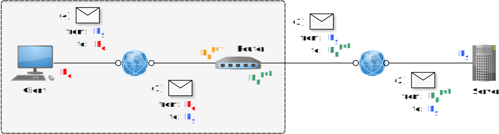

+++

title = "Advanced network configuration with `iptables`"
description = "Practical introduction to `iptables` and its functioning"
outputs = ["Reveal"]

[reveal_hugo.custom_theme_options]
targetPath = "css/custom-theme.css"
enableSourceMap = true

+++

# Advanced network configuration <br> with `iptables`

Giovanni Ciatto

---

## References

- [Illustrated introduction to Linux `iptables`](https://iximiuz.com/en/posts/laymans-iptables-101/)
- [`iptables` Processing Flowchart (Updated Often)](https://stuffphilwrites.com/2014/09/iptables-processing-flowchart/)
- Also the English [Wikipedia page on Netfilter](https://en.wikipedia.org/wiki/Netfilter) is quite informative

---

## Network packets stepping through the Linux OS



1. __Ingoing__ packets, coming _from_ the Internet, are received by _some_ local _network interface_ (e.g., `eth0`)
    1. these may be __directed__ towards some _local process_ willing to __receive__ them
    2. ... or towards __another machine__ in the _local_ network, via another local network interface (e.g., `eth1`)

2. __Outgoing__ packets are sent by _some_ local _network interface_ (e.g., `eth1`) _towards_ the Internet
    1. due to either some _local process_ __sending__ them...
    2. ... or some __forwarding__

---

## What's forwarding?



- While __sending__ and __receiving__ packets is more common for _end-hosts_ (e.g. clients or servers)...
- ... __forwarding__ is more common _infrastructural_ hosts (e.g. routers, load balancers, etc.)

---

## The need for customization (pt. 1)



#### One may want to __alter__ the _default_ behaviour of the Linux OS in handling packets, e.g. to perform:

- __firewalling__, e.g. _blocking_ packets from/to some IP addresses, or ports for _security_ reasons
- __translating network addresses__, e.g. _translating_ packets' source/destination IP addresses or ports, e.g. for the sake of _access control_
    * a.k.a. *NAT*ting, _masquerading_
- __load balancing__, e.g. _distributing_ packets among multiple servers
- __traffic shaping__, e.g. _prioritizing_ packets based on their content, or _limiting_ their bandwidth

---

## The need for customization (pt. 2)



#### This implies __attaching__ some _custom_ logic to specific _points_ in the _packet processing_ flow, e.g.:

- __firewalling__: may be achieved by _dropping_ packets in the `INPUT` phase
- __NATting__: may be achieved by _modifying_ packets in the `POSTROUTING` phase
- __load balancing__: may be achieved by _modifying_ packets in the `FORWARD` phase
- __traffic shaping__: may be achieved by _marking_ packets in the `PREROUTING` or `INPUT` phase 

---

## Netfilter and `iptables`

[Netfilter](https://en.wikipedia.org/wiki/Netfilter) is the _framework_ in the Linux kernel responsible for _handling packets_



- it allows for attaching _custom_ logic to specific _points_ in the _packet processing_ flow
- you can do so, via _high-level_ user-space tools, such as `iptables`

---

## Important aspects of Netfilter/`iptables` (pt. 1)

1. __Chain__: a _list_ of _rules_ to be _applied_ to a packet to _determine_ its _fate_, with _decreasing_ priority
    + they are usually named after the _phase_ in the _packet processing_ flow they are attached to 
        + e.g. `INPUT`, `FORWARD`, `OUTPUT`, `PREROUTING`, `POSTROUTING`

2. __Rule__ (of a chain): a _decision_ on what to do with a packet _matching_ a given _criterion_

3. __Matching criteria__ (of a rule): are _conditions_ a packet must _satisfy_ to be _matched_ by a rule
    + they could be like `--source`, `--destination`, `--protocol`, `--sport`, `--dport`, etc.

3. __Target__ (of a rule): rules' decisions are called "targets"
    + they could be like `ACCEPT`, `DROP`, `LOG`, `RETURN` to some prior chain, or _jump_ to another chain

4. __Policy__ (of a chain): the _default_ action to be taken if no rule in the _matches_ a packet

---

## Important aspects of Netfilter/`iptables` (pt. 2)

> __Suggestion__: think about
> - chains as _functions_ accepting packets as _arguments_, and returning a _decision_
> - rules as _if-then-else_ statements
> - policies as the _else_ part of an _if-then-else_ statement



---

## Important aspects of Netfilter/`iptables` (pt. 3)

5. __Tables__: predefined _groups_ of _chains_ with a specific _purpose_
    + `filter`: contains chains for _filtering_ packets
    + `nat`: contains chains for _translating_ packets' addresses/ports
    + `mangle`: contains chains for _modifying_ packets
    + `raw`: contains chains for low-level _packet processing_
    + `security`: contains chains for _SELinux_ (SE $\equiv$ Security-Enhanced) rules

---

## Default chains, per table

| Table        | Chains                                                    |
|-------------:|:----------------------------------------------------------|
| **filter**   | `INPUT`, `OUTPUT`, `FORWARD`                              |
| **nat**      | `PREROUTING`, `POSTROUTING`, `OUTPUT`                     |
| **mangle**   | `PREROUTING`, `INPUT`, `FORWARD`, `OUTPUT`, `POSTROUTING` |
| **raw**      | `PREROUTING`, `OUTPUT`                                    |
| **security** | `INPUT`, `OUTPUT`, `FORWARD`                              |

<br>

- `INPUT`: handles packets _directed to_ the local system
- `OUTPUT`: handles packets _originating from_ the local system
- `FORWARD`: handles packets _routed through_ the system
- `PREROUTING`: handles packets _before_ they are routed
- `POSTROUTING`: handles packets _after_ they are routed

---

## Default flow (pt. 1)

### Overview



think about chains as _hooks_ to which you can _attach_ your _custom_ logic

---

## Default flow (pt. 2)

### Input and output flows



---

## Default flow (pt. 3)

### Input and output flows



---

## Admissible targets, per table (pt. 1)

| Table        | Target            |
|-------------:|:------------------|
| **filter**   | `ACCEPT`\*, `DROP`\*, `REJECT`\*, `LOG`, `RETURN`, `ULOG` |
| **nat**      | `DNAT`, `SNAT`, `MASQUERADE`, `REDIRECT`, `RETURN`  |
| **mangle**   | `MARK`, `TOS`, `DSCP`, `TTL`, `SECMARK`, `CONNMARK`, `RETURN` |
| **raw**      | `NOTRACK`, `RETURN` |
| **security** | `SECMARK`, `RETURN` |

\* interrupts the _processing_ of the _current_ packet

---

## Admissible targets, per table (pt. 2)

{}
{}
- `ACCEPT`: _accept_ the packet
- `CONNMARK`: _enables_ a packet for __connection tracking__
- `DNAT`: changes the _destination_ address of a packet
- `DROP`: _drop_ the packet
- `DSCP`: sets the Differentiated Services Code Point (_DSCP_) header of the packet
- `LOG`: logs the packet details to the _system log_ 
- `MARK`: marks the packet for further processing (e.g., for QoS)
- `MASQUERADE`: changes the _destination_ address/port of a packet being _forwarded_ 
to match the outgoing network interface's _address_, 
and changes back the _destination_ address/port of the _response_ packets
{}
{}
- `NOTRACK`: _disables_ connection tracking for a packet
- `REDIRECT`: _redirects_ the packet to a different _port_ on the _same machine_
- `REJECT`: _drops_ the packet and sends an _error response_ back
- `RETURN`: jump back to the _calling_ chain
- `SECMARK`: _marks_ packets for use with _security_ modules 
- `SNAT`: changes the _source_ address of a packet
- `TOS`: sets the _Type of Service_ (_TOS_) header of the packet
- `TTL`: sets the _Time to Live_ (_TTL_) header of the packet
- `ULOG`: logs the packet details to _userspace_ 
{}
{}

---

## About masquerading

This may be useful when the _IP address_ of the _client_ must be __hidden__ from the _server_ (or vice versa)



- In steps (1) and (2), the router performs __masquerading__ on the _outgoing_ packets of the _client_
- In steps (3) and (4), the router performs __de-masquerading__ on the _incoming_ packets from the _server_

---

# Use cases

---

## Experimental setup

(download VMs [here](https://drive.google.com/file/d/1fKIm3rqvlQpamVwZ6uDSIGP3OUFKumKP/view?usp=drive_link))



- 3 Linux VM, running Lubuntu 20.04
- VMs are interconnected _with each other_ into a _private_ network (`192.168.1.x`)
- VMs are also connected to the _Internet_ via the host, which is acting as the _gateway_ (`10.0.2.x`)
- _Port-forwarding_ is set up on the host to allow _SSH_ access to the VMs
    + e.g. on ports `3022`, `3023`, and `3024`

---

## Use case: Firewalling at the _service_ level (pt. 1)

- __Goal__: block _all_ ingoing packets, except the ones directed towards a specific _$port$_
- __Assumption__: the _$port$_ corresponds to a _service_ you want to _expose_ to the Internet
- __Motivation__: reduce the _attack surface_ of the system, by allowing only _specific_ services
- __Issue 1__: ingoing packets for connections _initiated_ from the local system should _not_ be blocked
- __Issue 2__: the loop-back interface should _not_ be blocked

{}
### Solution

1. Set `REJECT` as the default _policy_ for the `INPUT` and `FORWARD` chains of the `filter` table
2. Set `ACCEPT` as the _policy_ for the `OUTPUT` chain of the `filter` table
3. Add a rule to the `INPUT` chain of the `filter` table, _matching_ packets directed towards the _$port$_, and `ACCEPT`ing them
4. Add a rule to the `INPUT` chain of the `filter` table, _matching_ packets for _established connections_ and `ACCEPT`ing them
5. Add a rule to the `INPUT` chain of the `filter` table, _matching_ packets for the _loop-back_ interface and `ACCEPT`ing them
{}

---

## Use case: Firewalling at the _service_ level (pt. 2)

### Code Example (for SSH on port 22)

```bash
# Flush existing rules (optional, to start fresh)
sudo iptables -t filter -F

# Set default policies to DROP for the INPUT and FORWARD chains, and ACCEPT for OUTPUT
sudo iptables -t filter -P INPUT DROP
sudo iptables -t filter -P FORWARD DROP
sudo iptables -t filter -P OUTPUT ACCEPT

# Allow packets for established and related connections
sudo iptables -t filter -A INPUT -m state --state ESTABLISHED,RELATED -j ACCEPT

# Allow incoming SSH traffic (port 22)
sudo iptables -t filter -A INPUT -p tcp --dport 22 -j ACCEPT

# Allow loopback traffic
sudo iptables -t filter -A INPUT -i lo -j ACCEPT
```

#### Important Remarks

1. Do __not__ run the commands _one at a time_: this would most likely make your system unusable (by blocking all incoming packets first)
2. In any moment, use `sudo iptables -t filter -L` to _inspect_ the current rules in table `filter`

---

## Use case: Firewalling at the _service_ level (pt. 3)

### Defensive way to execute the code

1. Run `nano firewall.sh` and paste the following code:

    ```bash
    # Flush existing rules (optional, to start fresh)
    iptables -t filter -F

    # Allow loopback traffic
    iptables -t filter -A INPUT -i lo -j ACCEPT

    # Allow incoming SSH traffic (port 22)
    iptables -t filter -A INPUT -p tcp --dport 22 -j ACCEPT

    # Allow packets for established and related connections
    iptables -t filter -A INPUT -m state --state ESTABLISHED,RELATED -j ACCEPT

    # Set default policies to DROP for the INPUT and FORWARD chains, and ACCEPT for OUTPUT
    iptables -t filter -P INPUT DROP
    iptables -t filter -P FORWARD DROP
    iptables -t filter -P OUTPUT ACCEPT
    ```

    + notice that accept lines are _before_ the drop lines (to avoid blocking yourself out)

2. Run `sudo sh firewall.sh` to _apply_ the rules

3. Ensure the rules are as expected by reading them with `sudo iptables -t filter -L`

---

## Use case: Firewalling at the _service_ level (pt. 4)

### Manual tests

1. Try to _SSH_ into the machine from another one, on the default port (22)
    + `ssh user@machine`
    + __this should work__
2. Try to _SSH_ into the machine from another one, on a different port (e.g., 2222), after reconfiguring the _SSH_ server accordingly
    1. `sudo nano /etc/ssh/sshd_config` and change the `Port` directive
    2. `sudo cp /lib/systemd/system/ssh.socket /etc/systemd/system/`
    3. `sudo nano /etc/systemd/system/ssh.socket` and change the `ListenStream` directive
    4. `sudo systemctl daemon-reload`
    5. `sudo systemctl restart ssh.socket ssh.service`
    3. (from another machine) `ssh -p 2222 user@machine`
    + __this should *not* work__ (contacting the server on any port other than 22 should be blocked)
3. Try to browse the Web from the machine
    1. `w3m http://www.google.it`
    2. __this should work__ (incoming packets for established connections should be allowed)

---

## Use case: Firewalling at the _IP_ level (pt. 1)

- __Goal__: block _all_ ingoing packets, except the ones coming from a specific _IP address_ **range**
- __Assumption__: the _IP address_ in the allowed range are _trusted_ ones
- __Motivation__: access control based on _IP addresses_
- __Issue 1__: ingoing packets for connections _initiated_ from the local system should _not_ be blocked
- __Issue 2__: the loop-back interface should _not_ be blocked

{}
### Solution

1. Set `DROP` as the default _policy_ for the `INPUT` and `FORWARD` chains of the `filter` table
2. Set `ACCEPT` as the _policy_ for the `OUTPUT` chain of the `filter` table
3. Add a rule to the `INPUT` chain of the `filter` table, _matching_ packets coming from the _trusted_ _IP address_ range, and `ACCEPT`ing them
4. Add a rule to the `INPUT` chain of the `filter` table, _matching_ packets for _established connections_ and `ACCEPT`ing them
5. Add a rule to the `INPUT` chain of the `filter` table, _matching_ packets for the _loop-back_ interface and `ACCEPT`ing them
{}

---

## Use case: Firewalling at the _IP_ level (pt. 2)

### Code Example (for a specific IP range)

1. Run `nano firewall.sh` and paste the following code:
    ```bash
    # Flush existing rules (optional, to start fresh)
    iptables -t filter -F

    # Allow all traffic on the loopback interface (local system communication)
    iptables -t filter -A INPUT -i lo -j ACCEPT

    # Allow incoming packets from the trusted IP range (e.g., 10.0.2.x)
    iptables -t filter -A INPUT -s 10.0.2.0/24 -j ACCEPT

    # Allow incoming packets for established and related connections
    iptables -t filter -A INPUT -m state --state ESTABLISHED,RELATED -j ACCEPT

    # Set default policies to DROP for INPUT and FORWARD chains, and ACCEPT for OUTPUT
    iptables -t filter -P INPUT DROP
    iptables -t filter -P FORWARD DROP
    iptables -t filter -P OUTPUT ACCEPT
    ```

2. Run `sudo sh firewall.sh` to _apply_ the rules

3. Ensure the rules are as expected by reading them with `sudo iptables -t filter -L`

---

## Use case: Firewalling at the _IP_ level (pt. 3)

### Manual tests

1. Try to _SSH_ into the machine from a machine in the _trusted_ _IP address_ range
    1. use `ip -o -f inet address show` to verify the machine has an IP address in the range `10.0.2.x`
    2. `ssh user@machine`
    3. __this should work__
2. Try to _SSH_ into the machine from a machine __not__ in the _trusted_ _IP address_ range
    1. use `ip -o -f inet address show` to verify the machine has _no_ IP address in the range `10.0.2.x`
    2. `ssh user@machine`
    3. __this should *not* work__ (contacting the server from any IP address other than `10.0.2.x` should be blocked)
3. Try to browse the Web from the machine
    1. `w3m http://www.google.it`
    2. __this should work__ (incoming packets for established connections should be allowed)

---

## Use case: Load balancing a service (pt. 1)

- __Goal__: let a service be _replicated_ on _multiple machines_, and distribute incoming packets among them
- __Assumption__: there are 3 machines, `vm1` acting as the _load balancer_, while `vm2` and `vm3` act as _backends_
    + the service should be exposed on port `80` on `vm1`, while it is running on port `8080` on `vm2` and `vm3`
- __Motivation__: redundancy, scalability, and fault tolerance
- __Remark__: it would be better to use containers, and/or a dedicated _load balancer_, but this is a _didactic_ example

---

## Use case: Load balancing a service (pt. 2)

### Solution
0. Enable _IP forwarding_ on the load balancer `vm1`
1. Add a new rule to the `PREROUTING` chain of the `nat` table:
    + _matching_ incoming packets on port `80` for protocol _TCP_
    + (in particular, _half of_ the ones corresponding to _new connections_)
    + redirecting (`DNAT`) them to the backend `vm2` on port `8080`
2. Add another new rule to the `PREROUTING` chain of the `nat` table:
    + _matching_ incoming packets on port `80` for protocol _TCP_
    + (in particular, corresponding to _new connections_)
    + redirecting (`DNAT`) them to the backend `vm3` on port `8080`
    + (implicitly handles the _other half_ of the packets)
3. Add _2 more_ rules (one per backend) to the `POSTROUTING` chain of the `nat` table:
    + _matching_ packets _directed_ to the backends `vm2` and `vm3` on port `8080`
    + masquerading (`MASQUERADE`) traffic directed _to_ them
    + (implies *de*masquerading the _response_ packets coming _from_ them)

---

## Use case: Load balancing a service (pt. 3)

### Code Example (for a simple round-robin load balancer)

1. Run `nano loadbalancer.sh` and paste the following code:
    ```bash
    # Enable IP forwarding by writing non-zero value to /proc/sys/net/ipv4/ip_forward
    echo 1 | /proc/sys/net/ipv4/ip_forward

    # Flush existing NAT rules (optional, to start fresh)
    iptables -t nat -F

    # Whenever a new connection comes in on port 80, 
    # redirect it to the backend 192.168.1.2:8080 if it's an even packet...
    iptables -t nat -A PREROUTING \
        -p tcp --dport 80 \
        -m conntrack --ctstate NEW \
        -m statistic --mode nth --every 2 --packet 0 \
        -j DNAT --to-destination 192.168.1.2:8080 
    
    # ... otherwise, redirect it to the backend 192.168.1.3:8080
    iptables -t nat -A PREROUTING \
        -p tcp --dport 80 \
        -m conntrack --ctstate NEW \
        -j DNAT --to-destination 192.168.1.3:8080

    # Ensure that the backens' responses are correctly routed back to the client
    # as if they were coming from the load balancer
    iptables -t nat -A POSTROUTING -p tcp -d 192.168.1.2 --dport 8080 -j MASQUERADE
    iptables -t nat -A POSTROUTING -p tcp -d 192.168.1.3 --dport 8080 -j MASQUERADE
    ```

2. Run `sudo sh loadbalancer.sh` to _apply_ the rules

3. Ensure the rules are as expected by reading them with `sudo iptables -t nat -L`

---

## Use case: Load balancing a service (pt. 5)

### Manual tests

1. Start a Web service on port `8080` on `vm2` and `vm3`
    + better for the service to return the _hostname_ of the machine it is running on
        * e.g. the [hit-counter](https://github.com/gciatto/hit-counter) project

2. Contact the load balancer _from another machine_, and check the _hostname_ returned
    1. `curl http://vm1`
    2. reload the page _several times_
    3. __this should alternate between `vm2` and `vm3`__

3. Why you cannot use `localhost` to test the load balancer?
    + `curl http://localhost` on `vm1` would always __fail__, as the packets are _not_ being _routed_ 
        * hence not passing through the `PREROUTING` chain
