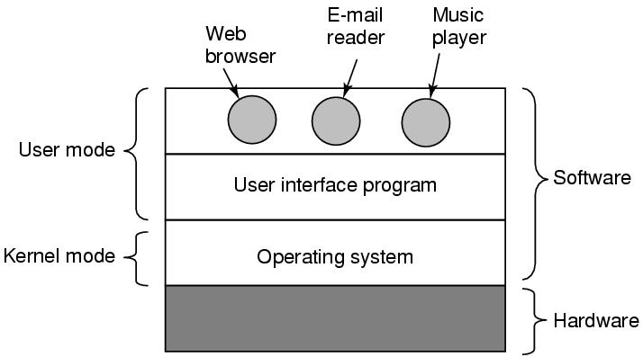
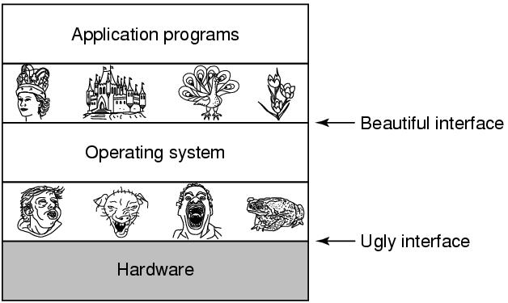
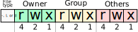
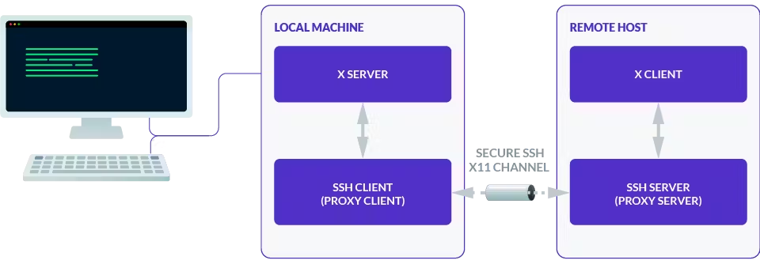
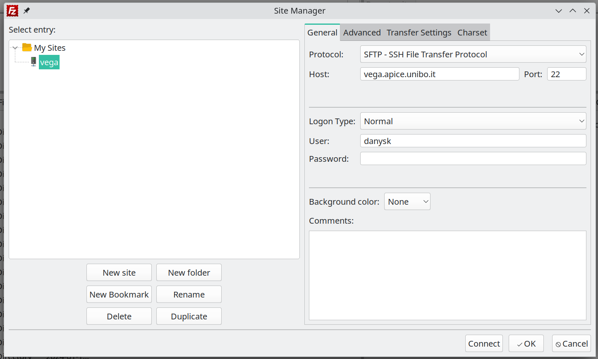

+++

title = "Basi di Linux, parte prima"
description = "Corso Linux Base @SCM Group"
outputs = ["Reveal"]
aliases = [
  "1"
]

+++

# BASI DI LINUX, PARTE PRIMA

## [Danilo Pianini](mailto:danilo.pianini@unibo.it)

### Compiled {}

---

## Il sistema operativo

Strato software che si occupa di gestire l'hardware,
la memoria, e i permessi,
permettendo l'esecuzione concorrente di più programmi.



Tanenbaum, Modern Operating Systems 3 e, (c) 2008 Prentice-Hall, Inc. All rights reserved. 0-13-6006639

---

## Il sistema operativo come mezzo di astrazione

Il sistema operativo nasconde i dettagli di basso livello
dell'hardware, fornendo un'interfaccia più semplice



Tanenbaum, Modern Operating Systems 3 e, (c) 2008 Prentice-Hall, Inc. All rights reserved. 0-13-6006639

---

## Kernel space e user space

I sistemi operativi moderni consentono due macro-livelli di esecuzione:
* in **kernel mode**, il software ha accesso diretto all'hardware e a tutte le risorse del sistema
* in **user mode**, il software ha accesso limitato, e deve passare per delle apposite chiamate (system call) per accedere alle risorse

Sistemi operativi diversi possono fare scelte diverse su cosa fa parte del kernel e cosa no.

* Nei sistemi a *microkernel*, il kernel contiene solo le funzionalità essenziali (scheduling, gestione memoria, comunicazione intra-processo), mentre tutto il resto (inclusi i device driver) eseguono in user mode.
  * Alta sicurezza (un errore in un driver non compromette il sistema).
* Nei sistemi *monolitici*, anche servizi accessori come i driver, il file system, e la rete eseguono in kernel mode
  * Maggiore efficienza (meno overhead per le system call).
  * Più difficile da mantenere e debuggare.
* Nei sistemi *ibridi*, solo alcuni servizi accessori eseguono in kernel mode (ad esempio solo i device driver, ma non la gestione della rete).

---

## Famiglie di sistemi operativi


---

## UNIX, POSIX, Linux, GNU, distribuzioni

**UNIX** (da UNICS, "**Un**iplexed **I**nformation **C**omputing **S**ystem") è un *sistema operativo* sviluppato negli anni '70 da AT&T.

**POSIX** (**P**ortable **O**perating **S**ystem **I**nterface)
è uno *standard* che definisce l'interfaccia di programmazione per sistemi operativi UNIX-like.
Sistemi operativi che rispettano POSIX sono detti *POSIX-compliant*
(ad esempio, Mac OS è POSIX-Compliant a partire dalla versione 10.5).

**Linux** <i class="fa-brands fa-linux"></i> è un *kernel* (non un sistema operativo completo) sviluppato da Linus Torvalds nel 1991.

**GNU/Linux** è l'insieme del kernel Linux e degli strumenti GNU (compilatore C, librerie, utility binarie, eccetera),
che *insieme costituiscono un sistema operativo*. Sebbene non certificato POSIX, aderisce in larga parte allo standard.

Una **Distribuzione Linux** (
<i class="fa-brands fa-ubuntu"></i>,
<i class="fa-brands fa-debian"></i>,
<i class="fa-brands fa-suse"></i>,
<i class="fa-brands fa-redhat"></i>,
<i class="fa-brands fa-centos"></i>,
<i class="fa-brands fa-fedora"></i>,
Arch,
Gentoo...
) è l'insieme di Linux, di strumenti di contorno (solitamente GNU o BusyBox), e di software aggiuntivo (gestore di pacchetti, ambiente desktop, eccetera) che viene distribuito come un'unità.

---

## Filosofia UNIX

* *"everything is a file" (or a process)*
* il *file system* è un albero
* il sistema è fatto da tanti piccoli programmi che fanno *una cosa* sola, *bene*
* i programmi possono essere combinati mettendo l'output di uno come input di un altro (piping)
* un *linguaggio di scripting* permette di combinare i programmi in workflow complessi o di comandare il sistema interattivamente tramite una *shell*

---

## Permessi UNIX

Le *risorse* (file e processi) sono associate a un *utente* e a un *gruppo*.

Sia utenti che gruppi sono identificati da un nome alfanumerico e da un identificativo numerico.

Gli accessi a *file* UNIX sono quindi regolati da tre tipi di permessi: **lettura**, **scrittura**, ed **esecuzione**.
Ciascuno di questi è associato a tre entità: *il proprietario* del file, *il gruppo proprietario*, e *tutti gli altri utenti*.

Esiste un utente detto **root** che ha accesso *totale* al sistema.

---

## Il file system UNIX

A differenza di <i class="fa-brands fa-windows"></i>,
UNIX non associa delle "lettere di unità" alle partizioni.

Il file system UNIX è *un unico albero*, con radice `/`,
vedremo poi in che modo possono essere gestiti più dispositivi senza costruire nuove radici.

I percorsi dei file sono separati da `/` (a differenza di <i class="fa-brands fa-windows"></i>, che usa `\`).

I percorsi dei file possono essere *assoluti* (partono da `/`) o *relativi* (partono dalla directory corrente).
Ad esempio, `/home/user/documents/file.txt` è un percorso assoluto, mentre `documents/file.txt` è un percorso relativo.

Nei percorsi UNIX, `.` rappresenta la directory corrente, e `..` rappresenta la directory padre.

I file il cui nome comincia con `.` sono considerati *nascosti*.

Il file system UNIX è *tipicamente case-sensitive*: `file.txt`, `File.txt`, e `FILE.TXT` sono tre file diversi
(mentre su <i class="fa-brands fa-windows"></i> sarebbero considerati lo stesso file).
Si noti che esistono eccezioni:
per ragioni di compatibilità, il file system di
<i class="fa-brands fa-apple"></i>
è case-insensitive di default.


---

## Il terminale

Programma che permette di interagire con il S.O. mediante comandi impartiti in modalità testuale, usate:
* per **automatizzare** le operazioni
* per **velocizzare** le operazioni (scrivere un comando è spesso molto più veloce di andare a fare click col mouse in giro per lo schermo)
* per fare operazioni complesse con pochi semplici comandi
* non tutti i software sono dotati di interfaccia grafica
* alcune opzioni di configurazione del sistema operativo restano accessibili solo via linea di comando
  *  (anche su <i class="fa-brands fa-windows"></i>: ad esempio i comandi per associare le estensioni ad un eseguibile)

---

## <i class="fa-brands fa-linux"></i><i class="fa-brands fa-apple"></i> Sistemi *nix (Linux, MacOS X, FreeBSD, Minix...)

### Nei sistemi UNIX-like esistono vari tipi di interpreti, chiamati shell
Alcuni esempi
* Bourne shell (sh)
  * Prima shell sviluppata per UNIX (1977)
* C-Shell (csh)
  * Sviluppata da Bill Joy per BSD
* Bourne Again Shell (bash)
  * Parte del progetto GNU, è un super set di Bourne shell
* ZSH, Fish, e altri terminali di ultima generazione
  * Altamente personalizzabili
  * Molto flessibili
  * Autocompletamento avanzato e contestualità
  * ZSH è default su <i class="fa-brands fa-apple"></i>, seppur con configurazione minimale
  * La shell che vedrete sul sistema del docente è ZSH con configurazione personalizzata

Panoramica delle differenze: http://www.faqs.org/faqs/unix-faq/shell/shell-differences/

---

## <i class="fa-brands fa-windows"></i> Sistemi Windows

L'interprete comandi storico è rappresentato dal programma `cmd.exe` (`C:\Windows\System32\cmd.exe`)
* Eredita sintassi e funzionalità della maggior parte dei comandi del vecchio MSDOS

Versioni recenti hanno introdotto **PowerShell**, basato su .NET e C#

Da Windows 10 è possibile installare Linux dentro Windows usando **Windows Subsystem for Linux (WSL2)**
* Può essere un modo ragionevole di avere shell Unix in ambiente Windows

---

## Manipolazione di base del file system

### Directory corrente: `pwd`

All'apertura, e in qualunque momento, il terminale si trova in una *directory* (cartella) del file system.

Normalmente, alla sua apertura, si trova nella *home directory* dell'utente.

Possiamo sempre sapere in che directory ci troviamo con il comando `pwd` (print working directory).

```console
$ pwd
/home/danysk/LocalProjects
```

---

## Manipolazione di base del file system

### Elencare il contenuto della directory corrente: `ls`

Il comando `ls` (list) permette di elencare il contenuto della directory corrente.

```console
$ ls
LICENSE     assets  config.toml  layouts        resources  shared-slides  themes
archetypes  build   content      renovate.json  scm.md     static
```

Di default, *omette i file nascosti*, che possono essere visualizzati con l'opzione `-a` (all).

```console
$ ls -a
.        .gitignore        LICENSE     config.toml    resources      themes
..       .gitmodules       archetypes  content        scm.md
.git     .hugo_build.lock  assets      layouts        shared-slides
.github  .mergify.yml      build       renovate.json  static
```

Notate che appaiono anche le directory `.` e `..` che rappresentano rispettivamente la directory corrente e la directory padre.

---

## Manipolazione di base del file system

### Visione dettagliata: opzione `-l` di `ls`

L'opzione `-l` di `ls` mostra anche permessi, dimensione e data di ultima modifica di ogni elemento.

```console
$ ls -l
total 60
-rw-r--r--  1 danysk danysk 11344 Aug  5 11:19 LICENSE
drwxr-xr-x  2 danysk danysk  4096 Aug  5 11:19 archetypes
drwxr-xr-x  2 danysk danysk  4096 Aug  5 11:19 assets
drwxr-xr-x  8 danysk danysk  4096 Aug  5 11:58 build
-rw-r--r--  1 danysk danysk  1842 Aug  5 11:27 config.toml
drwxr-xr-x  3 danysk danysk  4096 Aug  5 11:58 content
drwxr-xr-x  4 danysk danysk  4096 Aug  5 11:19 layouts
-rw-r--r--  1 danysk danysk   124 Aug  5 11:19 renovate.json
drwxr-xr-x  3 danysk danysk  4096 Aug  5 11:45 resources
-rw-------  1 danysk danysk  2807 Aug  5 11:33 scm.md
drwxr-xr-x 10 danysk danysk  4096 Aug  5 11:26 shared-slides
drwxr-xr-x  2 danysk danysk  4096 Aug  5 11:19 static
drwxr-xr-x  3 danysk danysk  4096 Aug  5 11:19 themes
```

---

## Manipolazione di base del file system

### Capire i permessi

I permessi sono rappresentati da 10 caratteri, divisi in 4 gruppi:
* il *primo* carattere indica il *tipo* di file (`d`: directory, `-`: file, `l`: link simbolico)
* i successivi *tre gruppi* di *tre caratteri* indicano i permessi per, rispettivamente, il proprietario, il gruppo, e tutti gli altri utenti

{}{}

{}{}
Esempi:
* `drwxr-xr-x` directory scrivibile da owner e visibile a tutti
* `-rw-------` file accessibile e modificabile solo da owner
* `-rwxr-xr-x` file eseguibile da tutti, modificabile da owner
* `-rwxrwxrwx` file eseguibile e modificabile da tutti
{}{}

I permessi sono anche detti *ottali*,
perché possono essere rappresentati come un numero in base 8
(cifre da zero a 7)
ottenuto concatenando i permessi dei tre gruppi.

---

## Manipolazione di base del file system

### Formato ottale dei permessi

{}{}


Esempi:
* `rw-------` $\Rightarrow$ `600`
* `rwxr-xr-x` $\Rightarrow$ `755`
* `rwxrwxrwx` $\Rightarrow$ `777`
* `rw-r--r--` $\Rightarrow$ `644`
* `rw-rw-rw-` $\Rightarrow$ `666`
{}{}

| Permesso    | Valore ottale | Valore binario |
|-------------|---------------|----------------|
| `---`       | 0             | 000            |
| `--x`       | 1             | 001            |
| `-w-`       | 2             | 010            |
| `-wx`       | 3             | 011            |
| `r--`       | 4             | 100            |
| `r-x`       | 5             | 101            |
| `rw-`       | 6             | 110            |
| `rwx`       | 7             | 111            |

{}{}

---

## Manipolazione di base del file system

### Dimensioni più comprensibili: opzione `-h` di `ls`

L'opzione `-h` di `ls` mostra la dimensione in formato "human-readable",
e funziona solo assieme a `-l`.

```console
$ ls -lh
total 60K
-rw-r--r--  1 danysk danysk  12K Aug  5 11:19 LICENSE
drwxr-xr-x  2 danysk danysk 4,0K Aug  5 11:19 archetypes
drwxr-xr-x  2 danysk danysk 4,0K Aug  5 11:19 assets
drwxr-xr-x  8 danysk danysk 4,0K Aug  5 11:58 build
-rw-r--r--  1 danysk danysk 1,8K Aug  5 11:27 config.toml
drwxr-xr-x  3 danysk danysk 4,0K Aug  5 11:58 content
drwxr-xr-x  4 danysk danysk 4,0K Aug  5 11:19 layouts
-rw-r--r--  1 danysk danysk  124 Aug  5 11:19 renovate.json
drwxr-xr-x  3 danysk danysk 4,0K Aug  5 11:45 resources
-rw-------  1 danysk danysk 2,8K Aug  5 11:33 scm.md
drwxr-xr-x 10 danysk danysk 4,0K Aug  5 11:26 shared-slides
drwxr-xr-x  2 danysk danysk 4,0K Aug  5 11:19 static
drwxr-xr-x  3 danysk danysk 4,0K Aug  5 11:19 themes
```

---

## Manipolazione di base del file system

### Dettagli completi: `ls -ahl`

le tre opzioni `a`, `l`, ed `h` possono (e solitamente sono) utilizzate all'unisono.

```console
$ ls -alh
total 88K
drwxr-xr-x  13 danysk danysk 4,0K Aug  5 12:05 .
drwxr-xr-x 108 danysk danysk 4,0K Aug  5 11:19 ..
drwxr-xr-x   9 danysk danysk 4,0K Aug  6 11:57 .git
drwxr-xr-x   3 danysk danysk 4,0K Aug  5 11:19 .github
-rw-r--r--   1 danysk danysk   65 Aug  5 11:19 .gitignore
-rw-r--r--   1 danysk danysk  217 Aug  5 11:19 .gitmodules
-rw-r--r--   1 danysk danysk    0 Aug  5 11:45 .hugo_build.lock
-rw-r--r--   1 danysk danysk   24 Aug  5 11:19 .mergify.yml
-rw-r--r--   1 danysk danysk  12K Aug  5 11:19 LICENSE
drwxr-xr-x   2 danysk danysk 4,0K Aug  5 11:19 archetypes
drwxr-xr-x   2 danysk danysk 4,0K Aug  5 11:19 assets
drwxr-xr-x   8 danysk danysk 4,0K Aug  5 11:58 build
-rw-r--r--   1 danysk danysk 1,8K Aug  5 11:27 config.toml
drwxr-xr-x   3 danysk danysk 4,0K Aug  5 11:58 content
drwxr-xr-x   4 danysk danysk 4,0K Aug  5 11:19 layouts
-rw-r--r--   1 danysk danysk  124 Aug  5 11:19 renovate.json
drwxr-xr-x   3 danysk danysk 4,0K Aug  5 11:45 resources
-rw-------   1 danysk danysk 2,8K Aug  5 11:33 scm.md
drwxr-xr-x  10 danysk danysk 4,0K Aug  5 11:26 shared-slides
drwxr-xr-x   2 danysk danysk 4,0K Aug  5 11:19 static
drwxr-xr-x   3 danysk danysk 4,0K Aug  5 11:19 themes
```

---

## Manipolazione di base del file system

### modifica della working directory: `cd`

È possibile spostarsi da una directory all'altra con il comando `cd` (change directory),
che prende un solo argomento: il percorso della directory di destinazione,
relativo o assoluto.
Se non viene specificato un percorso, `cd` porta alla home directory dell'utente corrente
(directory identificata anche dal simbolo speciale `~`).

```console
$ pwd
/home/danysk/LocalProjects
$ cd myFolder
$ pwd
/home/danysk/LocalProjects/myFolder
```

Dato che `..` è la directory padre,
è possibile tornare alla directory precedente con `cd ..`

```console
$ pwd
/home/danysk/LocalProjects/myFolder
$ cd ..
$ pwd
/home/danysk/LocalProjects
```

---

## Manipolazione di base del file system

### Aggiornamento della data di ultima modifica: `touch`

Il comando `touch` permette di aggiornare la data di ultima modifica di un file al momento corrente.

```console
$ ls -l
-rw-r--r--  1 danysk danysk  12K Aug  5 11:19 LICENSE
$ date
2024-08-06T14:25:21 CEST
$ touch LICENSE
$ ls -l
-rw-r--r--  1 danysk danysk  12K Aug  6 14:25 LICENSE
```

L'utilizzo più comune di `touch`, però, è la creazione di un file vuoto: è sufficiente "toccare" un file che non esiste.

```console
$ ls -alh
total 8,0K
drwxr-xr-x  2 danysk danysk 4,0K Aug  6 14:29 .
drwxr-xr-x 14 danysk danysk 4,0K Aug  6 14:28 ..
$ touch mynewfile
$ ls -alh
total 8,0K
drwxr-xr-x  2 danysk danysk 4,0K Aug  6 14:29 .
drwxr-xr-x 14 danysk danysk 4,0K Aug  6 14:28 ..
-rw-r--r--  1 danysk danysk    0 Aug  6 14:29 mynewfile
```

---

## Manipolazione di base del file system

### Costruzione di nuove directory: `mkdir`

Il comando `mkdir` (make directory) permette di creare una nuova directory.
Prende in ingresso un solo argomento: il percorso della directory da creare.

Il comando è in grado di creare anche directory annidate, se viene specificata l'opzione `-p`.

```console
$ ls -alh
total 8,0K
drwxr-xr-x  2 danysk danysk 4,0K Aug  6 14:30 .
drwxr-xr-x 14 danysk danysk 4,0K Aug  6 14:28 ..
$ mkdir ciao
$ mkdir -p pippo/pluto/paperino
$ ls -alh
total 16K
drwxr-xr-x  4 danysk danysk 4,0K Aug  6 14:32 .
drwxr-xr-x 14 danysk danysk 4,0K Aug  6 14:28 ..
drwxr-xr-x  2 danysk danysk 4,0K Aug  6 14:32 ciao
drwxr-xr-x  3 danysk danysk 4,0K Aug  6 14:32 pippo
```

---

## Manipolazione di base del file system

### Copia di file e directory: `cp`

Il comando `cp` (copy) permette di copiare file e directory.
Prende due argomenti: il percorso del file o della directory da copiare, e il percorso di destinazione.
Nel caso in cui si voglia copiare una directory, è necessario specificare l'opzione `-r` (recursive).

### Rimozione di file e directory: `rm`

Il comando `rm` (remove) permette di rimuovere file e directory.
Prende un numero arbitrario di argomenti, e li rimuove.
Per rimuovere una directory ed i suoi contenuti, è necessario specificare l'opzione `-r` (recursive).


### Rinominare (spostare) file e directory: `mv`

Il comando `mv` (move) permette di rinominare file e directory
(equivalente a spostarli in un'altra posizione).
Prende due argomenti: il percorso del file o della directory da rinominare, e il percorso di destinazione.

---

## Wildcards

Le *wildcards* sono caratteri speciali che permettono di specificare insiemi di file o directory, indicando che al loro posto può essere sostituito un qualunque carattere.

* `?` -- un singolo carattere, escluso `/`
* `*` -- una sequenza di zero o più caratteri, escluso `/`
* `**` -- **non standard**: dipendentemente dalla shell,
potrebbe essere disattivata (è il caso di `bash` ed `sh`),
e quindi equivalente a `*`
(perché una sequenza di zero o più caratteri seguita da una sequenza di zero o più caratteri è essa stessa una sequenza di zero o più caratteri),
oppure indicare che nella sequenza è incluso il carattere `/`,
ossia che la ricerca avviene ricorsivamente (è il caso di `zsh`).

---

## Strumenti di base del terminale

### Pulizia dello schermo: `clear`

Il comando `clear` permette di pulire il terminale, spostando in alto la schermata.

### Storia dei comandi: `history` e ricerca: <kbd>Ctrl</kbd><kbd>R</kbd>

Le shell UNIX mantengono una storia dei comandi eseguiti.
Consultare la storia è molto utile,
consente di richiamare velocemente comandi eseguiti in precedenza.
Ciascuna shell salva la storia per ogni utente su un file nascosto nella home directory (`.bash_history` per `bash`, `.zhistory` per `zsh`).

Indipendentemente da quale file la contiene,
la storia può essere visualizzata con il comando `history`.

Inoltre, è possibile cercare rapidamente nella storia con <kbd>Ctrl</kbd><kbd>R</kbd> (reverse search).
Gli ultimi comandi possono essere scorsi con
<kbd><i class="fa-solid fa-arrow-up"></i></kbd> (previous) e <kbd><i class="fa-solid fa-arrow-down"></i></kbd> (next).

I comandi possono essere modificati a piacimento, e lanciati con <kbd><?xml version="1.0" encoding="UTF-8"?><svg width="1em" height="1em" stroke-width="1.5" viewBox="0 0 24 24" fill="none" xmlns="http://www.w3.org/2000/svg" color="#000000"><path d="M10.25 19.25L6.75 15.75L10.25 12.25" stroke="#FFFFFF" stroke-width="2" stroke-linecap="round" stroke-linejoin="round"></path><path d="M6.75 15.75H12.75C14.9591 15.75 16.75 13.9591 16.75 11.75V4.75" stroke="#FFFFFF" stroke-width="2" stroke-linecap="round" stroke-linejoin="round"></path></svg>
</kbd>.

---

## Strumenti di base del terminale

### Copia-incolla col mouse

Sugli emulatore di terminale moderni, è possibile copiare e incollare con il mouse:
1. selezionare il testo usando il mouse, tasto sinistro
2. posizionare il cursore dove si vuole incollare usando la tastiera
3. premere il tasto centrale del mouse per incollare

**ATTENZIONE**: <kbd>Ctrl</kbd><kbd>C</kbd> e <kbd>Ctrl</kbd><kbd>V</kbd> **non** funzionano in terminale!
Specialmente, il primo fa tutt'altro, vedremo poi.
Molti emulatori di terminale supportano però il copia-incolla tramite tastiera usando:
* <kbd>Ctrl</kbd><kbd>Shift</kbd><kbd>C</kbd> dopo aver selezionato il testo col mouse, e
* <kbd>Ctrl</kbd><kbd>Shift</kbd><kbd>V</kbd> per incollare.

---

## Standard input, output, ed error

I programmi UNIX comunicano con l'ambiente esterno attraverso tre canali standard,
di cui uno in input e due in output:
* **standard input** (`stdin`), per comandi lanciati da terminale, di default è l'input che viene dato da tastiera al terminale dopo il lancio del programma
* **standard output** (`stdout`), per comandi lanciati da terminale, di default è il testo che appare sul terminale stesso
* **standard error** (`stderr`), usato per i messaggi di errore; di default configurato come standard errror (stampa a terminale)

### Teletypewriter: il terminale come file

In realtà, i tre canali sono *file*:
poiché il terminale stesso è modellato come *device file*
(d'altronde, in UNIX, tutto è un file o un processo).
Il file che rappresenta il terminale può essere recuperato col comando `tty` (teletype),
e su <i class="fa-brands fa-linux"></i> è tipicamente `/dev/pts/N` (con `N` numero intero positivo che rappresenta l'identificativo del terminale).

Di default, `stdin`, `stdout` e `stderr` sono associati al device file del terminale che li ha lanciati.

---

## Standard input, output, ed error

### Redirezione base

Attraverso la *redirezione* è possibile far puntare i canali a file diversi da quello originale:

* `>` redirige `stdout` verso l'inizio di un file (ossia, lo sovrascrive)
* `>>` redirige `stdout` verso la fine di un file (ossia, aggiunge elementi in coda)
* `<` redirige `stdin` da un file

### Redirezione di stream specifici

Abbiamo visto che `>` e `>>` redirigono `stdout`,
ma come possiamo redirigere `stderr`?

In realtà, l'operatore di redirezione `>` è un'abbreviazione per `1>`: la redirezione comincia con il numero del file descriptor dello stream da ridirezionare.
Ognuno degli stream standard ha un file descriptor associato:
* `0` per `stdin`
* `1` per `stdout`
* `2` per `stderr`

Dunque `0<` equivale a `<`, `1>` equivale a `>`, e `2>` redirige `stderr`.

Se si volesse che un comando salvasse i messaggi di errore su error.log, e i messaggi di output su output.log, si potrebbe fare così:

```console
my_command > output.log 2> error.log
```

---

## Standard input, output, ed error

### Redirezione unione

L'operatore `>&` permette di unire assieme due canali di output,
redirezionandone uno su un altro.


È possibile, ad esempio, redirigere `stderr` verso `stdout` con `2>&1`,
ad esempio perché si vuole che entrambi appaiano in un solo file di log:

```console
my_command > output.log 2>&1
```

diversamente, lo stream di errore resterebbe agganciato al device file del terminale!

### Piping

L'operatore `|` permette di concatenare due comandi, facendo sì che l'output di uno diventi l'input dell'altro.

Scrivendo, ad esempio, `ls | my_command`, l'output di `ls` diventa l'input di `my_command`, come se l'avessimo avviato ed avessimo messo in input la stringa prodotta da `ls`.

*Nota*: `|` collega input e output, non passa degli argomenti!

---

## Interazione con la shell

### Stampa di un messaggio: `echo`

Il comando `echo` permette di stampare un messaggio a schermo.
Prende un numero arbitrario di argomenti, e li stampa separati da uno spazio.

Il comando è molto utile per inizializzare file con un certo contenuto, oppure per aggiungere un messaggio a un file di log.


### Concatenazione di file: `cat`

Il comando `cat` (concatenate) permette di concatenare file.
Prende un numero arbitrario di argomenti, e li restituisce concatenati in uscita.

Il comando è molto utile per visualizzare il contenuto di un file.

```console
$ echo "Hello, world!" > hello.txt
$ cat hello.txt
Hello, world!
$ echo "Hello, world! 2" >> hello.txt
$ cat hello.txt
Hello, world!
Hello, world! 2
```

---

## Interazione con la shell

### Paginazione di un file: `less`

Il comando `less` permette di visualizzare un file a schermo, paginato, ossia,
mostrando una pagina alla volta e permettendo di scorrere avanti e indietro.

Si esce dalla modalità di visualizzazione premendo <kbd>Q</kbd>.

### Intestazione di un file: `head`

Il comando `head` permette di visualizzare le prime 10 righe di un file.

Il comportamento può essere modificato con l'opzione `-n`, che permette di specificare il numero di righe da visualizzare.

### Coda di un file: `tail`

Il comando `tail` permette di visualizzare le ultime 10 righe di un file.

Anche in questo caso, il comportamento può essere modificato con l'opzione `-n`.

Inoltre, `tail` permette di "seguire" un file,
ossia di visualizzare le righe che vengono aggiunte in tempo reale.
La modalità "fetch" di `tail` è attivata con l'opzione `-f`.

---

## Analisi e ricerca nel file system

### Dimensione di una directory: `du`

Il comando `du` (disk usage) permette di calcolare la dimensione di una directory e dei suoi contenuti.

Prende un numero arbitrario di argomenti, e restituisce la dimensione di ciascuno di essi.

L'opzione `-h` permette di visualizzare la dimensione in formato "human-readable".

### Ricerca di file e directory: `find`

Il comando `find` permette di cercare file nel file system.

Prende un numero arbitrario di argomenti, e restituisce i file che soddisfano i criteri di ricerca specificati.

L'opzione `-name` permette di cercare file per nome.

L'opzione `-type` permette di cercare file per tipo.

#### Esempi

```console
$ find /home/utente -type f -name "documento.txt" # Cerca un file col nome esatto "documento.txt"
$ find /home/utente -type d -name "progetti" # Cerca una directory col nome esatto "progetti"
$ find /home/utente -type f -name "*.txt" # Cerca tutti i file con estensione .txt (si possono usare i glob!)
```

---

## Analisi e ricerca nel file system

### Ricerca del file che implementa un comando: `which`

Il comando `which` permette di trovare il percorso di un eseguibile.

Prende un numero arbitrario di argomenti,
e per ciascuno restituisce il percorso dell'eseguibile che implementa il comando specificato
(se esiste).

```console
$ which cat echo intellij-idea-ultimate-edition pippo
/usr/bin/cat
echo: shell built-in command
/usr/bin/intellij-idea-ultimate-edition
pippo not found
```

---

## Struttura del file system Linux


---

## Collegamenti simbolici

Un *collegamento simbolico* (o *link simbolico*) è un file speciale che punta ad un altro file o directory.

Il comportamento è analogo a quello di un collegamento in Windows (file `.lnk`), ma è più potente:
* è gestito a livello di file system, mentre su Windows i file `.lnk` sono tipicamente scorciatoie per il file manager
* non ha obbligo di estensione, è un *alias* e non una *scorciatoia*

### Creazione di un collegamento simbolico: `ln -s`

Il comando `ln` (link) permette di creare collegamenti simbolici.
L'opzione `-s` (symbolic) permette di creare un collegamento simbolico.

Sintassi: `ln -s file-target file-link` crea un nuovo collegamento simbolico `file-link` che punta a `file-target`.

Quando si utilizza `ls -l`,
i collegamenti simbolici sono riconoscibili dal fatto che il nome del file è preceduto da `->`.

---

## Terminare input e processi da terminale

Se un processo resta in attesa sul terminale,
i casi più comuni sono:
1. il processo è in attesa di input
2. il processo è sospeso in una sleep
3. il processo è in un loop che non termina

### Inviare una end-of-file

Nel primo caso, si può inviare un carattere speciale detto
`EOF` (end-of-file) per terminare l'input.

Per farlo, premere <kbd>Ctrl</kbd><kbd>D</kbd>

### Inviare un segnale `SIGINT`

Nel secondo e terzo caso, si può inviare un segnale di interruzione (`SIGINT`) che richiede al processo di terminare.

Il segnale si invia premendo <kbd>Ctrl</kbd><kbd>C</kbd>

---

## Filtri UNIX

In UNIX, i processi che lavorano su input e producono output sono chiamati *filtri*.

Il loro utilizzo tipico è quello di essere usati in *catene*,
separate da `|` (pipe),
per trasformare l'output di un comando precedente.

### Filtraggio di base con `grep`

Un esempio di filtro è `grep`, che permette di filtrare righe di testo in base a un pattern.

`grep` prende un pattern da cercare in input, e restituisce le righe che contengono il pattern.

```console
$ cat commedia.txt | grep Caron
  E 'l duca lui: "Caron, non ti crucciare:
  Caron dimonio, con occhi di bragia,
e però, se Caron di te si lagna,
```

* L'opzione `-v` permette di invertire il filtro, mostrando le righe che non contengono il pattern.
* L'opzione `-n` permette di mostrare il numero di riga.
* L'opzione `-c` permette di mostrare il numero di occorrenze.

Ad esempio, possiamo scoprire quante righe nel della Divina Commedia non contengono nè la lettera `s` nè la lettera `t`
(si noti che il comando è case-sensitive):

```console
$ grep -v s < commedia.txt | grep -v t | grep -v S | grep -v T -c
559
```

`grep` supporta il filtraggio utilizzando [Espressioni Regolari (regex)](https://it.wikipedia.org/wiki/Espressione_regolare#Espressioni_regolari_tradizionali_di_UNIX), che non copriamo in questo corso.

---

## Filtri UNIX

### Trasformazione di output in argomenti: `xargs`

Il comando `xargs` permette di trasformare l'output di un comando in *argomenti* di un altro.

Per questo viene utilizzato spesso in combinazione con `find`.

#### Esempio

Stampa a schermo del contenuto di tutti i file che si chiamano info.log nella home directory dell'utente e nelle sue sottodirectory:

```console
$ find ~ -type f -name "info.log" | xargs cat
```

---

## Esercizio

Data una directory in `/log/my_app` con struttura non nota,
stampare tutte le righe di tutti i file `.log` che contengono la parola `ERROR`.

{}
Suggerimento: usare `find` e `cat` con `grep`.
{}

{}
```console
$ find /log/my_app -type f -name "*.log" | xargs cat | grep ERROR
```
{}

---

## Manualistica e informazioni

Ricordarsi a memoria comandi e opzioni è difficile,
specialmente quando non vengono utilizzati quotidianamente.

Per questo, è importante sapere come ottenere informazioni sui comandi e sulle opzioni.
Fortunatamente, UNIX ha un sistema di manualistica integrato.

### Cosa fa un comando? `whatis`

Il comando `whatis` permette di ottenere una descrizione molto breve di un comando.

```console
$ whatis ls
ls (1)               - list directory contents
$ whatis whatis
whatis (1)           - display one-line manual page descriptions
```

### Manuale completo: `man`

Il comando `man` permette di visualizzare il manuale completo di un comando.

### Ricerca di comandi: `apropos`

Data una parola chiave, il comando `apropos` permette di cercare comandi che la contengono
(cercando nei titoli dei manuali).

---

## Utenti, gruppi, e permessi

Come abbiamo visto,
in UNIX ogni file e processo ha un utente "owner",
ed ogni file e directory ha, in aggiunta dei permessi di lettura, scrittura, ed esecuzione
per possessore, gruppo possessore, e per tutti gli altri.

Riuscire a manipolare gruppi, utenti, e permessi è quindi fondamentale per gestire un sistema UNIX.

### Chi è loggato? `who`

Il comando `who` permette di ottenere la lista degli utenti loggati nel sistema.

### Cambiare il possessore di un file: `chown`

Il comando `chown` (change owner) permette di cambiare il possessore di un file.

L'opzione `-R` permette di cambiare il possessore di una directory e di tutti i suoi contenuti.

Utilizzo: `chown [opzioni] nuovo_possessore file`

---

## Utenti, gruppi, e permessi

### Cambiare permessi: `chmod`

{}{}

Abbiamo visto in precedenza come sono strutturati i permessi di un file, e ne abbiamo visto la rappresentazione *ottale*.

Il comando `chmod` (change mode) permette di cambiare questi permessi (ammesso che l'utente abbia diritti di scrittura sul file in esame).

{}{}


{}{}

Utilizzo: `chmod [opzioni] permessi_ottali file`

L'opzione `-R` permette di cambiare i permessi di una directory e di tutti i suoi contenuti.

**NOTA:** per le cartelle, il permesso di esecuzione è necessario per poterla attraversare.

#### Esempi:

* Rendere un file eseguibile da chiunque: `chmod 777 file`
* Rendere un file eseguibile da tutti e scrivibile solo da owner: `chmod 755 file`
* Rendere il file leggibile e scrivibile solo da owner: `chmod 600 file`


---

## Utenti, gruppi, e permessi

### Privilege escalation: `sudo`

Il comando `sudo` (superuser do) permette di eseguire un comando come un altro utente (di default, `root`).

Perché un utente possa usare `sudo`, deve essere incluso nel file `/etc/sudoers` (o in un file incluso da esso).

A meno che non sia configurato diversamente in `/etc/sudoers`, `sudo` richiede la password dell'utente corrente.

È possibile anche lanciare un terminale come utente `root` con `sudo -i`.

Da questo momento, negli specchietti col codice il simbolo `$` indicherà comandi lanciati da un utente normale,
mentre `#` indicherà che il comando è eseguito come `root`
(e quindi o è premesso da `sudo`, oppure è eseguito in un terminale privilegiato).

---

## Utenti, gruppi, e permessi

### Creare un nuovo utente: `useradd`

Il comando `useradd` permette di creare un nuovo utente.
Utilizzo: `useradd [opzioni] nome_utente`

L'opzione `-m` permette di creare la home directory per l'utente, copiandola da `/etc/skel`.

L'opzione `-G` permette di aggiungere l'utente a uno o più gruppi, separati da `,` (senza spazi).

L'opzione `-s` permette di specificare la shell di default per l'utente.

#### Esempio:

Creazione di un utente `pluto`, appartenente ai gruppi
`lp` (stampanti),
`audio` (audio),
`docker` (uso di Docker),
e `wheel` (amministratori),
con shell di default `bash`
e home directory popolata a partire dal contenuto di `/etc/skel`:

```console
# useradd -m -G lp,audio,docker,wheel -s /bin/bash pluto
```

---

## Utenti, gruppi, e permessi

### Settare o cambiare la password di un utente: `passwd`

Alla creazione, un utente non ha una password,
il che significa che non può fare il login.

Per alcuni utenti "di servizio" (come `nobody` o `daemon`) questo è desiderabile,
ma per account che richiedono un effettivo login è necessario settare una password.

Il comando `passwd` permette di settare o cambiare la password di un utente.
Il comando prende un solo argomento opzionale,
che è il nome dell'utente di cui cambiare la password.
Se viene omesso, `passwd` cambia la password dell'utente corrente.

Per cambiare la password di un utente, è necessario essere `root` o l'utente stesso.

`passwd` chiederà la vecchia password (se l'utente è diverso da `root`),
e poi chiederà due volte la nuova password,
cambiandola solo se le due corrispondono.

---

## Utenti, gruppi, e permessi

### Impersonificare un utente: `su`

Il comando `su` (switch user) permette di impersonare un altro utente.

Il comando prende un solo argomento, che è il nome dell'utente da impersonare.
Se viene omesso, `su` impersona l'utente `root`.

`su` chiederà la password dell'utente da impersonare,
a meno che l'utente corrente sia `root`,
quindi, aprirà un nuovo terminale con l'utente impersonato.

### Chi sono? `whoami`

Dacchè è possibile impersonare altri utenti,
potrebbe essere non chiaro chi sia l'utente corrente.

Il comando `whoami` permette di ottenere il nome dell'utente corrente.

---

## Utenti, gruppi, e permessi

### Creare un nuovo gruppo: `groupadd`

Il comando `groupadd` permette di creare un nuovo gruppo.

Utilizzo: `groupadd nome_gruppo`

### Modifica di utenti: `usermod`

Il comando `usermod` permette di modificare le proprietà di un utente.

Utilizzo: `usermod [opzioni] nome_utente`

Le opzioni sono simili a quelle di `useradd`.

Per *aggiungere* gruppi all'utente, si può usare l'opzione `-aG`: usare `-G` invece sostituisce i gruppi esistenti con i nuovi.

---

## Processi, segnali, e loro gestione

### Identificatore di processo: PID

Ogni processo in un sistema UNIX-like ha un identificatore numerico univoco, chiamato **PID** (Process IDentifier).

Il PID è un numero intero positivo, e viene assegnato in ordine crescente ad ogni processo che viene creato.

Il PID del processo corrente può essere ottenuto con il comando `echo $$`.

### Stato corrente dei processi: `ps`

Il comando `ps` (Process Status) permette di ottenere informazioni sui processi attivi.

Di default, `ps` mostra i processi attivi dell'utente corrente.

`ps` senza opzioni mostra i processi dell'utente corrente associati al terminale su cui ps viene lanciato.

`ps a` mostra i processi di tutti gli utenti.

`ps u` mostra le informazioni in formato user-oriented.

`ps x` mostra informazioni sui processi che non hanno un terminale di controllo (background, demoni, servizi)

Le tre opzioni vengono tipicamente combinate: `ps aux`

---

## Processi, segnali, e loro gestione

### Segnali in UNIX

UNIX consente ai processi di inviare segnali ad altri processi.

I segnali sono numerici, e ciascuno ha un significato specifico.

Quelli più rilevanti per noi sono:

1. `SIGINT` (2) -- segnale che viene inviato alla pressione di <kbd>Ctrl</kbd><kbd>C</kbd>, che chiede al processo di terminare ordinatamente (simile a `SIGTERM`)
1. `SIGTERM` (15) -- segnale di terminazione, che chiede al processo di terminare ordinatamente
2. `SIGKILL` (9) -- segnale di terminazione forzata, che termina il processo immediatamente
4. `SIGSTOP` (19) -- segnale di pausa del processo, che lo sospende senza terminarlo
5. `SIGCONT` (18) -- segnale di continuazione del processo, che lo fa ripredere se attualmente sospeso

---

## Processi, segnali, e loro gestione

### Invio di segnali ai processi: `kill`

A dispetto del nome, il comando `kill` non "uccide" i processi, ma permette di inviare loro segnali.

Sintassi: `kill [opzioni] PID`.
Se nessuna opzione viene specificata, al processo target viene inviato un segnale `SIGTERM`.

Può essere inviato un segnale diverso sostituendo `SIG` con `-`, per esempio: `kill -KILL 6754` manda un `SIGKILL` al processo con PID 6754.

Con l'opzione `-s`, è possibile inviare un segnale in base al suo numero.
Il comando precedente è equivalente a `kill -s 9 6754`

### Invio di segnali a processi usando il nome: `killall`

Il comando `killall` è simile a `kill`, ma invece di prendere un PID,
prende un nome di processo e invia il segnale a tutti i processi che corrispondono a quel nome

---

## Secure shell

Secure Shell (SSH) è un protocollo di rete che permette di accedere a un computer remoto in maniera sicura.

Permette di:
* aprire una shell remota, e quindi fare amministrazione da remoto
  * incluso l'inoltro di informazioni grafiche
* trasferire file in maniera sicura
* costruire un tunnel sicuro per trasferire traffico non sicuro

È composto di due parti:
* Un *server*, `sshd`, che ascolta di default sulla porta 22 (ma può essere configurato per usarne un'altra)
* Un *client*, `ssh`, che permette di aprire una shell remota su un sistema dove `sshd` sia in esecuzione

In questo corso base, ci concentreremo sul client.

---

## Secure shell

### Connessione a un server remoto: `ssh`

Il comando `ssh` permette di aprire una shell remota su un server.

Sintassi: `ssh utente@indirizzo-server`
* L'utente è opzionale. Se non specificato, viene usato il nome dell'utente corrente.
* L'indirizzo del server può essere un nome di dominio o un indirizzo IP
* Se il server remoto è in ascolto su una porta diversa dalla `22`, occorre specificarla con l'opzione `-p`
    * Esempio: `ssh -p 2222 utente@indirizzo-server`

All'arrivo di una richiesta di apertura di una sessione,
il server tenterà di autenticare l'utente.

La configurazione del server può cambiare, normalmente i metodi di autenticazione sono:
1. chiave pubblica/privata
2. password

Il primo metodo è considerato, più sicuro, ma può essere meno pratico.

---

## Secure shell

### Crittografia a chiavi asimmetriche

L'autenticazione a chiavi asimmetriche è un meccanismo di riconoscimento che si basa su due codici (chiavi):
* una **chiave pubblica**, che può essere *distribuita liberamente*
* una **chiave privata**, che deve essere mantenuta *segreta*

Il meccanismo funziona come segue:
* Un'informazione può essere cifrata con ciascuna delle due chiavi
* L'informazione cifrata con una delle due chiavi può essere decifrata solo con l'*altra* chiave

Utilizzando opportunamente le due chiavi, la crittazione asimmetrica consente di implementare:
* invio di messaggi firmati (autenticazione)
* invio di messaggi segreti
* invio di messaggi segreti e firmati

---

## Secure shell

### Esempi con crittografia a chiavi asimmetriche

Alcuni esempi, usando la notazione seguente:
* <box-icon name='spreadsheet'></box-icon> rappresenta i dati non cifrati,
* <box-icon name='key' type='solid' rotate='45'></box-icon>
e
<box-icon name='key' flip='horizontal' rotate='180'></box-icon> rappresentano le chiavi pubblica e privata rispettivamente,
* i simboli
<box-icon type='solid' name='lock-alt'></box-icon>
e
<box-icon name='lock-alt'></box-icon>
i dati cifrati con le medesime.

Valgono le seguenti proprietà:

* <box-icon name='spreadsheet'></box-icon> +
<box-icon name='key' type='solid' rotate='45'></box-icon> =
<box-icon type='solid' name='lock-alt'></box-icon>
<i class="fa-solid fa-right-long"></i>
*messaggio segreto* per il possessore della chiave <box-icon name='key' flip='horizontal' rotate='180'></box-icon>
* <box-icon name='spreadsheet'></box-icon> +
<box-icon name='key' flip='horizontal' rotate='180'></box-icon> =
<box-icon name='lock-alt'></box-icon>
<i class="fa-solid fa-right-long"></i>
*messaggio firmato* dal possessore della chiave <box-icon name='key' flip='horizontal' rotate='180'></box-icon>
* <box-icon type='solid' name='lock-alt'></box-icon> +
<box-icon name='key' flip='horizontal' rotate='180'></box-icon> =
<box-icon name='spreadsheet'></box-icon>
<i class="fa-solid fa-right-long"></i>
*decrittazione* di un messaggio segreto
* <box-icon name='lock-alt'></box-icon> +
<box-icon name='key' type='solid' rotate='45'></box-icon> =
<box-icon name='spreadsheet'></box-icon>
<i class="fa-solid fa-right-long"></i>
*verifica della firma* (chiunque può controllare )

Si noti che utilizzando solo la chiave pubblica <box-icon name='key' type='solid' rotate='45'></box-icon>
è possibile mandare messaggi al possessore di <box-icon name='key' flip='horizontal' rotate='180'></box-icon>
e verificare che l'autore di un certo messaggio sia proprio il possessore di <box-icon name='key' flip='horizontal' rotate='180'></box-icon>,
ma **non** è possibile leggere messaggi crittati con <box-icon name='key' type='solid' rotate='45'></box-icon>:
la crittografia è quindi detta **asimmetrica**,
perché le due chiavi sono complementari, e l'unico che può fare tutte le operazioni è chi le possiede entrambe
(ossia, chi possiede la chiave privata <box-icon name='key' flip='horizontal' rotate='180'></box-icon>,
dato che <box-icon name='key' type='solid' rotate='45'></box-icon> è nota a tutti)

---

## Secure shell

### Configurazione delle chiavi asimmetriche

Lo strumento per generare le chiavi asimmetriche è `ssh-keygen`.

**Nota**: qui si mostra la generazione di una chiave con impostazioni di default.
Per un uso sicuro, si consiglia di seguire le [moderne pratiche di sicurezza](https://archive.is/3Pn0L).

Una chiave di default può essere generata lanciando semplicemente `ssh-keygen`,
confermando i default proposti.
Se viene inserita una password, la chiave privata sarà cifrata e richiederà la password per essere utilizzata.
È possibile creare chiavi prive di password semplicemente non inserendola.

Al termine dell'operazione, la chiave pubblica <box-icon name='key' type='solid' rotate='45'></box-icon> sarà salvata in `~/.ssh/id_rsa.pub`.
Nella stessa cartella si troverà la chiave privata <box-icon name='key' flip='horizontal' rotate='180'></box-icon>, `~/.ssh/id_rsa`.

La chiave privata **non va mai condivisa**, mentre quella pubblica può essere distribuita agli amministratori dei sistemi cui dobbiamo avere accesso.

Per autorizzare una chiave SSH all'ingresso di un server, è sufficiente aggiungerla al file `~/.ssh/authorized_keys` *del server*
<br>
(va quindi fatta da qualcuno che abbia accesso alla macchina server con diritti amministrativi).

Una volta fatto, sarà possibile accedere al server senza alcuna password
(eccetto quella necessaria a decrittare la propria chiave privata, se è stata inserita in fase di configurazione).

---

## Secure shell

### Autenticazione tramite password

L'autenticazione tramite password non richiede alcuna configurazione.

Se l'autenticazione tramite chiavi, che viene tentata per prima perché più sicura,
non ha successo,
allora viene chiesto l'inserimento della password dell'utente remoto.

La password che va inserita è quella dell'utente remoto, esattamente come verrebbe chiesta se ci si loggasse direttamente sul server.

```console
[pluto@notebook ~]$ whoami
pluto
[pluto@notebook ~]$ ssh pippo@my-server.my-domain.com
Password: ******** # Password di pippo, non di pluto
[pippo@server ~]$ whoami
pippo
```

---

## Secure shell

### Configurazione di SSH

SSH ed il demone `sshd` sono configurabili tramite file di configurazione che si trovano in `/etc/ssh`.
* `ssh_config` è il file di configurazione del client
* `sshd_config` è il file di configurazione del server

I file sono ben commentati, e la configurazione di default è generalmente sufficiente per la maggior parte degli utilizzi.

Per modificare la configurazione, è necessario avere i diritti di amministratore.

### X forwarding

Se il server è configurato per supportarlo (impostazione disattivata di default),
è possibile lanciare programmi grafici remotamente e visualizzarli localmente.

Per farlo, si deve lanciare `ssh` con l'opzione `-X` o `-Y` (si raccomanda la seconda).



---

## Secure shell

### Copia di file tramite SSH: `scp`

Un utilizzo molto comune di SSH è la copia di file da e verso un server remoto
tramite il protocollo SFTP (Secure File Transfer Protocol).

Il comando `scp` (secure copy) permette di copiare file da e verso un server remoto
passando attraverso una connessione sicura SSH.

Sintassi: `scp [opzioni] file_origine file_destinazione`

dove `file_origine` e `file_destinazione` possono essere:
* file locali (quindi percorsi assoluti o relativi) o
* file remoti, con formato `utente@server:percorso`
    * In questo caso, `percorso` deve essere assoluto, oppure relativo a partire dalla home directory dell'utente remoto

#### Esercizio

1. Ispezionare localmente la configurazione sshd del server remoto `my-server.my-domain.com`,
dove sono configurati gli utenti `user` e `root`,
dei quali si conosce la password.
copiando localmente il file che la contiene.
2. Assumendo che la configurazione sia stata modificata, copiare il file modificato sul server remoto.

{}
```console
$ scp user@my-server.my-domain.com:/etc/ssh/sshd_config server_sshd_config
$ # Modifica il file
$ scp server_sshd_config root@my-server.my-domain.com:/etc/ssh/sshd_config
```
{}


* {} Perché sono stati usati due utenti diversi? {}
* {} Cosa sarebbe successo se si fosse usato sempre `root`? {}
* {} Cosa sarebbe successo se si fosse usato `user` per entrambe le operazioni? {}


---

## Secure shell

### Client grafico multipiattaforma per SFTP: FileZilla

FileZilla consente il trasferimento di file da e verso server SSH in modo grafico.
È gratuito ed open source, e funziona su <i class="fa-brands fa-windows"></i>, <i class="fa-brands fa-linux"></i>, e <i class="fa-brands fa-apple"></i>.


---

## Secure shell

### FileZilla: configurazione di un accesso a server SFTP



---

## Bash scripting

Il terminale è in realtà una Read-Eval-Print Loop (REPL) per il linguaggio di programmazione `bash`,
che significa che:
1. è possibile scrivere script in `bash` e lanciarli da terminale
2. è possibile utilizzare istruzioni di programmazione (definizione di variabile, cicli, condizionali, ecc.) direttamente nel terminale

### Scripting in bash

Uno *script* è un file di testo contenente una sequenza di comandi che possono essere eseguiti in sequenza.

La prima riga di uno script bash ben formato deve essere la *shebang line*,
che indica il percorso dell'interprete da usare per eseguire lo script.

```bash
#!/bin/bash
```

Si noti che, cambiando la shebang line, è possibile scrivere script in altri linguaggi, ad esempio Python, Ruby, Kotlin, eccetera.
* `#!/usr/bin/env python`
* `#!/usr/bin/env ruby`
* `#!/usr/bin/env kotlin`

Perché sia eseguibile direttamente, lo script deve avere i permessi di esecuzione, che possono essere assegnati con
* `chmod +x script_file`

---

## Bash scripting

### Variabili

Le variabili in bash sono definite senza dichiarazione di tipo, e sono sempre stringhe.

Per assegnare un valore a una variabile, si usa l'operatore `=`, che va usato senza spazi:
```bash
nome_variable="valore"
```

La variabile può essere letta prefiggendo al nome il simbolo `$`:
```console
$ echo $nome_variable
valore
```

I nomi di variabili possono contenere lettere, numeri, e `_`, ma non devono iniziare con un numero
* in altre parole, devono fare match con la RegEx `[a-zA-Z_][a-zA-Z0-9_]*`

Convenzionalmente, si usano nomi di variabili in maiuscolo per le *costanti* e in minuscolo per *variabili*.

---

## Bash scripting

### String expansion: variabili

Le variabili possono essere interpolate (*espanse*) in stringhe con le doppie virgolette:
```console
$ nome_variable="valore"
$ echo "Il valore della variabile è $nome_variable"
Il valore della variabile è valore
```

Al contrario, le singole virgolette non interpolano le variabili:
```console
$ echo 'Il valore della variabile è $nome_variable'
Il valore della variabile è $nome_variable
```

**ATTENZIONE**: l'espansione di una variabile non assegnata non è un errore
(comportamento modificabile),
ma la stringa vuota `''''`!

```console
$ echo "Il valore della variabile è $nome_varbaile" # Notare l'errore di battitura
Il valore della variabile è
```

È possibile utilizzare le parentesi graffe per identificare il nome di una variabile ed evitare casi di ambiguità:
```console
$ variabile="prova"
$ echo "Stasera sono ${variabile}to"
Stasera sono provato
$ echo "Stasera sono $variabileto"
Stasera sono
```

---

## Bash scripting

In bash, è possibile interpolare come stringhe l'output di comandi e e di operazioni aritmetiche.

### Command output expansion

Per eseguire un comando e usare il suo output come stringa, si usa la *command output expansion*,
che si ottiene racchiudendo il comando tra parentesi tonde:
```console
$ echo "Oggi è $(date)"
Oggi è Mon 25 Oct 2021 10:00:00 AM CEST
```

### Arithmetic expansion

Per eseguire operazioni aritmetiche, si usa la *arithmetic expansion*,
che si ottiene racchiudendo l'operazione tra parentesi tonde e precedendo la parentesi aperta con `$((`:
```console
$ echo "2 + 2 fa $((2 + 2))"
2 + 2 fa 4
```

**NOTA:** il design di queste operazioni è per numeri interi.
Sebbene `zsh` supporti operazioni in virgola mobile, `bash` ed `sh` non lo fanno.

---

## Bash scripting

### Condizionali

I condizionali in bash sono simili a quelli in altri linguaggi di programmazione.

La sintassi di base è:
```bash
if comandi; then comando1; comando2; ...; comandoN; fi
```

I `;` possono essere sostituiti da degli a capo negli script per rendere il codice più leggibile:

```bash
if condizione; then
    comando1
    comando2
    ...
    comandoN
fi
```

La `condizione` deve essere un comando che restituisce un valore di uscita (exit status)
uguale a 0 per essere considerata vera
* si noti che è l'opposto di quello che succede in C, dove `0` è considerato falso e qualunque altro numero è vero.
Questo perché, per convenzione, lo stato di uscita `0` di un processo indica che il processo è terminato correttamente.

Esistono due comandi built-in `true` e `false` che restituiscono rispettivamente 0 e 1.

---

## Bash scripting

### Condizionali


Prima di `fi`, è possibile inserire un blocco `else`:
```bash
if comandi; then
    ...
else
    ...
fi
```

È possibile concatenare più condizioni con `elif`:
```bash
if condizione1; then
    ...
elif condizione2; then
    ...
else
    ...
fi
```

---

## Bash scripting

### Il comando `test`

Il comando più frequentemente utilizzato come condizione nei branch è `test`.
Il comando ha due sintassi distinte ed equivalenti, la seconda delle quali è più comune:
* `test condizione`
* `[ condizione ]`

è interessante notare che `[` è un comando a sé stante, e `]` è un argomento di esso.

Le condizioni più comuni sono:
* `-e file` -- il file esiste
* `-f file` -- il file esiste ed è un file
* `-d file` -- il file esiste ed è una directory
* `-z stringa` -- la stringa è vuota
* `-n stringa` -- la stringa non è vuota
* `stringa1 = stringa2` -- le stringhe sono uguali
* `stringa1 != stringa2` -- le stringhe sono diverse
* `n1 -eq n2` -- i numeri sono uguali
* `n1 -ne n2` -- i numeri sono diversi
* `n1 -lt n2` -- il primo numero è minore del secondo
* `n1 -le n2` -- il primo numero è minore o uguale al secondo
* `n1 -gt n2` -- il primo numero è maggiore del secondo
* `n1 -ge n2` -- il primo numero è maggiore o uguale al secondo

---

## Bash scripting

### Iterazione: `while` e `until`

Il ciclo `while` esegue un blocco di comandi fintanto che una condizione è vera,
similmente a quanto accade in molti linguaggi di programmazione.
La sintassi è simila a quella di `if`:
```bash
while condizione; do comando1; comando2; done
# Alternativa
while condizione; do
    comando1
    comando2
done
```

La `condizione` funziona esattamente come in `if`.

Il ciclo `until` è simile a `while`, ma esegue il blocco fintanto che la condizione è falsa,
e può essere utile per scrivere script idiomatici.

---

## Bash scripting

### Iterazione: `for`

Il ciclo `for` esegue un blocco di comandi per ciascun elemento di una lista.

```bash
for variabile in elemento0 elemento1 elemento2; do comando1; comando2; done
```

Ad ogni iterazione, a `variabile` viene assegnato il valore dell'elemento corrente.

Un uso interessante di for è iterare su un insieme di file.
Ad esempio, se volessimo stampare il contenuto di tutti i file `txt` il cui nome comincia per `2024`,
potremmo scrivere:

```bash
for file in 2024*.txt; do
  cat $file;
done
```

---

## Bash scripting

### Ordinamento: `sort`

Il comando `sort` permette di ordinare le righe di un file lessicograficamente,
oppure, con l'opzione `-n`.

Per ordinare un file `file.txt` e stamparne il contenuto ordinato, si può usare:
```bash
sort file.txt
```

`sort` funziona anche come filtro, quindi può essere usato in pipe.

L'ordinamento inverso può essere ottenuto con l'opzione `-r`.

### Identificazione di linee ripetute: `uniq`

Il comando `uniq` permette di identificare e rimuovere linee ripetute *consecutivamente* in un file.

Un'opzione particolarmente utile è `-c`, che conta le occorrenze di ciascuna linea.

Può essere usato assieme con `sort` per identificare le linee identiche,
dato che anch'esso funziona come filtro.

Ad esempio, il seguente esempio conta le occorrenze di ciascuna linea in un file `file.txt`,
e le mostra dalla meno alla più frequente:
```bash
sort file.txt | uniq -c | sort -n
```

---

## Bash scripting

### Sostituzione di testo: `sed`

Il comando `sed` (stream editor) permette di sostituire testo in un flusso di testo.

Prende due argomenti:
1. una stringa che identifica il tipo di modifica da effettuare
    * il formato è `s/pattern/replacement/flags`
    * il carattere `/` può essere sostituito con qualsiasi altro carattere,
    se necessario usarlo in pattern o replacement
    (ad esempio, `s@pattern@replacement@flags`)
    * l'utilizzo più semplice è quello di sostituire la prima occorrenza di `pattern` con `replacement`: `s/pattern/replacement/`
    * per sostituire tutte le occorrenze, si aggiunge il flag `g`: `s/pattern/replacement/g`
2. il file da cui leggere le linee

Il risultato non viene scritto sul file, ma stampato sullo standard output.

Se si desidera invece modificare il file originale, è possibile usare l'opzione `-i` (modifica "in place").

Per esempio, per sostituire tutte le occorrenze di `debito` con `credito` all'interno di un file `tasse.txt`:
```bash
sed -i 's/debito/credito/g' tasse.txt
```

---

## Esercizio: hacking session

L'esercizio di riferimento per noi sarà il gioco "Bandit" di [OverTheWire](https://overthewire.org/wargames/),
una community di hacking.

Per tutta la durata degli esercizi, è consentito l'uso del materiale didattico,
di Internet, e ovviamente dei comandi di documentazione come `man`.

Lo scopo del gioco è quello di violare la sicurezza degli utenti sul server `bandit.labs.overthewire.org`,
che si chiamano `banditN`, dove `N` è un numero intero.
Violeremo per prima cosa la sicurezza dell'utente `bandit0`,
che è stato sprovveduto e ha inserito il proprio nome utente come password.

Ogni utente di cui riusciremo a violare la sicurezza
avrà accesso alle informazioni necessarie per violare la sicurezza dell'utente successivo
(ad esempio, dall'account di `bandit3`, operando col terminale, potremo trovare la password di `bandit4`).

1. Si entri nel server `bandit.labs.overthewire.org` impersonando l'utente `bandit0`
2. Collegarsi a https://overthewire.org/wargames/bandit/bandit1.html.
Dato un qualunque utente, questo sito web ci fornisce informazioni su dove trovare la password di quello successivo
    * In caso di problemi (anche con la lingua) interpellare il docente
3. Nel caso in cui non si riesca a trovare la password in modo autonomo, si interpelli il docente per una spiegazione o aiuto
4. Una volta che la password è stata trovata, si contatti il docente per una verifica dell'approccio adottato
5. Si proceda a violare la sicurezza dell'utente successivo, ripetendo i passaggi da 3 a 5, fino a raggiungere il livello 10

**ATTENZIONE**: a partire dal livello 10, saranno necessarie conoscenze ulteriori rispetto a quelle fornite in questo corso,
che sarete però in grado di acquisire a partire da quanto conosciamo già!

Il mondo cambia continuamente, *imparare a imparare* è più importante che imparare <i class="fa-solid fa-face-smile-wink"></i>
