+++

title = "Basi di Linux, secondo modulo"
description = "Corso Linux Base @SCM Group"
outputs = ["Reveal"]
aliases = [
  "1"
]

[reveal_hugo]
custom_theme = "martina-theme.scss"
custom_theme_compile = true

+++

# BASI DI LINUX, SECONDO MODULO

## [Martina Baiardi](mailto:m.baiardi@unibo.it)

### Compiled {}

---

# Macro argomenti

## 1. Gestione periferiche

## 2. Strumenti di analisi e gestione dei processi

## 3. Networking

---

## 1. Gestione periferiche

---


<div class='multiCol'>
<div class='col text-center'>


</div>
<div class='col'>

### Connessione delle periferiche

- Tutte le periferiche sono connesse tramite un bus standard *PCI* (*Peripheral Component Interconnect*)
- Alcune di esse comunicano direttamente con il bus, altre tramite i *controller*
- I controller regolano I/O con i dispositivi, alcuni sono direttamente integrati nella periferica (es. dischi), 
altri invece consentono di utilizzare protocolli standard per connettersi a periferiche esterne (es. controller USB)


**Ogni pc ha una diversa configurazione delle periferiche, l'immagine è solamente un esempio semplificato di una configurazione.**

</div>
</div>

---

### Analisi delle periferiche connesse al bus PCI

### `lspci`

```console
$ lspci
00:00.0 Host bridge: Intel Corporation Coffee Lake HOST and DRAM Controller (rev 0b)
00:02.0 VGA compatible controller: Intel Corporation WhiskeyLake-U GT2 [UHD Graphics 620]
00:04.0 Signal processing controller: Intel Corporation Xeon E3-1200 v5/E3-1500 v5/6th Gen Core Processor Thermal Subsystem (rev 0b)
00:08.0 System peripheral: Intel Corporation Xeon E3-1200 v5/v6 / E3-1500 v5 / 6th/7th/8th Gen Core Processor Gaussian Mixture Model
00:12.0 Signal processing controller: Intel Corporation Cannon Point-LP Thermal Controller (rev 30)
00:14.0 USB controller: Intel Corporation Cannon Point-LP USB 3.1 xHCI Controller (rev 30)
00:14.2 RAM memory: Intel Corporation Cannon Point-LP Shared SRAM (rev 30)
00:14.3 Network controller: Intel Corporation Cannon Point-LP CNVi [Wireless-AC] (rev 30)
00:15.0 Serial bus controller: Intel Corporation Cannon Point-LP Serial IO I2C Controller #0 (rev 30)
00:15.1 Serial bus controller: Intel Corporation Cannon Point-LP Serial IO I2C Controller #1 (rev 30)
00:16.0 Communication controller: Intel Corporation Cannon Point-LP MEI Controller #1 (rev 30)
00:1c.0 PCI bridge: Intel Corporation Cannon Point-LP PCI Express Root Port #1 (rev f0)
00:1c.4 PCI bridge: Intel Corporation Cannon Point-LP PCI Express Root Port #5 (rev f0)
00:1d.0 PCI bridge: Intel Corporation Cannon Point-LP PCI Express Root Port #9 (rev f0)
00:1d.4 PCI bridge: Intel Corporation Cannon Point-LP PCI Express Root Port #13 (rev f0)
00:1e.0 Communication controller: Intel Corporation Cannon Point-LP Serial IO UART Controller #2 (rev 30)
00:1e.2 Serial bus controller: Intel Corporation Cannon Point-LP Serial IO SPI Controller (rev 30)
00:1f.0 ISA bridge: Intel Corporation Cannon Point-LP LPC Controller (rev 30)
00:1f.3 Audio device: Intel Corporation Cannon Point-LP High Definition Audio Controller (rev 30)
00:1f.4 SMBus: Intel Corporation Cannon Point-LP SMBus Controller (rev 30)
00:1f.5 Serial bus controller: Intel Corporation Cannon Point-LP SPI Controller (rev 30)
02:00.0 3D controller: NVIDIA Corporation GP108M [GeForce MX150] (rev a1)
04:00.0 Non-Volatile memory controller: Sandisk Corp WD Blue SN500 / PC SN520 x2 M.2 2280 NVMe SSD (rev 01)
```

### `lspci -tv`

Con l'aggiunta dei flag `-t` (visione ad albero) e `-v` (mostra tutte le informazioni) è possibile avere una visione gerarchica dei dispositivi connessi al bus PCI 

---

#### Perchè alcune periferiche sono assenti da questa lista? 

Perchè significa che tali dispositivi non sono direttamente connessi al bus, ma passano per un controller. 
Ad esempio, tutti i miei dispositivi USB sono connessi al *controller USB*, che a sua volta è connesso al bus pci, il quale infatti è presente nella lista sopra.

### `lsusb`

```console
$ lsusb
Bus 001 Device 001: ID 1d6b:0002 Linux Foundation 2.0 root hub
Bus 001 Device 002: ID 13d3:56cb IMC Networks USB2.0 HD IR UVC WebCam
Bus 001 Device 003: ID 8087:0aaa Intel Corp. Bluetooth 9460/9560 Jefferson Peak (JfP)
Bus 001 Device 013: ID ffff:5678 USB Disk 2.0
Bus 002 Device 001: ID 1d6b:0003 Linux Foundation 3.0 root hub
Bus 002 Device 003: ID 152d:0578 JMicron Technology Corp. / JMicron USA Technology Corp. JMS578 SATA 6Gb/s
```

### `lsusb -tv`
```console
/:  Bus 001.Port 001: Dev 001, Class=root_hub, Driver=xhci_hcd/12p, 480M
    ID 1d6b:0002 Linux Foundation 2.0 root hub
    |__ Port 002: Dev 036, If 0, Class=Mass Storage, Driver=usb-storage, 480M
        ID ffff:5678 USB Disk 2.0
    |__ Port 005: Dev 002, If 0, Class=Video, Driver=uvcvideo, 480M
        ID 13d3:56cb IMC Networks 
    |__ Port 005: Dev 002, If 1, Class=Video, Driver=uvcvideo, 480M
        ID 13d3:56cb IMC Networks 
    |__ Port 005: Dev 002, If 2, Class=Video, Driver=uvcvideo, 480M
        ID 13d3:56cb IMC Networks 
    |__ Port 005: Dev 002, If 3, Class=Video, Driver=uvcvideo, 480M
        ID 13d3:56cb IMC Networks 
    |__ Port 010: Dev 003, If 0, Class=Wireless, Driver=btusb, 12M
        ID 8087:0aaa Intel Corp. Bluetooth 9460/9560 Jefferson Peak (JfP)
    |__ Port 010: Dev 003, If 1, Class=Wireless, Driver=btusb, 12M
        ID 8087:0aaa Intel Corp. Bluetooth 9460/9560 Jefferson Peak (JfP)
/:  Bus 002.Port 001: Dev 001, Class=root_hub, Driver=xhci_hcd/6p, 10000M
    ID 1d6b:0003 Linux Foundation 3.0 root hub
    |__ Port 001: Dev 005, If 0, Class=Mass Storage, Driver=uas, 5000M
        ID 152d:0578 JMicron Technology Corp. / JMicron USA Technology Corp. JMS578 SATA 6Gb/s
```


---


<div class='multiCol'>
<div class='col text-center'>


</div>
<div class='col'>

### Driver 

I *driver* sono moduli software di basso livello che consentono al sistema operativo di pilotare un dispositivo hardware. 
Un insieme di driver standard sono già previsti all'interno del sistema operativo, per dispositivi particolari potrebbe essere necessario installare driver aggiuntivi.

Il sistema operativo espone poi delle interfacce standard per interagire con i dispositivi in modo **trasparente** per l'applicazione utente.

</div>
</div>

---


<div class='multiCol'>
<div class='col text-center'>


</div>
<div class='col'>

### File dispositivo

La filosofia *"everything is a file"* si applica anche per le periferiche connesse alla macchina,
infatti esistono dei file speciali nella cartella */dev* che sono la rappresentazione nel file system dei dispositivi.

Essendo dei file, il loro contenuto può essere analizzato come se fossero come tutti gli altri (utilizzando comandi come `cat`, `ls`, ...),
però essi rappresentano delle interfacce di basso livello che le applicazioni utente possono utilizzare per interagire con i dispositivi con operazioni di I/O. 

</div>
</div>

---


<div class='multiCol'>
<div class='col text-center'>

### File dispositivo

All'interno della cartella */dev* risiedono due categorie di file: 
- **Character special files (c)**: I/O basato sullo scambio di singoli caratteri (di dimensione 1 byte). Fanno parte di questa categoria dispotivi come *mouse*, *tastiere* e *schede audio*.
- **Block special files (b)**: I/O basato sullo scambio di *blocchi* di dati. Fanno parte di questa categoria *usb* e *hard disk*.

</div>
<div class='col'>

```console
$ ls -alh /dev
total 4,0K
drwxr-xr-x  21 root root            4,3K  5 set 12.54 .
drwxr-xr-x  18 root root            4,0K  4 set 15.30 ..
[...]
drwxr-xr-x   3 root root           60 21 ago 09.36 bus
drwxr-xr-x   2 root root         4,8K  5 set 17.26 char
[...]
drwxr-xr-x   4 root root          400  5 set 17.26 input
[...]
crw-rw-rw-   1 root root     1,     3  2 set 14.47 null
crw-------   1 root root   241,     0  2 set 14.47 nvme0
brw-rw----   1 root disk   259,     0  2 set 14.47 nvme0n1
brw-rw----   1 root disk   259,     1  2 set 14.47 nvme0n1p1
brw-rw----   1 root disk   259,     2  2 set 14.47 nvme0n1p2
brw-rw----   1 root disk   259,     3  2 set 14.47 nvme0n1p3
[...]
crw-rw-rw-   1 root root     1,     8  2 set 14.47 random
[...]
brw-rw----   1 root disk     8,     0  2 set 14.47 sda
brw-rw----   1 root disk     8,     1  2 set 14.47 sda1
brw-rw----   1 root disk     8,     2  2 set 14.47 sda2
[...]
```

</div>
</div>

---

### Character device

Per comprendere meglio che cos'è un device che comunica tramite un *character special file*, consideriamo il mouse.

Tutti i file all'interno della directory `/dev/input` consentono la comunicazione con le periferiche di input del nostro sistema (ad esempio: tastiera, mouse, webcam, ...).

All'interno della directory `/dev/input/by-path` è possibile esplorare i dispositivi in maniera "user-friendly". 

<br />

**Domanda**: Cosa succede eseguendo il comando `cat /dev/input/mice`?

{}
Sto visualizzando i byte che il mio mouse invia al sistema operativo ad ogni movimento!
{}


---

### /dev/sd[a-z][1-15]

Associati al file con prefisso *sd* (SCSI Disk) storicamente si potevano individuare tutti i dispositivi che utilizzavano SCSI (stampanti, scanner, hard disk, ...), oggi il protocollo è in disuso, ma i sistemi Linux continuano a indirizzare hark disk (SCSI, IDE e SATA) e chiavette USB a questo percorso. 

- `/dev/sda` rappresenta il primo hard disk, `/dev/sbd` il secondo, e così via. 

In caso il dispositivo presenti delle **partizioni**, esse sono rappresentate con un numero posto accanto al nome del dispositivo.

- `/dev/sda1` è la prima partizione, `/dev/sda2` la seconda, e così via.

---

### /dev/nvme[0-N]n[1-N]p[0-15]

Viene associato a tutti i dispositivi che utilizzano *NVM Express* (*NVMe*) come tecnologia per accedere al dispositivo di memoria non-volatile.
Viene comunemente utilizzato per i *dischi a stato solido* (*SSD*).

All'interno della cartella */dev* è possibile distinguere:
- Il character device `/dev/nvme0` che rappresenta il **controller** del primo disco. Esso regola la scrittura sul disco, consentendo l'esistenza dei *namespace*.
- Il block device `/dev/nvme0n1` rappresenta il namespace 1 all'interno del primo disco NVMe. 
- Il block device `/dev/nvme0n1p[1-15]` rappresenta la partizione [1-15] all'interno del namespace 1 del primo disco NMVe.

---


<div class='multiCol'>
<div class='col'>

### Namespace di un disco NVMe

I *namespace* di un disco NMVe sono una suddivisione logica dei dati, gestita direttamente dal *controller* del disco stesso. Ogni namespace consente di essere trattato come un "disco" separato, consentendo un accesso concorrente rispetto gli altri namespace. I namespace vengono impiegati in computer con esigenze particolari, comunemente nei pc desktop si utilizza il namespace di default, ovvero il numero 1. Più dettagli riguardo ai namespace sono riportati sul sito di NVMe: https://nvmexpress.org/resource/nvme-namespaces/.

### Partizioni di un disco

Una partizione del disco definisce delle aree separate di memoria che possono essere gestite separatamente dal sistema operativo, ad ognuna di essere può essere associato un tipo di file system differente. 


</div>
<div class='col text-center'>


</div>
</div>

---

### Pseudo-dispositivi

Sono dispositivi che non possiedono un componente fisico collegato al pc, ma offrono funzionalità implementate direttamente a livello di sistema operativo.
Alcuni esempi:
- `/dev/random`: Produce uno stream infinito di bytes con valori *pseudo-casuali*. Vengono utilizzati per scopi crittografici.

> Un computer è una macchina che segue delle regole per svolgere le sue funzioni, di conseguenza, anche se in grado di produrre numeri che all'apparenza sembrano casuali, essi non sono totalmente impredicibili come eventi naturali (ad esempio, il rumore atmosferico), per questo motivo vengono definiti come pseudo-casuali.

- `/dev/null`: Accetta qualsiasi tipo di input e lo scarta, senza produrre nessun output. L'utilizzo più comune per questo comando è quello di ignorare degli stream in uscita prodotti da processi.
Un esempio:

```console
$ cat /dev/random > /dev/null
```

- `/dev/zero`: Accetta qualsiasi tipo di input e lo scarta, producendo come output uno stream continuo di NULL (0 bytes). Utile per creare nuovi file contenenti unicamente dei byte a zero, con il fine di pre-allocare lo spazio sul disco.

---

### Cartella `/dev/disk`

Consente di esplorare tutte le unità di memoria connesse al computer in modalità "user-friendly"

### Cartella `/dev/bus`

Contiene tutti i controller (character devices) che gestiscono i dispositivi USB connessi al pc. 

---

## Ma... per salvare un file su una chiavetta usb?

<div class='multiCol'>
<div class='col text-center'>

{}


{}

</div>
<div class='col'>

{}

Diversi strumenti aiutano sia l'esplorazione che l'utilizzo di dispositivi di memoria esterni:

- `lsblk`: Informazioni sui dispositivi a blocchi connessi al pc.
- `fdisk`: Utility di sistema per gestire le partizioni dei dischi.
- `mount`: Utility per montare un file system ad un percorso.

{}


</div>
</div>

---

### `lsblk`

Consente di consultare i dispositivi a blocchi presenti sul pc (fatta eccezione per la RAM), e informazioni importanti come il **punto di mount**, utilizzato per accedervi.

```console
$ lsblk
NAME        MAJ:MIN RM   SIZE RO TYPE MOUNTPOINTS
sda           8:0    1  29,3G  0 disk 
nvme0n1     259:0    0 476,9G  0 disk 
├─nvme0n1p1 259:1    0   300M  0 part /boot/efi
├─nvme0n1p2 259:2    0 459,7G  0 part /
└─nvme0n1p3 259:3    0    17G  0 part [SWAP]
```

Come mostra l'output del comando `lsblk` il disco in utilizzo sul pc presenta 3 partizioni, ciascuna delle quali ha un *punto di mount*.

Un *punto di mount* è una directory del file system che è logicamente connessa ad un altro file system, in questo esempio proveniente dal disco primario.

---

### `fdisk`

Utility di sistema per gestire le partizioni di un disco, in questo ambito utile per investigare a quale file di sistema è stato associato il dispositivo USB connesso.

```console
$ fdisk -l
Disk /dev/nvme0n1: 476,94 GiB, 512110190592 bytes, 1000215216 sectors
Disk model: WDC PC SN520 SDAPNUW-512G-1002          
Units: sectors of 1 * 512 = 512 bytes
Sector size (logical/physical): 512 bytes / 512 bytes
I/O size (minimum/optimal): 512 bytes / 512 bytes
Disklabel type: gpt
Disk identifier: BCA6CA00-08B6-6245-83F8-FC173D095FFA

Device             Start        End   Sectors   Size Type
/dev/nvme0n1p1      4096     618495    614400   300M EFI System
/dev/nvme0n1p2    618496  964576913 963958418 459,7G Linux filesystem
/dev/nvme0n1p3 964576914 1000206899  35629986    17G Linux swap


Disk /dev/sda: 29,3 GiB, 31457280000 bytes, 61440000 sectors
Disk model: ProductCode     
Units: sectors of 1 * 512 = 512 bytes
Sector size (logical/physical): 512 bytes / 512 bytes
I/O size (minimum/optimal): 512 bytes / 512 bytes
```

Altri utilizzi dell'utility `fdisk` non sono coperti da questo corso, ma possono essere approfonditi dal manuale utente: https://man7.org/linux/man-pages/man8/fdisk.8.html

---

### `mount`

Consente di montare un file system esterno su una cartella desiderata all'interno di un percorso del pc

Il file system esterno può provenire da un dispositivo rimovibile o da un percorso di rete, in questa lezione copriamo il primo caso.

Con il comando `fdisk -l` sono a conoscenza di qual è il percorso che mi consente di accedere al mio dispositivo USB (in questo caso `/dev/sda`), 
mentre il comando `lsblk` mostra che il device `/dev/sda` al momento non possiede un mount point per accedervi.

Il processo è semplice:

1. Creo una cartella che voglio utilizzare per accedere al file system del mio dispositivo usb

```console
$ mkdir $HOME/usb
```

2. Monto il dispositivo all'interno della cartella che ho appena creato

```console
$ mount /dev/sda $HOME/usb
```

3. Posso accedere ai dati in lettura e in scrittura

```console
$ ls -alh $HOME/usb
...
```

4. Per "scollegare" il dispositivo dal file system basta utilizzare il comando `umount`

```console
$ umount /dev/sda
$ ls -alh $HOME/usb
```

---

## 2. Strumenti di analisi e gestione dei processi

---

### Processi

Ogni programma eseguito in un sistema linux ha il suo *processo*.

I processi hanno una struttura gerarchica, la radice comune a tutti è il processo *init* responsabile dell'esecuzione di tutti i software all'interno del sistema.

Ogni processo:
- Ha un identificatore numerico univoco, chiamato **PID** (Process IDentifier). Il PID è un numero intero positivo, e viene assegnato in ordine crescente ad ogni processo che viene creato. Il PID del processo corrente può essere ottenuto con il comando `echo $$`.
- È indipendente dagli altri, consentendo di eseguire simultaneamente.
- Ha il suo spazio di indirizzi in memoria (RAM), consentendo al processo di eseguire, scrivere e leggere liberamente in quella porzione di memoria senza sovrascrivere i dati di altri processi.

---

### Stati di un processo

Lo stato di un processo può essere:
- *In esecuzione* (*Running*): il processo è attualmente in esecuzione e sta svolgendo il suo compito.
- *In attesa* (*Sleeping*): il processo è in attesa di un evento per continuare la sua esecuzione, ad esempio l'attesa di un input da parte dell'utente. 
- *Sospeso* (*Stopped*): il processo ha ricevuto un segnale di terminazione, attraverso l'utilizzo dei comandi `kill` o `killall` e non sta eseguendo nessuna operazione, ma **la sua esecuzione può essere riesumata**.
- *Zombie*: Il processo ha terminato la sua esecuzione e rilasciato tutte le risorse di sistema, ma non è stato rimosso dall'elenco dei processi attivi. Questo accade perchè l'*exit-code* non è stato letto dal processo padre, operazione necessaria per rimuoverlo dall'elenco. 

<br/>
<br/>

L'*exit-code* è un valore numerico (0-255) restituito al processo padre nel momento in cui un processo termina. 
La convenzione per gli exit-code è:
- `0` significa che il processo è terminato correttamente
- `1-255` il processo è terminato con un errore. Idealmente ogni valore identifica un errore differente, ma il significato che ad essi è associato può variare.

---

### Tipi di processo

Un processo in esecuzione può essere di tre tipi: 
- *Foreground*: Richiedono che un utente li faccia partire e/o che interagisca con loro durante l'esecuzione. Di default tutti i comandi eseguono come processi in foreground. Un esempio di interazione con l'utente è la visualizzazione degli output di un comando lanciato da terminale: finchè esso non termina, infatti, l'utente non può eseguire un altro comando nello stesso terminale perchè "occupato" dal processo in esecuzione.
- *Background*: Eseguono senza necessità di interagire con l'utente.
- *Daemon*: Sono processi costantemente in esecuzione all'interno del sistema, alcuni in esecuzione e alcuni sospesi (stopped). Essi consentono di fornire servizi di sistema. Verranno approfonditi nel modulo corso di linux avanzato.

---

### Stato corrente dei processi: `ps`

Il comando `ps` (Process Status) permette di ottenere informazioni sui processi attivi.

Di default, `ps` mostra i processi attivi dell'utente corrente.

`ps` senza opzioni mostra i processi dell'utente corrente associati al terminale su cui ps viene lanciato.

`ps a` mostra i processi di tutti gli utenti.

`ps u` mostra le informazioni in formato user-oriented.

`ps x` mostra informazioni sui processi che non hanno un terminale di controllo (background, demoni, servizi)

Le tre opzioni vengono tipicamente combinate: `ps aux`

---

È possibile eseguire un processo in background post-ponendo `&` al comando su terminale. Ad esempio:

```console
$ sh -c 'sleep 5 && echo Terminato!' &
[1] 131593
$ jobs
[1]  + 131593 running    sh -c 'sleep 5 && echo Terminato!'
$ Terminato!
[1]  + 131593 done       sh -c 'sleep 5 && echo Terminato!'
```

Questo comando esegue uno script shell che attende 5 secondi poi scrive sullo standard output "Terminato!".

Se non lo eseguissi in background (rimuovendo `&`) dovrei attendere 5 secondi prima di poter interagire nuovamente con il terminale da cui l'ho lanciato, perchè di default è un processo in foreground. 

Per gestire i processi in background **figli del processo corrente** posso eseguire:
- `jobs` consente di visualizzare l'elenco dei sotto-processi in background
- `fg` comando che consente di spostare l'esecuzione in foreground di un processo in background. Se non viene specificato l'id, viene prelevato l'ultimo che è stato posto in background.    

---

### Visualizzazione dei processi in esecuzione (`top` / `htop`)

`top` Consente di avere una visione real-time dei processi in esecuzione, insieme ad una preziosa panoramica delle risorse utilizzate rispetto alle totali.

```console
$ top
top - 15:33:59 up  4:42,  2 users,  load average: 2,70, 6,53, 4,70
Tasks: 339 total,   1 running, 338 sleeping,   0 stopped,   0 zombie
%Cpu(s):  3,4 us,  1,5 sy,  0,0 ni, 94,4 id,  0,1 wa,  0,5 hi,  0,2 si,  0,0 st 
MiB Mem :  15808,3 total,    847,4 free,  10927,9 used,   5369,8 buff/cache     
MiB Swap:  17397,4 total,  17341,2 free,     56,2 used.   4880,4 avail Mem 

    PID USER      PR  NI    VIRT    RES    SHR S  %CPU  %MEM     TIME+ COMMAND
 137878 anitvam   20   0 1239992 231768 211956 S   6,6   1,4   0:00.83 konsole
    847 root      20   0 1182360 207444 141000 S   5,0   1,3  12:04.65 Xorg
   1728 anitvam   20   0 2534772 279132 130920 S   4,7   1,7  10:47.28 kwin_x11
   2716 anitvam   20   0   33,2g 658404 324392 S   4,3   4,1  19:14.92 chrome
   2763 anitvam   20   0   32,4g 165380 110848 S   3,0   1,0   4:21.39 chrome
  77629 anitvam   20   0 1156,0g 401540 139904 S   2,0   2,5   4:31.55 chrome
    679 root      20   0   22992  16612   6500 S   1,7   0,1   1:08.24 python3
   1769 anitvam   20   0 3644448 417728 166268 S   1,3   2,6   5:16.92 plasmashell
   4771 101       20   0 1555036 155724  46304 S   1,0   1,0   1:37.89 mongod
    435 root     -51   0       0      0      0 S   0,7   0,0   0:16.40 irq/109-ELAN1401:00
   1878 anitvam   20   0  246104  35724  30604 S   0,7   0,2   1:15.28 ksystemstats
  78013 anitvam   20   0 1155,9g 173896 110072 S   0,7   1,1   0:27.40 chrome
 138113 anitvam   20   0 1131,9g 369660  93528 S   0,7   2,3   0:22.63 code
 140042 anitvam   20   0   11072   8060   5884 R   0,7   0,0   0:00.07 top
    171 root       0 -20       0      0      0 I   0,3   0,0   0:01.47 kworker/2:1H-events_highpri
    678 root      20   0  413844  25020  20668 S   0,3   0,2   0:16.80 NetworkManager
   1725 anitvam   20   0  772716  64736  53452 S   0,3   0,4   0:04.25 ksmserver
   1963 anitvam   20   0 5887584 285932  41824 S   0,3   1,8   1:16.35 jetbrains-toolb
  77659 anitvam   20   0 1219,6g 319376 111132 S   0,3   2,0   4:21.60 chrome
...
```

---

<div class='multiCol'>
<div class='col'>

`top` è un comando interattivo, che aggiorna le informazioni ogni intervallo di tempo prestabilito.

Una volta individuato un processo critico che sta utilizzando un numero inaspettatamente superiore delle risorse previste, è possibile mandargli il segnale di terminazione direttamente mentre `top` è in esecuzione, premendo il tasto `k` sulla tastiera.

Una volta premuto k posso indicare a direttamente l'id e il segnale da mandare al processo.

</div>
<div class='col text-center'>

Esiste anche una versione più semplice da navigare con anche una presentazione a colori, chiamata `htop`. 

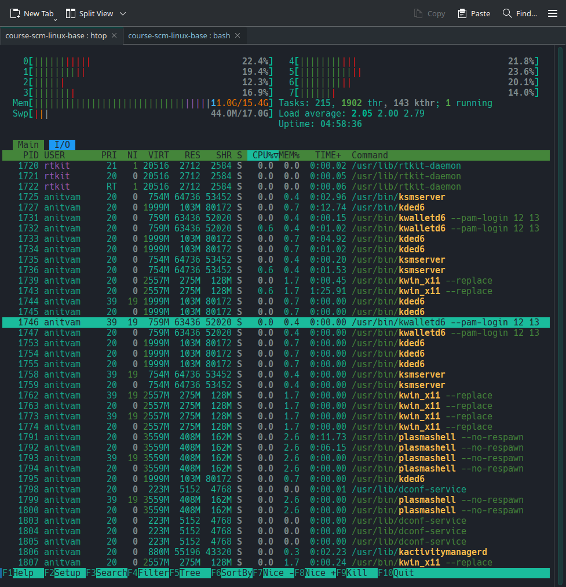

</div>
</div>

---


### Processi, segnali, e loro gestione


UNIX consente ai processi di inviare segnali ad altri processi.

I segnali sono numerici, e ciascuno ha un significato specifico.

Quelli più rilevanti per noi sono:

1. `SIGINT` (2) -- segnale che viene inviato alla pressione di <kbd>Ctrl</kbd><kbd>C</kbd>, che chiede al processo di terminare ordinatamente (simile a `SIGTERM`)
1. `SIGTERM` (15) -- segnale di terminazione, che chiede al processo di terminare ordinatamente
2. `SIGKILL` (9) -- segnale di terminazione forzata, che termina il processo immediatamente
4. `SIGSTOP` (19) -- segnale di pausa del processo, che lo sospende senza terminarlo
5. `SIGCONT` (18) -- segnale di continuazione del processo, che lo fa ripredere se attualmente sospeso

---


### Invio di segnali ai processi: `kill`

A dispetto del nome, il comando `kill` non "uccide" i processi, ma permette di inviare loro segnali.

Sintassi: `kill [opzioni] PID`.
Se nessuna opzione viene specificata, al processo target viene inviato un segnale `SIGTERM`.

Può essere inviato un segnale diverso sostituendo `SIG` con `-`, per esempio: `kill -KILL 6754` manda un `SIGKILL` al processo con PID 6754.

Con l'opzione `-s`, è possibile inviare un segnale in base al suo numero.
Il comando precedente è equivalente a `kill -s 9 6754`

### Invio di segnali a processi usando il nome: `killall`

Il comando `killall` è simile a `kill`, ma invece di prendere un PID,
prende un nome di processo e invia il segnale a tutti i processi che corrispondono a quel nome

---

### Load average

La prima riga di output del comando `top` riporta delle informazioni importanti per un amministratore di sistema,
infatti, esse mostrano da quanto tempo il computer è in esecuzione, quanti utenti sono attivi in un determinato momento e qual è il *load average* del sistema.

```console
$ top
top - 15:33:59 up  4:42,  2 users,  load average: 2,70, 6,53, 4,70
```

Il *load average* non è altro che la media del numero di processi in attesa di essere eseguiti dal processore.

La metrica mostra tre valori in quanto rappresentano la media per gli ultimi 1, 5 e 15 minuti d'esecuzione.

<br />

**Si può ottenere la stessa informazione eseguendo il comando `uptime`**

```console 
$ uptime
 16:06:02 up  5:14,  2 users,  load average: 1,02, 1,19, 1,77
```
---

### Amministrazione dei processi

I processi in esecuzione, scrivono importanti informazioni sull'andamento della loro esecuzione in file di `log`.

I file di log sono fondamentali per gestire un processo fallito in modo inaspettato e identificare una soluzione.

I file di log sono memorizzati nella cartella `/var/log` e possono essere di due formati: *log di sistema* (in binario) e *log di testo normale*. 

Gran parte delle applicazioni memorizzano utilizzando il servizio di log di sistema, per interagire con essi è necessario passare dall'utility di `journalctl`. 

---

### `journalctl`

<br />

#### `journalctl -b`
Filtra i log a partire dal riavvio più recente. Altrimenti l'output parte dai log più vecchi memorizzati.
È possibile specificare di quanti riavvii il journal deve filtrare gli output con degli indici negativi; 
se `0` indica il riavvio corrente, `-1` indica quello precedente e così via.

#### `journalctl -p err`
Filtra i log per livello di gravità "err".

#### `journalctl -k`
Filtra i log relativi al kernel.

#### `journalctl --since yesterday`
Filtra i log a partire dal giorno precedente.

#### `journalctl --since "2024-01-09" --until "2024-09-09"`
Filtra i log appartenenti ad un intervallo di tempo prestabilito, specificato con lo standard ISO 8601 (*YYYY-MM-DD*).  

#### `journalctl -f`
Mostra i log correnti e mostra i log in tempo reale nel terminale.

---

<div class='multiCol'>
<div class='col'>

#### Ma questi dati non saturano il disco a lungo termine?

{}

**Potenzialmente sì**.

Per questo motivo, a intervalli di tempo stabiliti, i file di log vengono *ruotati*, ovvero:
1. Rinominati 
2. Sostituiti da nuovi file di log
3. Compressi con gzip

Grazie alla rotazione dei log è quindi possibile ottimizzare lo spazio occupato da essi, seppur mantenendo la possibilità di analizzarli in futuro. 
`logrotate` è il comando che si occupa della rotazione dei file di log, configurato con il file di sistema `/etc/logrotate.conf`.

{}

</div>
<div class='col'>

{}

```console
$ cat /etc/logrotate.conf
# see "man logrotate" for details
# rotate log files weekly
weekly

# keep 4 weeks worth of backlogs
rotate 4

# restrict maximum size of log files
#size 20M

# create new (empty) log files after rotating old ones
create

# uncomment this if you want your log files compressed
#compress

# Logs are moved into directory for rotation
# olddir /var/log/archive

# Ignore pacman saved files
tabooext + .pacorig .pacnew .pacsave

# Arch packages drop log rotation information into this directory
include /etc/logrotate.d

/var/log/wtmp {
    monthly
    create 0664 root utmp
    minsize 1M
    rotate 1
}

/var/log/btmp {
    missingok
    monthly
    create 0600 root utmp
    rotate 1
}
```

{}

</div>
</div>

---

## 3. Networking

---

### Che cos'è Internet

*Internet* è una *rete* che interconnette *dispositivi* provenienti da tutto il mondo.

> Ci sono 5,16 miliardi utenti di Internet, il 64,4% della popolazione mondiale è ora online. 
> <br/> [Fonte](https://wearesocial.com/it/blog/2023/01/digital-2023-i-dati-globali/)


---

<div class='multiCol'>
<div class='col'>

### Host / End System

Tutti i dispositivi connessi ad internet sono chiamati *host* (o *end system*). 
*Host* perchè essi "ospitano" le applicazioni che utilizzano internet, *end system* perchè risiedono "ai bordi" rispetto alla vasta infrastruttura Internet. Sono host:
- pc desktop, 
- server, 
- dispositivi mobile (laptop, smartphone, tablet), 
- *"cose"* / *"things"* (smartwatch, smartfridge, ...) 

<br />
<br />

Gli host sono suddivisi in due categorie:
- *Server*: Computer ad alte prestazioni che conservano e distribuiscono dati / servizi in internet (pagine web, stream video, e-mail, ...)
- *Client*: Tutti gli altri dispositivi, che usufruiscono dei dati / servizi offerti dai server.

</div>
<div class='col text-center'>

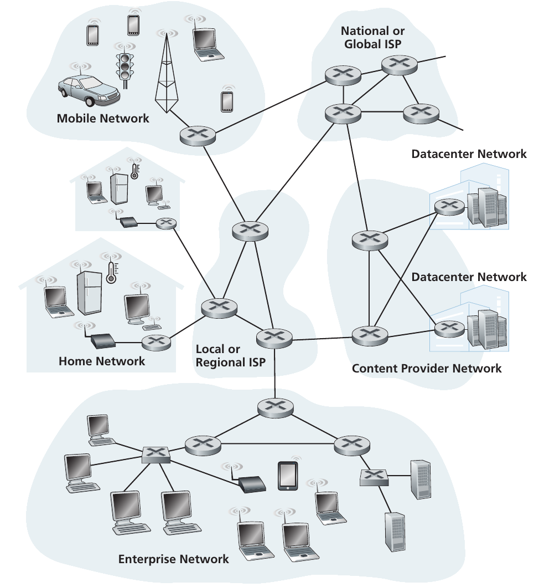

</div>
</div>

---

<div class='multiCol'>
<div class='col'>

### Packet Switches

Gli host sono connessi tra loro grazie a:
- Una *rete di connessioni* (*communication links*)
- Un insieme di *commutatori di pacchetti* (*packet switches*), grazie ai quali le informazioni (*pacchetti* di dati) vengono instradate verso la destinazione.

<br />
<br />

Esistono due principali tipi di commutatori di pacchetti:
- *Routers*: Connette dispositivi appartenenti a reti diverse
- *Switch*: Connette dispositivi appartenenti alla stessa rete

</div>
<div class='col text-center'>


  <small>

  Fonte: Computer Networking: A top-down approach - Kurose, Ross

  </small>
</img>

</div>
</div>

---

### Rete

È possibile distinguere due tipologie di rete:
- *Reti geografiche* (*Wide Area Network*, o *WAN*): coprono ampie distanze geografiche, consentendo la connessione tra siti distanti tra loro. Per farlo si connettono alle infrastrutture fornite dagli *Internet Service Provider* (*ISP*).
- *Reti locali* (*Local Area Network*, o *LAN*): progettate per coprire aree limitate (come aziende, abitazioni e campus).

---

<div class='multiCol'>
<div class='col'>

### Internet Service Provider (ISP)

Gli *ISPs* sono aziende che possiedono parte della complessa infrastruttura di rete, essi consentono agli utenti finali di stipulare contratti per accedere a Internet.

Esistono tre tipologie di ISP:
- *ISP di livello 1*: Sono in cima alla gerarchia e non pagano per il traffico che transita nella loro rete. Per coprire la più vasta area possibile geografica, questi fornitori di ISP si connettono tra loro, consentendo gratuitamente il traffico che transita da uno all'altro. Sono in tutto il mondo una dozzina di ISP.
- *ISP di livello 2*: Si connettono agli ISP di livello 1, pagando un canone per far transitare il loro traffico da una geolocalizzazione ad un'altra. Hanno una portata regionale/nazionale.
- *ISP di livello 3*: Sono quelli più vicini agli utenti finali, consentono ad essi l'accesso alla rete addebitando una somma di denaro. Questi ISP pagano gli ISP di livello 2 in base al traffico che fanno transitare. 

</div>
<div class='col text-center'>

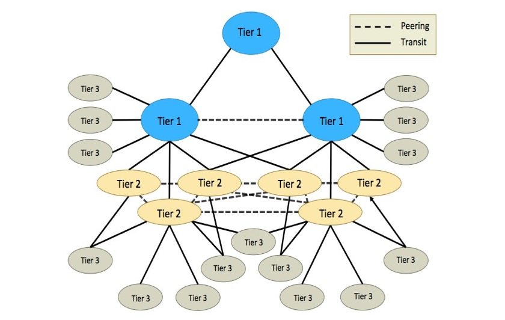

  <small>

  [Fonte](https://orhanergun.net/tier-1-tier-2-and-tier-3-service-providers)

  </small>
</img>
</div>
</div>

---

### Protocolli di rete

Compresa la complessa architettura della rete internet, si comprende quanto sia necessario che il transito delle informazioni al suo interno debba essere regolato. A questo scopo servono i *protocolli di rete*.

<br/>
<br/>

> Un protocollo definisce il formato e l'ordine dei messaggi scambiati tra due o più entità comunicanti, 
> come anche le azioni che bisogna intraprendere nel momento in cui si invia e/o riceve un messaggio.
> <br/> Computer Networking: A top-down approach - Kurose, Ross

---

<div class='multiCol'>
<div class='col'>

### TCP/IP

I protocolli di rete sono organizzati a *livelli* (*layers*). 

Ogni protocollo appartiene ad uno specifico livello, che può essere implementato via hardware, via software o una combinazione dei precedenti.

Internet si compone di uno *stack* di 5 livelli di protocolli, dall'alto:
- *Fisico*
- *Connessione*
- *Rete*
- *Trasporto*
- *Applicazione*

</div>
<div class='col text-center'>


</div>
</div>

---

### TCP/IP: Livello Fisico

Il ruolo del livello fisico è di far transitare le informazioni bit per bit sui canali che portano il messaggio a destinazione.

I protocolli che fanno parte di questo livello sono strettamente legati al mezzo utilizzato per far transitare le informazioni:
- *Doppino telefonico*: Uno dei mezzi di trasmissione più vecchi, proveniente dalle linee telefoniche fisse ma ancora molto utilizzato. È chiamato doppino perchè composto da due fili di rame intrecciati tra loro. 
- *Cavo coassiale*: Mezzo proveniente dalla trasmissione per la TV via cavo, sono più schermati dei doppini telefonici. Per questo motivo furono largamente utilizzati anche dalle compagnie telefoniche per le comunicazioni tra lunghe distanze. Sebbene per la TV via cavo è ancora molto utilizzato, le compagnie telefoniche sono transitate all'uso di tecnologie più performanti come *fibre ottiche*.
- *Fibra ottica*: Questa tecnologia si basa sul transito di un raggio di luce e viene impiegata per le trasmissioni a lunga distanza nelle dorsali di rete, nelle reti locali ad alta velocita (come alternativa al rame) e in alcuni casi anche per l'accesso ad alta velocità a Internet (*FTTH*, *Fiber To The Home*).
- *Onde radio*: Si basa sulla trasmissione tramite onde radio. Adatte per trasmissioni a medio raggio. Tecnologia alla base di *WiFi* e *Reti mobili*.

---

### Le dorsali 

<div class="multiCol">
<div class='col text-center'>

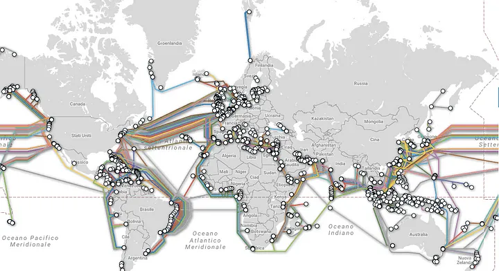 

  <small> 
  
  [Fonte](https://www.popinga.it/i-cavi-sottomarini-in-fibra-ottica-889f579d4049)
  
  </small>
</img>

</div>

<div class='col text-center'>

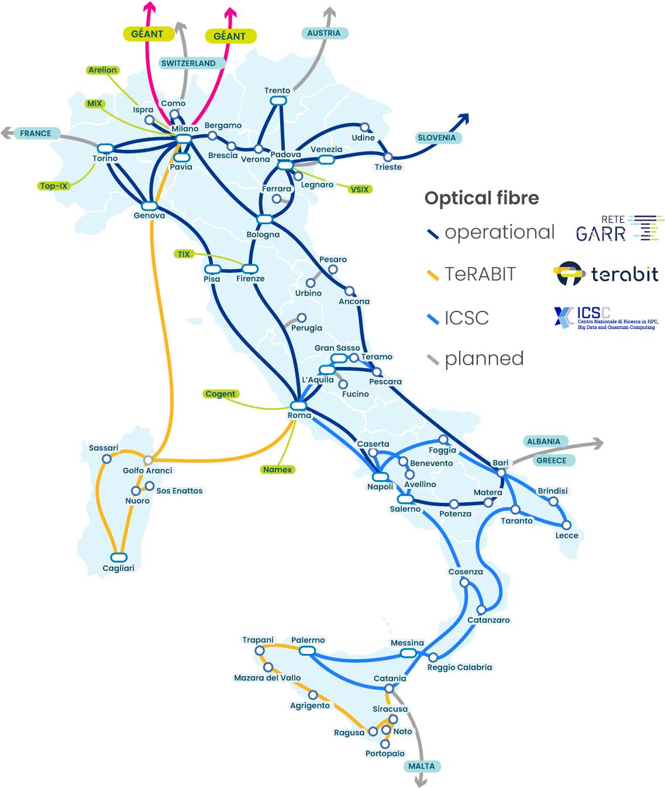 

  <small> 
  
  [Fonte](https://www.garr.it/it/infrastrutture/rete-nazionale/rete-garr-t)
  
  </small> 
</img>

</div>
</div>

---

### TCP/IP: Livello di Collegamento

<div class="multiCol">
<div class='col'>

Si occupa di instradare un pacchetto ricevuto da un livello di rete trasmettendolo al livello di rete dell'host destinatario. 
Per farlo, comunica bit per bit l'informazione che deve essere trasmessa.

A livello concettuale si può considerare che la comunicazione avviene tra due livelli di rete, anche se il percorso reale che l'informazione percorre passa dal livello fisico.

Il livello di collegamento inoltre verifica che non siano avvenuti *errori di trasmissione* e regola il *flusso* tra sorgente e destinatario.

Fanno parte di questo livello protocolli *Ethernet* (*IEEE 802.3*) e *WiFi* (*IEEE 802.11*).  

<br />
<br />

I pacchetti che transitano in questo livello di rete sono chiamati *frame*.

</div>
<div class='col text-center'>

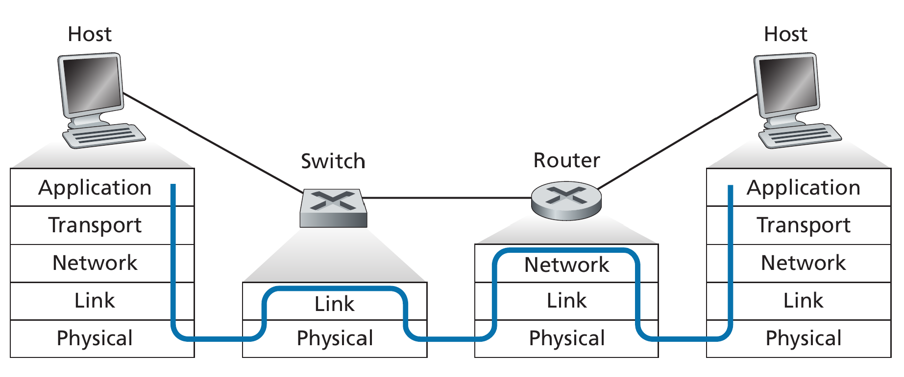

  <small> Fonte: Computer Networking: A top-down approach - Kurose, Ross </small>
</img>

</div>
</div>

---

<div class="multiCol">
<div class='col'>

#### Dov'è implementato il livello di collegamento?

Il livello di collegamento rappresenta il punto in cui i protocolli dello stack tcp/ip passano dall'essere implementati via software ad essere hardware (e viceversa). Infatti sono generalmente implementati da una combinazione di componenti hardware e software.

La maggior parte delle operazioni di questo livello risiede all'interno della scheda di rete di un host (*Network Interface Card* o *NIC*). 

</div>
<div class='col text-center'>

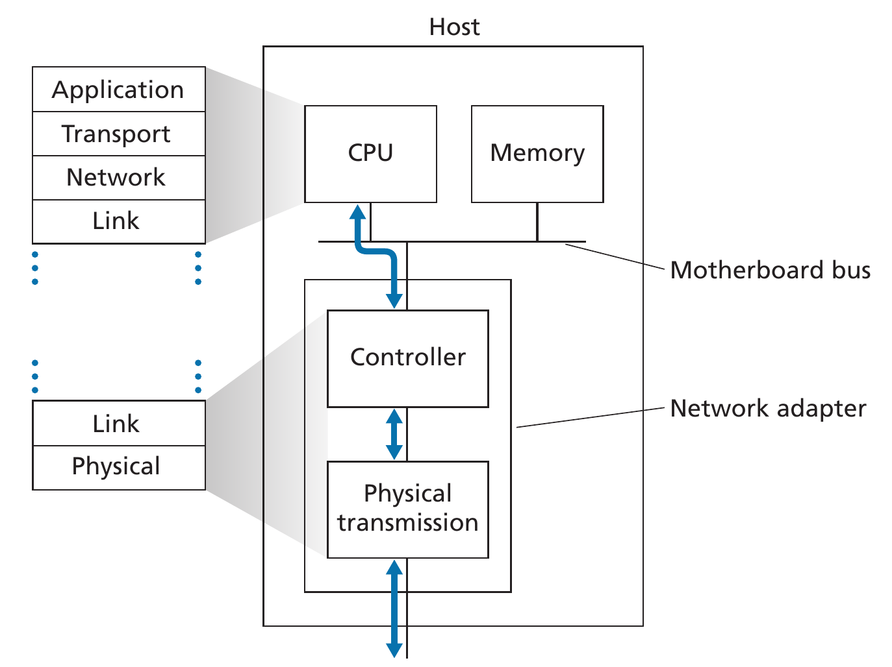

  <small> Fonte: Computer Networking: A top-down approach - Kurose, Ross </small>
</img>

</div>
</div>

---

#### Indirizzi MAC

Gli host e i router nella rete hanno assegnato un indirizzo a livello di collegamento, chiamato *MAC* (*Media Address Control* address). Gli switch invece no, perchè essi hanno solamente il compito di inoltrare il pacchetto da host a router (e viceversa) in modo trasparente.

*MAC* è un indirizzo di 6 byte, in notazione esadecimale, assegnato univocamente dai produttori delle schedere di rete al singolo dispositivo. 
Non esistono al mondo due schede di rete con lo stesso indirizzo *MAC*, perchè la loro distribuzione è regolamentata dalla *IEEE*.

Per trasportare le informazioni verso la destinazione corretta viene utilizzato l'indirizzo *MAC* di destinazione.

---

### TCP/IP: Livello Rete

Si occupa di: *inoltro* (*forwarding*) e *instradamento* (*routing*) corretto di un pacchetto verso l'host di destinazione, collocato in una rete differente.

L'inoltro è l'operazione per la quale viene ricevuto un pacchetto su una porta e viene ritrasmesso su un'altra.
L'instradamento invece si occupa di determinare il percorso migliore per raggiungere la destinazione.
Queste operazioni sono svolte dai *Router* e dagli *Switch di livello 3*.

Il protocollo *IP* (*Internet Protocol*) appartiene a questo livello, esso definisce non solo il formato dei messaggi che vengono trasmessi, ma anche l'indirizzo IP a livello di rete dell'interfaccia di rete dell'host destinatario di un certo messaggio. 
**Questo significa che un pc connesso a più reti avrà più indirizzi IP**.

<br />
<br />

I pacchetti che transitano in questo livello di rete sono chiamati *datagrammi*.

---

### Indirizzi IP (v4)

Al contrario degli indirizzi a livello di collegamento (MAC), gli indirizzi IP seguono una struttura gerarchica.

Gli indirizzi hanno una lunghezza di *32 bit* e si compongono di due parti:
- Una di *rete* di lunghezza variabile a partire dai bit a sinistra. 
- Una di *host* con i bit rimanenti.  

La parte di rete assume lo stesso valore per tutti gli host appartenenti alla stessa rete (ad esempio una LAN).
I dispositivi di una LAN quindi assumeranno uno degli ip appartenenti al blocco di indirizzi fissato dalla parte di rete (*sottorete*): tale blocco si chiama *prefisso*.

Gli indirizzi ip sono scritti in notazione decimale per ognuno dei 4 byte, intervallati da un punto, ad esempio: **128.208.2.151**.

I prefissi sono indicati fornendo l'indirizzo IP più basso del blocco di indirizzi e la dimensione bel blocco, intesa come numero di bit a partire da sinistra che lo identificano.
Per convenzione, la grandezza del blocco è scritta dopo l'indirizzo IP separata da uno slash ("/").

La lunghezza del prefisso non è altro che una *maschera* di bit che consente di estrarre l'indirizzo della rete dato un qualsiasi indirizzo ip con l'operazione di AND logico. 

---

### Maschera di rete

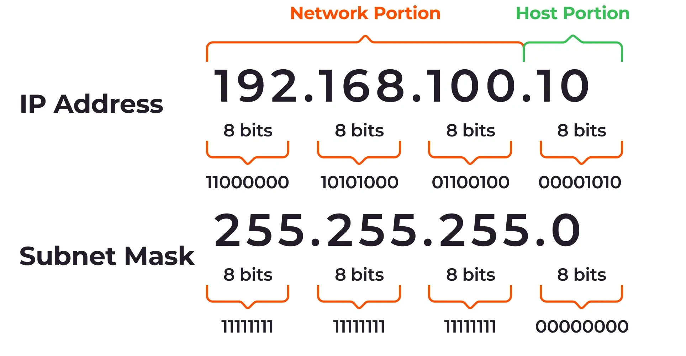

---

### ESERCIZIO 1

#### Quante sottoreti ci sono in questa topologia?

<div class="text-center">


<small> Fonte: Reti di calcolatori - Sesta Edizione - A. S. Tanenbaum et.al.  </small> 
</img>
</div>

---

### ESERCIZIO 1

#### Quante sottoreti ci sono in questa topologia?

<div class="text-center">
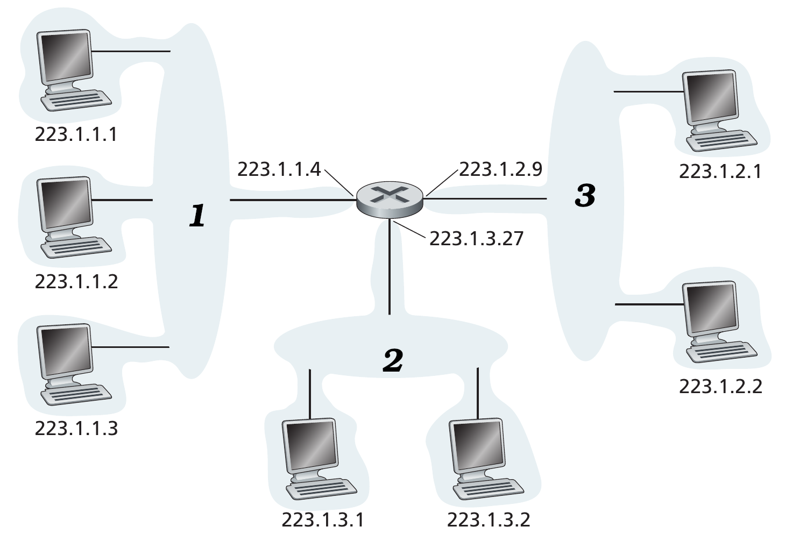

<small> Fonte: Reti di calcolatori - Sesta Edizione - A. S. Tanenbaum et.al.  </small> 
</img>
</div>

---

### ESERCIZIO 2

#### Qual è l'indirizzo che identifica ciascuna sottorete presente?

<div class="text-center">


<small> Fonte: Reti di calcolatori - Sesta Edizione - A. S. Tanenbaum et.al.  </small> 
</img>
</div>

---

### ESERCIZIO 2

{}

Partiamo da una sottorete, composta dagli indirizzi IP: $ 223.1.1.1, 223.1.1.2, 223.1.1.3, 223.1.1.4 $

**Qual è la parte di indirizzo che determina la sottorete?**

{}

{}

  $ 223.1.1.X $

{}

{}

**Quale maschera di rete consente di identificare questa sottorete?**

{}

{}

  $ 255.255.255.0 $

Ovvero, **24 bit**.

{}

{}

La rappresentazione della sottorete, di conseguenza sarà: $ 223.1.1.0/24 $

Lo stesso ragionamento si applica per le altre sottoreti.

{}

---

### Esercizio 2

<div class="text-center">
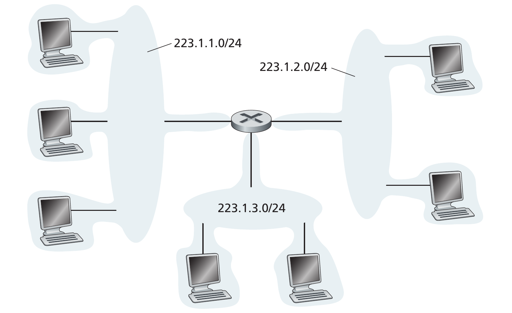

<small> Fonte: Reti di calcolatori - Sesta Edizione - A. S. Tanenbaum et.al.  </small> 
</img>
</div>

---

### Indirizzi IP (v4)

<div class="text-center">

$$ 2^{32} = 4294967296 \approx ~4,3 bil $$ 

</div>


Negli anni '80, quando è stato ideato il protocollo, si penso' fosse un numero più che sufficiente di indirizzi.

{}

**Spoiler: non sono bastati.**

La soluzione è quella di transitare verso l'utilizzo dell'aggiornato protocollo *IPv6*, la cui adozione è più lenta del previsto e ci vorranno anni prima di mandare in pensione IPv4.

{}

---

### NAT

Gli indirizzi IP sono distribuiti da un ente no-profit chiamato *ICANN* (*Internet Corporation for Assigned Names and Numbers*).
ICANN ha affidato la gestione di blocchi di indirizzi a enti regionali, che distribuiscono con parsimonia gli indirizzi gli ISP e alle aziende.

Una tecnica per poter utilizzare con parsimonia gli indirizzi IP è il *NAT* (*Network Address Translation*).
Ogni dispositivo connesso ad una rete locale riceve un indirizzo IP unico, valido solamente all'interno della rete locale.

Quando un dispositivo comunica verso l'esterno, il suo indirizzo ip viene tradotto dal NAT in quello pubblico assegnato dall'ISP.
Nel momento in cui viene inziata questa connessione, il NAT memorizza quale sorgente (della rete interna) e quale destinazione stanno comunicando, in modo da poter restituire alla sorgente la risposta ottenuta.

Sono consentiti solamente tre intervalli di indirizzi in una rete NAT:
- **192.168.0.0/16** (65.536 host)
- **172.16.0.0/12** (1.048.576 host)
- **10.0.0.0/8** (16.777.216 host)

---

### NAT

<div class="text-center">
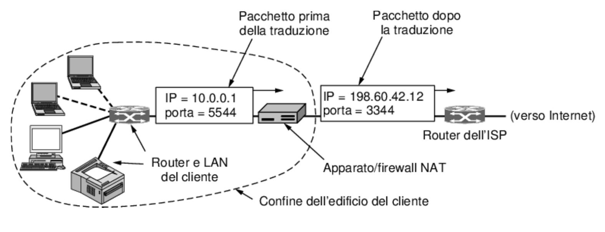

<small> Fonte: Reti di calcolatori - Sesta Edizione - A. S. Tanenbaum et.al.  </small> 
</img>
</div>

{}

**Ma... non manca qualcosa?**

{}

{}

Utilizzando il NAT **non** è possibile iniziare una comunicazione dall'esterno verso una macchina all'interno della rete locale.

Esistono tool per farlo, chiamati *NAT traversal*, che non vedremo in questo corso.

{}

---

### TCP/IP: Livello Trasporto

Si occupa di trasportare i messaggi provenienti dal livello applicazione verso destinazione.

I principali protocolli appartenenti a questo livello sono:
- *Transmission Control Protocol* o *TCP*: Fornisce un servizio *orientato alla connessione* al livello applicazione. TCP consente di garantire che il messaggio arrivi a destinazione e controllo del traffico dati e di congestione della rete. Per farlo suddivide il messaggio in segmenti più corti.
- *User Datagram Protocol* o *UDP*: Fornisce un servizio *senza connessione*, non fornisce garanzie che il messaggio arrivi a destinazione, non controlla il traffico dei dati e nemmeno la congestione della rete. Siccome non fornisce questi servizi, è un protocollo *veloce* e infatti viene adoperato in applicazioni critiche in termini di tempo: *gaming online*, *streaming video*, ...   

<br />
<br />

I pacchetti che transitano in questo livello di rete sono chiamati *segmenti*.

---

### TCP/IP: Livello Applicazione

Contiene tutti i protocolli utilizzati dalle applicazioni sugli host per comunicare tra loro. 

Fanno parte di questo livello: 
- *Hypertext Transfer Protocol* o *HTTP*: Utilizzato per il trasferimento di pagine web.
- *Simple Mail Transfer Protocol* o *SMTP*: Utilizato per il trasferimento di messaggi e-mail.
- *File Transfer Protocol* o *FTP*: Consente il trasferimento dei dati tra due hosts.
- *Dynamic Host Configuration Protocol* o *DHCP*: Protocollo che consente di assegnare in automatico un indirizzo IP ad un host.
- *Domain Name System* o *DNS*: Si occupa dell'assegnazione di nomi di dominio "user friendly" a indirizzi ip.
- *Network Time Protocol* o *NTP*: Protocollo che si occupa della sincronizzazione dell'orologio del computer. 

<br />
<br />

I pacchetti che transitano in questo livello di rete sono chiamati *messaggi*.

---

<div class="multiCol">
<div class='col'>

### DHCP

È un protocollo molto utile per gli amministratori di rete perchè consente di evitare la configurazione manuale di ogni dispositivo che vuole accedere ad una rete. 
DHCP, infatti, assegna un indirizzo IP a fronte di una richiesta.
Si tratta di un protocollo client-server, quindi di livello applicativo, che però configura l'interfaccia di rete del dispositivo, quindi la sua collocazione sullo stack TCP/IP varia in base alla fonte.

</div>
<div class='col text-center'>

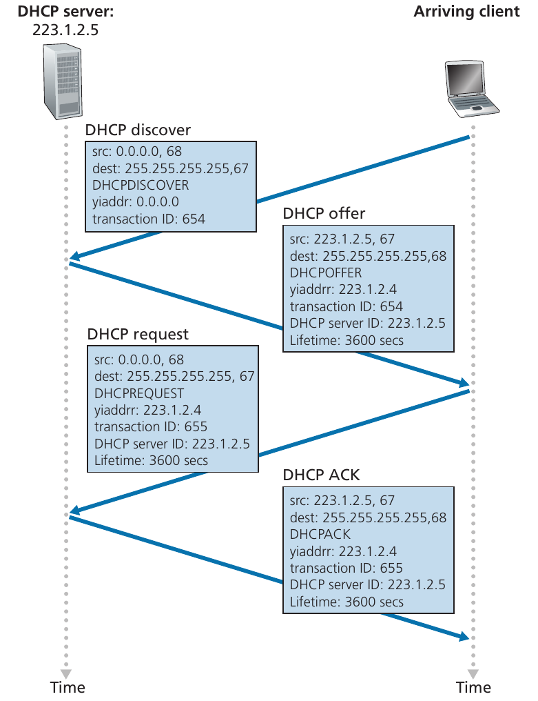

  <small> Fonte: Computer Networking: A top-down approach - Kurose, Ross </small>
</img>

</div>
</div>

---

<div class="multiCol">
<div class='col'>

### DHCP

Si compone di 4 fasi:
1. *DHCP Server discovery*: Un dispositivo si connette alla rete e manda un messaggio DHCP broadcast a tutti i dispositivi nella sottorete.
2. *DHCP Server offer*: Il server DHCP riceve il messaggio di discovery e manda anch'esso in broadcast una proposta di IP.
3. *DHCP Request*: Il client sceglie una delle offerte ricevute dal server DHCP e lo comunica al server.
4. *DHCP Ack*: Il server DHCP conferma l'assegnazione.  

</div>
<div class='col text-center'>


  <small> Fonte: Computer Networking: A top-down approach - Kurose, Ross </small>
</img>

</div>
</div>

---

### DNS

Gli host che offrono servizi possiedono un IP pubblicamente accessibile.

È complesso ricordare l'IP di ciascun sito web che si intende visitare, per questo motivo esistono gli *hostname* (come *www.google.com*).

Il compito del servizio *DNS* è quello di risolvere l'indirizzo IP di un determinato hostname.

<div class="text-center">

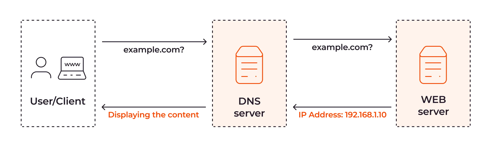
  <small> 

[Fonte](https://gcore.com/learning/dns-records-explained/) 
    
  </small>

</img>
</div>

---

### DNS

In realtà, *hostname* è una definizione generica. Un *Fully Qualified Domain Name* (*FQDN*) è il termine non ambiguo che identifica l'hostname destinazione che voglio contattare. 

<div class="text-center">

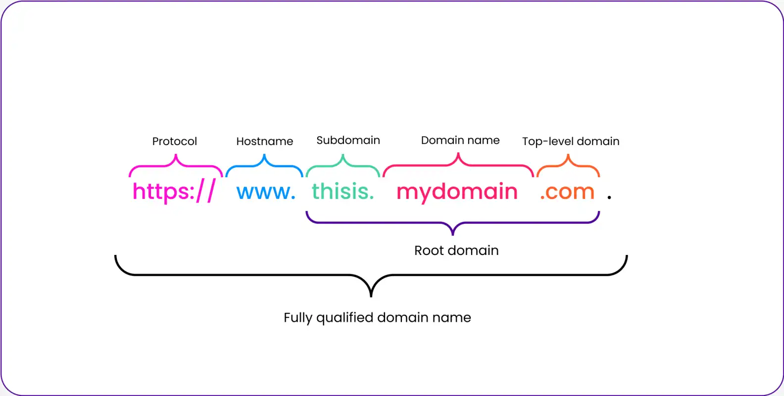
  <small> 

[Fonte](https://www.scaleway.com/en/docs/network/domains-and-dns/concepts/) 
    
  </small>

</img>
</div>

---

### DNS

<div class="multiCol">
<div class='col'>


Un *FQDN* ha una *struttura gerarchica*, che riflette l'infrattuttura del servizio DNS.

Per fornire un servizio adeguato al numero di richieste, esistono oltre 400 root server dislocati in tutto il mondo. 
Un elevato numero di repliche del servizio esiste anche per i top level domain.

DNS offre anche un servizio di *load balancing*, ovvero, per gli hostname a cui sono associati più server (quindi più indirizzi IP) per gestire le richieste, restituisce un IP differente per bilanciare il numero di richieste ad ogni host finale.

</div>
<div class='col text-center'>

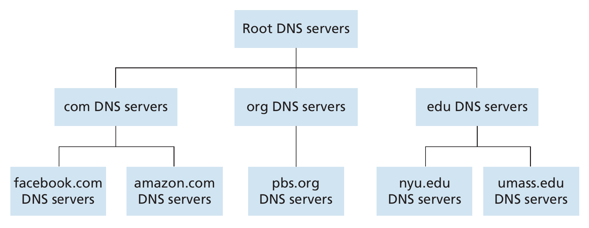

  <small> Fonte: Computer Networking: A top-down approach - Kurose, Ross </small>
</img>

</div>
</div>

---

### NTP

L’*NTP* time server fornisce meccanismi di protocollo fondamentali, necessari per sincronizzare l’ora di diversi sistemi con una precisione esatta al nanosecondo. 
Questo protocollo contiene anche dettagli sull’accuratezza e sulle probabili fonti d’errore dell'ora del sistema locale, oltre che sulle proprietà dell'orologio di riferimento. 


Per il processo di sincronizzazione NTP utilizza il *tempo coordinato universale* (*UTC*) adottato dai singoli client e server secondo un sistema gerarchico.

Come DNS, anche NTP presenta una struttura gerarchica, basata sulla presenza di *orologi atomici* sparsi in tutto il mondo.
L'orologio atomico è un tipo di orologio in cui la base del tempo è determinata dalla frequenza di risonanza di un atomo, che genera un segnale periodico di frequenza estremamente stabile e affidabile.

---

<div class='multiCol'>
<div class='col'>

### NTP

Nell'infrastruttura NTP ci sono server appartenenti al primo strato che sincronizzano il proprio tempo direttamente con gli orologi universali.

I server del secondo strato sincronizzano l'ora con i server appartenenti al primo livello, e così via, fino ad arrivare agli utenti finali.

</div>
<div class='col text-center'>

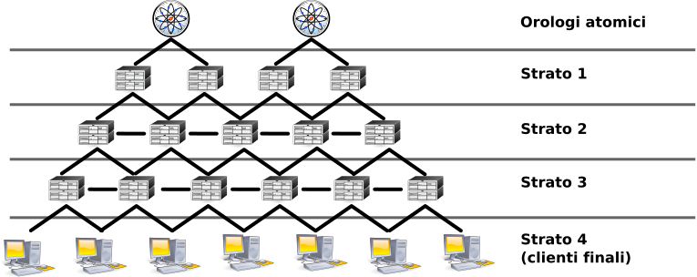
  <small> 

[Fonte](https://it.wikipedia.org/wiki/Network_Time_Protocol) 
    
  </small>

</img>

</div>
</div>


---

<div class='multiCol'>
<div class='col'>

### ISO OSI

Lo stack di protocolli TCP/IP non è l'unico esistente, negli anni '70 la International Organization of Standardisation (*ISO*) ha proposto uno stack composto da 7 livelli, chiamato *Open Systems Interconnection* (*OSI*).

Questo protocollo è stato proposto quando ancora TCP/IP era agli albori, quindi ha preso piede nella didattica e ancora oggi molti documenti fanno riferimento a questo stack. 

Lo stack ISO OSI estende la proposta TCP/IP con due layer aggiuntivi: 
- *Presentazione*: Ha il ruolo di "tradurre" il contenuto di messaggi scambiati tra due applicazioni. Fanno parte di questo layer protocolli di *cifratura* e *compressione*. 
- *Sessione*: Ha il ruolo di sincronizzare e delimitare temporalmente il traffico.

</div>
<div class='col text-center'>


</div>
</div>

---

<div class='multiCol'>
<div class='col'>

**Perchè questi layer non sono presenti nello stack TCP/IP? Non servono?**

{}

Per il protocollo TCP/IP l'implementazione di questi protocolli è a _discrezione dell'utente_. 
Questo significa che se è necessaria, verrà implementata direttamente nel livello di applicazione.

{}

</div>
<div class='col text-center'>

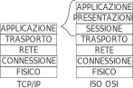

</div>
</div>

---

### Networking in Linux

Il networking di un sistema Linux si basa sulla configurazione delle *interfacce*.

Linux supporta diversi tipi di interfacce, dove le più comuni sono quelle fisiche, che tratteremo in questo modulo.

Esistono anche interfacce di rete virtuali (*VLAN*) e interfacce *bridge* che possono essere configurate per scopi particolari, come ad esempio la virtualizzazione.

---

### Comando `ip`

<br />

#### `ip link list`
Consente di visualizzare la lista delle interfacce di rete configurate all'interno della macchina, insieme al loro *stato*.

```console
$ ip link list
1: lo: <LOOPBACK,UP,LOWER_UP> mtu 65536 qdisc noqueue state UNKNOWN mode DEFAULT group default qlen 1000
    link/loopback 00:00:00:00:00:00 brd 00:00:00:00:00:00
2: wlo1: <BROADCAST,MULTICAST,UP,LOWER_UP> mtu 1500 qdisc noqueue state UP mode DORMANT group default qlen 1000
    link/ether f4:d1:08:a5:11:bc brd ff:ff:ff:ff:ff:ff
    altname wlp0s20f3
```

Le parentesi angolari danno informazioni immediate riguardo alle interfacce che sto analizzando:
- *UP*: Significa che l'interfaccia è abilitata
- *DOWN*: Significa che l'interfaccia **non** è abilitata
- *LOWER_UP*: Significa che il collegamento dell'interfaccia è attivo
- *NO_CARRIER*: Significa che l'interfaccia è abilitata, ma non ha nessun collegamento 

Un'altra informazione importante visibile in questo output è l'indirizzo *MAC* associato a ciascuna interfaccia.

---

### Comando `ip`

<br />

#### `ip addr list`

Oltre a mostrare le informazioni legate allo stato delle interfacce di rete disponibili, mostra quali sono gli IP (v4 e v6) associati a tali interfacce.

```console
$ ip addr list
1: lo: <LOOPBACK,UP,LOWER_UP> mtu 65536 qdisc noqueue state UNKNOWN group default qlen 1000
    link/loopback 00:00:00:00:00:00 brd 00:00:00:00:00:00
    inet 127.0.0.1/8 scope host lo
       valid_lft forever preferred_lft forever
    inet6 ::1/128 scope host noprefixroute 
       valid_lft forever preferred_lft forever
2: wlo1: <BROADCAST,MULTICAST,UP,LOWER_UP> mtu 1500 qdisc noqueue state UP group default qlen 1000
    link/ether f4:d1:08:a5:11:bc brd ff:ff:ff:ff:ff:ff
    altname wlp0s20f3
    inet 172.20.10.5/28 brd 172.20.10.15 scope global dynamic noprefixroute wlo1
       valid_lft 86133sec preferred_lft 86133sec
    inet6 fe80::2171:37c:1573:7e67/64 scope link noprefixroute 
       valid_lft forever preferred_lft forever
```

---

### Interfaccia di loopback

È una scheda di rete virtuale, sempre presente e sempre *UP*, anche se il pc non è connesso ad internet, che consente di gestire una porzione di traffico senza passare dalla scheda di rete.

Nelle reti di computer, l'interfaccia di loopback permette la comunicazione tra processi, ma esclusivamente tra processi che sono eseguiti nella stessa macchina. 

Un esempio tipico di utilizzo è quello in cui si deve testare il funzionamento di un server web, realizzando una connessione con un client eseguito sulla stessa macchina su cui è eseguito anche il server.

---

### Abilitare/Disabilitare una interfaccia

#### `ip link set <interface> <status>`
```console
$ ip link list wlo1
2: wlo1: <BROADCAST,MULTICAST,UP,LOWER_UP> mtu 1500 qdisc noqueue state UP mode DORMANT group default qlen 1000
    link/ether f4:d1:08:a5:11:bc brd ff:ff:ff:ff:ff:ff
    altname wlp0s20f3
$ ip link set wlo1 down
$ ip link list wlo1
2: wlo1: <BROADCAST,MULTICAST> mtu 1500 qdisc noqueue state DOWN mode DORMANT group default qlen 1000
    link/ether f4:d1:08:a5:11:bc brd ff:ff:ff:ff:ff:ff
    altname wlp0s20f3
$ ip link set wlo1 up
2: wlo1: <BROADCAST,MULTICAST,UP,LOWER_UP> mtu 1500 qdisc noqueue state UP mode DORMANT group default qlen 1000
    link/ether f4:d1:08:a5:11:bc brd ff:ff:ff:ff:ff:ff
    altname wlp0s20f3

```

L'assenza del *NO_CARRIER* quando l'interfaccia è *DOWN* mi consente si sapere che l'interfaccia è *amministrativamente* disabilitata, e non è un problema di collegamento.


---

### Assegnare un IP ad una interfaccia di rete

#### `ip addr add <ip>/<subnet_mask> dev <interface>`

```console
$ ip addr list wlo1
2: wlo1: <BROADCAST,MULTICAST,UP,LOWER_UP> mtu 1500 qdisc noqueue state UP group default qlen 1000
    link/ether f4:d1:08:a5:11:bc brd ff:ff:ff:ff:ff:ff
    altname wlp0s20f3
    inet 172.20.10.5/28 brd 172.20.10.15 scope global dynamic noprefixroute wlo1
       valid_lft 86085sec preferred_lft 86085sec
    inet6 fe80::2171:37c:1573:7e67/64 scope link noprefixroute 
       valid_lft forever preferred_lft forever
$ ip addr add 172.20.10.6/28 dev wlo1
2: wlo1: <BROADCAST,MULTICAST,UP,LOWER_UP> mtu 1500 qdisc noqueue state UP group default qlen 1000
    link/ether f4:d1:08:a5:11:bc brd ff:ff:ff:ff:ff:ff
    altname wlp0s20f3
    inet 172.20.10.5/28 brd 172.20.10.15 scope global dynamic noprefixroute wlo1
       valid_lft 86019sec preferred_lft 86019sec
    inet 172.20.10.6/28 scope global secondary wlo1
       valid_lft forever preferred_lft forever
    inet6 fe80::2171:37c:1573:7e67/64 scope link noprefixroute 
       valid_lft forever preferred_lft forever
```

Siccome la mia interfaccia aveva già assegnato un indirizzo, il comando eseguito non cancella quello precedente, ma aggiunge semplicemente un IP alternativo a quello principale. Per rimuoverlo posso utilizzare il comando `ip addr del 172.20.10.6/28 dev wlo1`.

---

### Come rendere le configurazioni permanenti

Tutto ciò che viene eseguito con il comando `ip` in un terminale non è *persistente*. 
Questo significa che al riavvio della macchina tutte le modifiche saranno eliminate.

Storicamente nei sistemi *Ubuntu* una configurazione di rete persistente al riavvio richiedeva la modifica manuale del file `/etc/network/interfaces`, il cui contenuto descrive tutte le informazioni necessarie per configurare le interfacce di rete.

I sistemi più recenti, però, hanno sostituito la gestione della rete con nuovi strumenti come:
 - *NetworkManager* per installazioni linux Desktop
 - *systemd-networkd* per installazioni linux Server

---


#### /etc/network/interfaces

```console
# The loopback interface.

auto lo
iface lo inet loopback
 
# An example ethernet card setup: (broadcast and gateway are optional)

auto eth0
iface eth0 inet static
     address 192.168.0.42
     network 192.168.0.0
     netmask 255.255.255.0
     broadcast 192.168.0.255
     gateway 192.168.0.1

auto eth1
iface eth1 inet dhcp

```

---

### Tabella di instradamento degli ip nel mio host

#### `ip route list`
```console
$ ip route list
default via 172.20.10.1 dev wlo1 proto dhcp src 172.20.10.5 metric 600 
172.20.10.0/28 dev wlo1 proto kernel scope link src 172.20.10.5 metric 600 
```

So che il mio *default gateway* è `172.20.10.1`, che è l'indiririzzo del router nella mia sotto-rete che mi consente la comunicazione verso l'esterno.

La comunicazione di default avverrà con l'interfaccia di rete `wlo1`, al quale è associato l'ip `172.20.10.5`.

Tutte le comunicazioni per la sottorete `172.20.10.0/28` passeranno per l'interfaccia di rete `wlo1`.

---

### wpa_supplicant

Per connettersi ad una rete WiFi (*IEEE 802.11X*) è necessario utilizzare il protocollo di sicurezza *WPA*.

*wpa supplicant* è un demone di sistema che consente di gestire proprio questo tipo di connesioni.

#### `iwlist scan`

Consente di effettuare una scansione per individuare gli `SSID` raggiungibili dalla connessione WiFi del mio computer.

```console 
$ iwlist scan
...
lo        Interface doesn't support scanning.

wlo1      Scan completed :
          Cell 01 - Address: 16:41:A5:B5:E5:0F
                    Channel:6
                    Frequency:2.437 GHz (Channel 6)
                    Quality=63/70  Signal level=-47 dBm  
                    Encryption key:on
                    ESSID:"iPhone di Martina"
                    Bit Rates:1 Mb/s; 2 Mb/s; 5.5 Mb/s; 11 Mb/s; 18 Mb/s
                              24 Mb/s; 36 Mb/s; 54 Mb/s
                    Bit Rates:6 Mb/s; 9 Mb/s; 12 Mb/s; 48 Mb/s
[...]
 Cell 03 - Address: D8:44:89:27:7F:42
                    Channel:1
                    Frequency:2.412 GHz (Channel 1)
                    Quality=45/70  Signal level=-65 dBm  
                    Encryption key:on
                    ESSID:"anitvam-home"
                    Bit Rates:1 Mb/s; 2 Mb/s; 5.5 Mb/s; 11 Mb/s; 9 Mb/s
                              18 Mb/s; 36 Mb/s; 54 Mb/s
                    Bit Rates:6 Mb/s; 12 Mb/s; 24 Mb/s; 48 Mb/s

[...]

```

---

### Generazione di un file di autenticazione

#### `wpa_passphrase <SSID> <PASSWORD> > wpa.conf`
#### `wpa_passphrase <SSID> > wpa.conf`
Consentono di generare un file di configurazione chiamato `wpa.conf` che conterrà l'SSID dell'access point al quale voglio connettermi e la mia password hashata.

È possibile omettere la password per poterla inserire da standard input

### Associazione ad una rete WiFi

#### `wpa_supplicant -i<interfaccia> -c<percorso_assoluto>/wpa.conf`
Il processo non viene fatto di default in background, per farlo bisogna passare il flag `-B`

### Ottenere un indirizzo ip tramite DHCP
#### `dhclient wlo1`
Ottengo così un indirizzo ip sfruttando DHCP installato nel mio router.

---

### Devo fare tutte le volte questi passaggi?

In realtà no, perchè queste configurazioni di basso livello sono già fornite all'interno dei tool di più alto livello citati in precedenza, ovvero *NetworkManager* e *systemd-networkd*. 

<div class="multiCol">
<div class='col'>

#### Systemd-networkd
Questo tool è fornito solitamente con le distribuzioni server, si configura interamente attraverso file di configurazione che risiedono nel file `/etc/systemd/network`.


</div>
<div class='col'>

#### Network Manager
Tool fornito nelle distribuzioni Desktop di Linux. 

Tipicamente si configura utilizzando direttamente l'interfaccia grafica, però esso fornisce una utility da linea di comando che consente di effettuare le operazioni di `ip`, `wpa_cli` e `dhclient` sopra citate.

</div>
</div>

---

### Come testare la mia connettività di rete

#### `ping` <host>
L'utility `ping` manda a raffica dei pacchetti all'host destinazione. 
Quando la destinazione riceve un messaggio di ping risponde al mittente, e il comando tiene traccia del tempo che il specifico messaggio ha impiegato per andare a destinazione e tornare indietro.

Il monitoraggio del tempo di transito di questo pacchetto consente di verificare l'efficienza della comunicazione di rete.

Posso specificare come host un indirizzo ip o un hostname.

```console
$ ping google.com
ping google.com
PING google.com (142.251.209.46) 56(84) bytes of data.
64 bytes from mil04s51-in-f14.1e100.net (142.251.209.46): icmp_seq=1 ttl=116 time=29.3 ms
64 bytes from mil04s51-in-f14.1e100.net (142.251.209.46): icmp_seq=2 ttl=116 time=70.7 ms
64 bytes from mil04s51-in-f14.1e100.net (142.251.209.46): icmp_seq=3 ttl=116 time=67.6 ms
64 bytes from mil04s51-in-f14.1e100.net (142.251.209.46): icmp_seq=4 ttl=116 time=64.1 ms
[...]
```

---

### Altri strumenti di diagnostica utili

<div class="multiCol">
<div class='col'>

#### `traceroute`
Fornisce una mappa del percorso compiuto dai dati su Internet dall’origine alla destinazione, mostrando il percorso compiuto dal pacchetto.

```console
$ traceroute 8.8.8.8
traceroute to 8.8.8.8 (8.8.8.8), 30 hops max, 60 byte packets
1  _gateway (172.20.10.1)  6.582 ms  6.438 ms  6.377 ms
2  * * *
3  192.168.9.46 (192.168.9.46)  72.874 ms * *
4  192.168.255.19 (192.168.255.19)  73.690 ms  73.645 ms  73.601 ms
5  ppp176-paris2.isdnet.net (194.149.182.176)  80.137 ms * *
6  * * 194.149.189.58 (194.149.189.58)  70.836 ms
7  * * *
8  * * *
9  dns.google (8.8.8.8)  74.866 ms  76.534 ms  37.069 ms
```

</div>
<div class='col'>

#### `nslookup`
Consente di effettuare delle query DNS per ottenere l'indirizzo ip associato ad un hostname.

```console
$ nslookup google.com
Server:         172.20.10.1
Address:        172.20.10.1#53

Non-authoritative answer:
Name:   google.com
Address: 142.251.209.46
Name:   google.com
Address: 2a00:1450:4002:414::200e
```

L'indirizzo verso il quale rivolgo le mie query DNS in questo caso è il gateway appartenente alla mia rete locale, che a sua volta instraderà il messaggio verso il DNS di destinazione. 

È possibile modificare il server a cui porre le query modificando il file di sistema `/etc/resolv.conf`

</div>
</div>

È possibile configurare una tabella di risoluzione di ip locale, che il pc consulta prima di inoltrare la richiesta al DNS server, utile in caso si hanno degli ip noti nella rete locale ai quali si vuole associare un hostname valido solo nel mio pc.
Per farlo posso aggiungere delle entry al file `/etc/hosts`.
