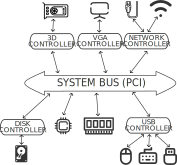
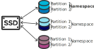

+++

title = "Basi di Linux, secondo modulo"
description = "Corso Linux Base @SCM Group"
outputs = ["Reveal"]
aliases = [
  "1"
]

[reveal_hugo]
custom_theme = "martina-theme.scss"
custom_theme_compile = true

+++

# BASI DI LINUX, SECONDO MODULO

## [Martina Baiardi](mailto:m.baiardi@unibo.it)

### Compiled {}

---

# Macro argomenti

## 1. Gestione periferiche

## 2. Strumenti di analisi e gestione dei processi

## 3. Networking

---

## 1. Gestione periferiche

---


<div class='multiCol'>
<div class='col text-center'>



</div>
<div class='col'>

### Connessione delle periferiche

- Tutte le periferiche sono connesse tramite un bus standard *PCI* (*Peripheral Component Interconnect*)
- Alcune di esse comunicano direttamente con il bus, altre tramite i *controller*
- I controller regolano I/O con i dispositivi, alcuni sono direttamente integrati nella periferica (es. dischi), 
altri invece consentono di utilizzare protocolli standard per connettersi a periferiche esterne (es. controller USB)


**Ogni pc ha una diversa configurazione delle periferiche, l'immagine è solamente un esempio semplificato di una configurazione.**

</div>
</div>

---

### Analisi delle periferiche connesse al bus PCI

### `lspci`

```console
$ lspci
00:00.0 Host bridge: Intel Corporation Coffee Lake HOST and DRAM Controller (rev 0b)
00:02.0 VGA compatible controller: Intel Corporation WhiskeyLake-U GT2 [UHD Graphics 620]
00:04.0 Signal processing controller: Intel Corporation Xeon E3-1200 v5/E3-1500 v5/6th Gen Core Processor Thermal Subsystem (rev 0b)
00:08.0 System peripheral: Intel Corporation Xeon E3-1200 v5/v6 / E3-1500 v5 / 6th/7th/8th Gen Core Processor Gaussian Mixture Model
00:12.0 Signal processing controller: Intel Corporation Cannon Point-LP Thermal Controller (rev 30)
00:14.0 USB controller: Intel Corporation Cannon Point-LP USB 3.1 xHCI Controller (rev 30)
00:14.2 RAM memory: Intel Corporation Cannon Point-LP Shared SRAM (rev 30)
00:14.3 Network controller: Intel Corporation Cannon Point-LP CNVi [Wireless-AC] (rev 30)
00:15.0 Serial bus controller: Intel Corporation Cannon Point-LP Serial IO I2C Controller #0 (rev 30)
00:15.1 Serial bus controller: Intel Corporation Cannon Point-LP Serial IO I2C Controller #1 (rev 30)
00:16.0 Communication controller: Intel Corporation Cannon Point-LP MEI Controller #1 (rev 30)
00:1c.0 PCI bridge: Intel Corporation Cannon Point-LP PCI Express Root Port #1 (rev f0)
00:1c.4 PCI bridge: Intel Corporation Cannon Point-LP PCI Express Root Port #5 (rev f0)
00:1d.0 PCI bridge: Intel Corporation Cannon Point-LP PCI Express Root Port #9 (rev f0)
00:1d.4 PCI bridge: Intel Corporation Cannon Point-LP PCI Express Root Port #13 (rev f0)
00:1e.0 Communication controller: Intel Corporation Cannon Point-LP Serial IO UART Controller #2 (rev 30)
00:1e.2 Serial bus controller: Intel Corporation Cannon Point-LP Serial IO SPI Controller (rev 30)
00:1f.0 ISA bridge: Intel Corporation Cannon Point-LP LPC Controller (rev 30)
00:1f.3 Audio device: Intel Corporation Cannon Point-LP High Definition Audio Controller (rev 30)
00:1f.4 SMBus: Intel Corporation Cannon Point-LP SMBus Controller (rev 30)
00:1f.5 Serial bus controller: Intel Corporation Cannon Point-LP SPI Controller (rev 30)
02:00.0 3D controller: NVIDIA Corporation GP108M [GeForce MX150] (rev a1)
04:00.0 Non-Volatile memory controller: Sandisk Corp WD Blue SN500 / PC SN520 x2 M.2 2280 NVMe SSD (rev 01)
```

### `lspci -tv`

Con l'aggiunta dei flag `-t` (visione ad albero) e `-v` (mostra tutte le informazioni) è possibile avere una visione gerarchica dei dispositivi connessi al bus PCI 

---

#### Perchè alcune periferiche sono assenti da questa lista? 

Perchè significa che tali dispositivi non sono direttamente connessi al bus, ma passano per un controller. 
Ad esempio, tutti i miei dispositivi USB sono connessi al *controller USB*, che a sua volta è connesso al bus pci, il quale infatti è presente nella lista sopra.

### `lsusb`

```console
$ lsusb
Bus 001 Device 001: ID 1d6b:0002 Linux Foundation 2.0 root hub
Bus 001 Device 002: ID 13d3:56cb IMC Networks USB2.0 HD IR UVC WebCam
Bus 001 Device 003: ID 8087:0aaa Intel Corp. Bluetooth 9460/9560 Jefferson Peak (JfP)
Bus 001 Device 013: ID ffff:5678 USB Disk 2.0
Bus 002 Device 001: ID 1d6b:0003 Linux Foundation 3.0 root hub
Bus 002 Device 003: ID 152d:0578 JMicron Technology Corp. / JMicron USA Technology Corp. JMS578 SATA 6Gb/s
```

### `lsusb -tv`
```console
/:  Bus 001.Port 001: Dev 001, Class=root_hub, Driver=xhci_hcd/12p, 480M
    ID 1d6b:0002 Linux Foundation 2.0 root hub
    |__ Port 002: Dev 036, If 0, Class=Mass Storage, Driver=usb-storage, 480M
        ID ffff:5678 USB Disk 2.0
    |__ Port 005: Dev 002, If 0, Class=Video, Driver=uvcvideo, 480M
        ID 13d3:56cb IMC Networks 
    |__ Port 005: Dev 002, If 1, Class=Video, Driver=uvcvideo, 480M
        ID 13d3:56cb IMC Networks 
    |__ Port 005: Dev 002, If 2, Class=Video, Driver=uvcvideo, 480M
        ID 13d3:56cb IMC Networks 
    |__ Port 005: Dev 002, If 3, Class=Video, Driver=uvcvideo, 480M
        ID 13d3:56cb IMC Networks 
    |__ Port 010: Dev 003, If 0, Class=Wireless, Driver=btusb, 12M
        ID 8087:0aaa Intel Corp. Bluetooth 9460/9560 Jefferson Peak (JfP)
    |__ Port 010: Dev 003, If 1, Class=Wireless, Driver=btusb, 12M
        ID 8087:0aaa Intel Corp. Bluetooth 9460/9560 Jefferson Peak (JfP)
/:  Bus 002.Port 001: Dev 001, Class=root_hub, Driver=xhci_hcd/6p, 10000M
    ID 1d6b:0003 Linux Foundation 3.0 root hub
    |__ Port 001: Dev 005, If 0, Class=Mass Storage, Driver=uas, 5000M
        ID 152d:0578 JMicron Technology Corp. / JMicron USA Technology Corp. JMS578 SATA 6Gb/s
```


---


<div class='multiCol'>
<div class='col text-center'>


</div>
<div class='col'>

### Driver 

I *driver* sono moduli software di basso livello che consentono al sistema operativo di pilotare un dispositivo hardware. 
Un insieme di driver standard sono già previsti all'interno del sistema operativo, per dispositivi particolari potrebbe essere necessario installare driver aggiuntivi.

Il sistema operativo espone poi delle interfacce standard per interagire con i dispositivi in modo **trasparente** per l'applicazione utente.

</div>
</div>

---


<div class='multiCol'>
<div class='col text-center'>


</div>
<div class='col'>

### File dispositivo

La filosofia *"everything is a file"* si applica anche per le periferiche connesse alla macchina,
infatti esistono dei file speciali nella cartella */dev* che sono la rappresentazione nel file system dei dispositivi.

Essendo dei file, il loro contenuto può essere analizzato come se fossero come tutti gli altri (utilizzando comandi come `cat`, `ls`, ...),
però essi rappresentano delle interfacce di basso livello che le applicazioni utente possono utilizzare per interagire con i dispositivi con operazioni di I/O. 

</div>
</div>

---


<div class='multiCol'>
<div class='col text-center'>

### File dispositivo

All'interno della cartella */dev* risiedono due categorie di file: 
- **Character special files (c)**: I/O basato sullo scambio di singoli caratteri (di dimensione 1 byte). Fanno parte di questa categoria dispotivi come *mouse*, *tastiere* e *schede audio*.
- **Block special files (b)**: I/O basato sullo scambio di *blocchi* di dati. Fanno parte di questa categoria *usb* e *hard disk*.

</div>
<div class='col'>

```console
$ ls -alh /dev
total 4,0K
drwxr-xr-x  21 root root            4,3K  5 set 12.54 .
drwxr-xr-x  18 root root            4,0K  4 set 15.30 ..
[...]
drwxr-xr-x   3 root root           60 21 ago 09.36 bus
drwxr-xr-x   2 root root         4,8K  5 set 17.26 char
[...]
drwxr-xr-x   4 root root          400  5 set 17.26 input
[...]
crw-rw-rw-   1 root root     1,     3  2 set 14.47 null
crw-------   1 root root   241,     0  2 set 14.47 nvme0
brw-rw----   1 root disk   259,     0  2 set 14.47 nvme0n1
brw-rw----   1 root disk   259,     1  2 set 14.47 nvme0n1p1
brw-rw----   1 root disk   259,     2  2 set 14.47 nvme0n1p2
brw-rw----   1 root disk   259,     3  2 set 14.47 nvme0n1p3
[...]
crw-rw-rw-   1 root root     1,     8  2 set 14.47 random
[...]
brw-rw----   1 root disk     8,     0  2 set 14.47 sda
brw-rw----   1 root disk     8,     1  2 set 14.47 sda1
brw-rw----   1 root disk     8,     2  2 set 14.47 sda2
[...]
```

</div>
</div>

---

### Character device

Per comprendere meglio che cos'è un device che comunica tramite un *character special file*, consideriamo il mouse.

Tutti i file all'interno della directory `/dev/input` consentono la comunicazione con le periferiche di input del nostro sistema (ad esempio: tastiera, mouse, webcam, ...).

All'interno della directory `/dev/input/by-path` è possibile esplorare i dispositivi in maniera "user-friendly". 

<br />

**Domanda**: Cosa succede eseguendo il comando `cat /dev/input/mice`?

{}
Sto visualizzando i byte che il mio mouse invia al sistema operativo ad ogni movimento!
{}


---

### /dev/sd[a-z][1-15]

Associati al file con prefisso *sd* (SCSI Disk) storicamente si potevano individuare tutti i dispositivi che utilizzavano SCSI (stampanti, scanner, hard disk, ...), oggi il protocollo è in disuso, ma i sistemi Linux continuano a indirizzare hark disk (SCSI, IDE e SATA) e chiavette USB a questo percorso. 

- `/dev/sda` rappresenta il primo hard disk, `/dev/sbd` il secondo, e così via. 

In caso il dispositivo presenti delle **partizioni**, esse sono rappresentate con un numero posto accanto al nome del dispositivo.

- `/dev/sda1` è la prima partizione, `/dev/sda2` la seconda, e così via.

---

### /dev/nvme[0-N]n[1-N]p[0-15]

Viene associato a tutti i dispositivi che utilizzano *NVM Express* (*NVMe*) come tecnologia per accedere al dispositivo di memoria non-volatile.
Viene comunemente utilizzato per i *dischi a stato solido* (*SSD*).

All'interno della cartella */dev* è possibile distinguere:
- Il character device `/dev/nvme0` che rappresenta il **controller** del primo disco. Esso regola la scrittura sul disco, consentendo l'esistenza dei *namespace*.
- Il block device `/dev/nvme0n1` rappresenta il namespace 1 all'interno del primo disco NVMe. 
- Il block device `/dev/nvme0n1p[1-15]` rappresenta la partizione [1-15] all'interno del namespace 1 del primo disco NMVe.

---


<div class='multiCol'>
<div class='col'>

### Namespace di un disco NVMe

I *namespace* di un disco NMVe sono una suddivisione logica dei dati, gestita direttamente dal *controller* del disco stesso. Ogni namespace consente di essere trattato come un "disco" separato, consentendo un accesso concorrente rispetto gli altri namespace. I namespace vengono impiegati in computer con esigenze particolari, comunemente nei pc desktop si utilizza il namespace di default, ovvero il numero 1. Più dettagli riguardo ai namespace sono riportati sul sito di NVMe: https://nvmexpress.org/resource/nvme-namespaces/.

### Partizioni di un disco

Una partizione del disco definisce delle aree separate di memoria che possono essere gestite separatamente dal sistema operativo, ad ognuna di essere può essere associato un tipo di file system differente. 


</div>
<div class='col text-center'>



</div>
</div>

---

### Pseudo-dispositivi

Sono dispositivi che non possiedono un componente fisico collegato al pc, ma offrono funzionalità implementate direttamente a livello di sistema operativo.
Alcuni esempi:
- `/dev/random`: Produce uno stream infinito di bytes con valori *pseudo-casuali*. Vengono utilizzati per scopi crittografici.

> Un computer è una macchina che segue delle regole per svolgere le sue funzioni, di conseguenza, anche se in grado di produrre numeri che all'apparenza sembrano casuali, essi non sono totalmente impredicibili come eventi naturali (ad esempio, il rumore atmosferico), per questo motivo vengono definiti come pseudo-casuali.

- `/dev/null`: Accetta qualsiasi tipo di input e lo scarta, senza produrre nessun output. L'utilizzo più comune per questo comando è quello di ignorare degli stream in uscita prodotti da processi.
Un esempio:

```console
$ cat /dev/random > /dev/null
```

- `/dev/zero`: Accetta qualsiasi tipo di input e lo scarta, producendo come output uno stream continuo di NULL (0 bytes). Utile per creare nuovi file contenenti unicamente dei byte a zero, con il fine di pre-allocare lo spazio sul disco.

---

### Cartella `/dev/disk`

Consente di esplorare tutte le unità di memoria connesse al computer in modalità "user-friendly"

### Cartella `/dev/bus`

Contiene tutti i controller (character devices) che gestiscono i dispositivi USB connessi al pc. 

---

## Ma... per salvare un file su una chiavetta usb?

<div class='multiCol'>
<div class='col text-center'>

{}


{}

</div>
<div class='col'>

{}

Diversi strumenti aiutano sia l'esplorazione che l'utilizzo di dispositivi di memoria esterni:

- `lsblk`: Informazioni sui dispositivi a blocchi connessi al pc.
- `fdisk`: Utility di sistema per gestire le partizioni dei dischi.
- `mount`: Utility per montare un file system ad un percorso.

{}


</div>
</div>

---

### `lsblk`

Consente di consultare i dispositivi a blocchi presenti sul pc (fatta eccezione per la RAM), e informazioni importanti come il **punto di mount**, utilizzato per accedervi.

```console
$ lsblk
NAME        MAJ:MIN RM   SIZE RO TYPE MOUNTPOINTS
sda           8:0    1  29,3G  0 disk 
nvme0n1     259:0    0 476,9G  0 disk 
├─nvme0n1p1 259:1    0   300M  0 part /boot/efi
├─nvme0n1p2 259:2    0 459,7G  0 part /
└─nvme0n1p3 259:3    0    17G  0 part [SWAP]
```

Come mostra l'output del comando `lsblk` il disco in utilizzo sul pc presenta 3 partizioni, ciascuna delle quali ha un *punto di mount*.

Un *punto di mount* è una directory del file system che è logicamente connessa ad un altro file system, in questo esempio proveniente dal disco primario.

---

### `fdisk`

Utility di sistema per gestire le partizioni di un disco, in questo ambito utile per investigare a quale file di sistema è stato associato il dispositivo USB connesso.

```console
$ fdisk -l
Disk /dev/nvme0n1: 476,94 GiB, 512110190592 bytes, 1000215216 sectors
Disk model: WDC PC SN520 SDAPNUW-512G-1002          
Units: sectors of 1 * 512 = 512 bytes
Sector size (logical/physical): 512 bytes / 512 bytes
I/O size (minimum/optimal): 512 bytes / 512 bytes
Disklabel type: gpt
Disk identifier: BCA6CA00-08B6-6245-83F8-FC173D095FFA

Device             Start        End   Sectors   Size Type
/dev/nvme0n1p1      4096     618495    614400   300M EFI System
/dev/nvme0n1p2    618496  964576913 963958418 459,7G Linux filesystem
/dev/nvme0n1p3 964576914 1000206899  35629986    17G Linux swap


Disk /dev/sda: 29,3 GiB, 31457280000 bytes, 61440000 sectors
Disk model: ProductCode     
Units: sectors of 1 * 512 = 512 bytes
Sector size (logical/physical): 512 bytes / 512 bytes
I/O size (minimum/optimal): 512 bytes / 512 bytes
```

Altri utilizzi dell'utility `fdisk` non sono coperti da questo corso, ma possono essere approfonditi dal manuale utente: https://man7.org/linux/man-pages/man8/fdisk.8.html

---

### `mount`

Consente di montare un file system esterno su una cartella desiderata all'interno di un percorso del pc

Il file system esterno può provenire da un dispositivo rimovibile o da un percorso di rete, in questa lezione copriamo il primo caso.

Con il comando `fdisk -l` sono a conoscenza di qual è il percorso che mi consente di accedere al mio dispositivo USB (in questo caso `/dev/sda`), 
mentre il comando `lsblk` mostra che il device `/dev/sda` al momento non possiede un mount point per accedervi.

Il processo è semplice:

1. Creo una cartella che voglio utilizzare per accedere al file system del mio dispositivo usb

```console
$ mkdir $HOME/usb
```

2. Monto il dispositivo all'interno della cartella che ho appena creato

```console
$ mount /dev/sda $HOME/usb
```

3. Posso accedere ai dati in lettura e in scrittura

```console
$ ls -alh $HOME/usb
...
```

4. Per "scollegare" il dispositivo dal file system basta utilizzare il comando `umount`

```console
$ umount /dev/sda
$ ls -alh $HOME/usb
```

---

## 2. Strumenti di analisi e gestione dei processi


---

### Parte 2 -- Martina Baiardi

- Basic Linux Networking
  - LAN vs WAN
  - ISO OSI
- Layer 2
  - mac address
  - Loopback interface
  - Ethernet/Wi-Fi interfaces
- Layer 3
  - TCP/IPv4 addresses
    - format
    - netmasks
  - DHCP
  - NAT
  - DNS
  - NTP
  - Network manager
- Network configuration
    - ip command
    - systemd/networkd
    - nmcli command
    - /etc/network/interfaces
    - ping command
    - traceroute
    - nslookup
    - netstat
    - configurazione rete tramite dhcp
    - configurazione rete WPA2/WPA3
        - wpa_cli command
- Network tools
  - /etc/hosts
  - curl
  - wget

## Strumenti per analisi processi
- Foreground and Background processes
- Process states
- load average
- ps command
- top/htop command
- kill command

## Strumenti per analisi risorse di sistema

## Log di sistema
- log rotate e gestione dei log di systemctl (size, persistence time)
- /var/log
- journalctl


https://info-ee.surrey.ac.uk/Teaching/Unix/
