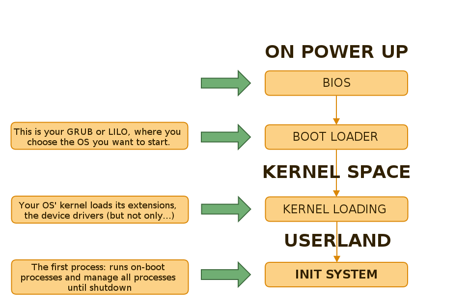

+++

title = "Systemd"
description = "Practical introduction to systemd"
outputs = ["Reveal"]

[reveal_hugo.custom_theme_options]
targetPath = "css/custom-theme.css"
enableSourceMap = true

+++

# Systemd

Giovanni Ciatto

---

## References

- [`systemd` on ArchLinux Wiki](https://wiki.archlinux.org/title/Systemd)
- [DigitalOcean's tutorial on `systemd`](https://www.digitalocean.com/community/tutorials/systemd-essentials-working-with-services-units-and-the-journal)
- [Lucas Nussbaum's tutorial on `systemd`](https://www.slideshare.net/slideshow/systemd-46731240/46731240)
- ["Linux explained part 2 : Bootloader, Init and Shell"](https://zedas.fr/posts/linux-explained-2-init-and-shell/)
- ["The current state of init systems"](https://phndiaye.github.io/the-current-state-of-init-systems.html)

---

## What is `systemd`? (pt. 1)

> `systemd` $\approx$ today's most common __init system__ for Linux systems

- what's an init system?

---

## What happens when you boot a Linux system?

### Overview

---

## What happens when you boot a Linux system?

### The role of the _init system_

---

## What happens when you boot a Linux system?

### Architectural View

{}
{}

{}
{}
- The init system is the _first process_ started by the _kernel_
- It's responsible for starting _all_ other _processes_
    + including _daemons_ and _services_
    + including 
{}
{}