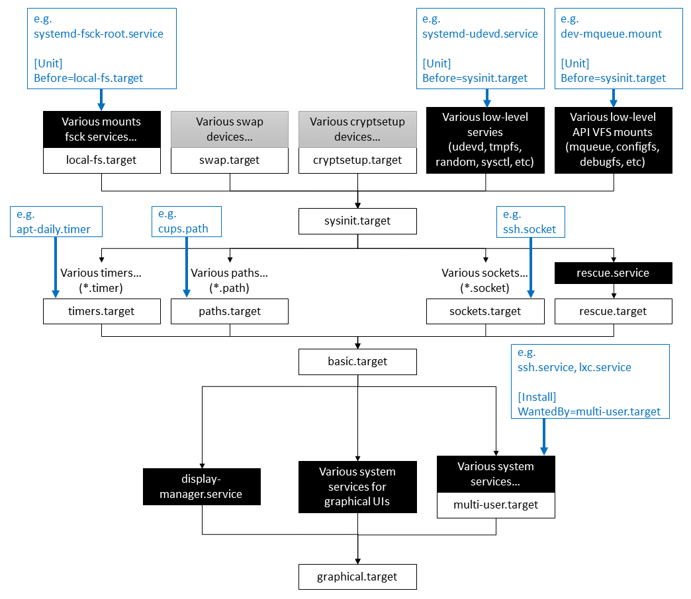

+++

title = "System administration with systemd"
description = "Practical introduction to systemd"
outputs = ["Reveal"]

[reveal_hugo.custom_theme_options]
targetPath = "css/custom-theme.css"
enableSourceMap = true

+++

# System administration with systemd

Giovanni Ciatto

---

## References

- [`systemd` on ArchLinux Wiki](https://wiki.archlinux.org/title/Systemd)
- [DigitalOcean's tutorial on `systemd`](https://www.digitalocean.com/community/tutorials/systemd-essentials-working-with-services-units-and-the-journal)
- [Lucas Nussbaum's tutorial on `systemd`](https://www.slideshare.net/slideshow/systemd-46731240/46731240)
- ["Linux explained part 2 : Bootloader, Init and Shell"](https://zedas.fr/posts/linux-explained-2-init-and-shell/)
- ["The current state of init systems"](https://phndiaye.github.io/the-current-state-of-init-systems.html)
- ["systemd by example"](https://seb.jambor.dev/posts/systemd-by-example-part-1-minimization/)
- Also the English [Wikipedia page on systemd](https://en.wikipedia.org/wiki/Systemd) is quite informative

---

## What is `systemd`? (pt. 1)

> `systemd` $\approx$ today's most common __init system__ for Linux systems

- but what's an _init system_ in the first place?

---

## What happens when you boot a Linux system?

### Overview


---

## What happens when you boot a Linux system?

### The role of the _init system_

{}
{}

{}
{}
The init system is the _first process_ started by the _kernel_
<br>
(this is why it has __PID=1__)

###
### Responsibilities

- _Starting_ all other _processes_ (namely, the __services__):
    + including the _display server_ (e.g. X, Wayland)
    + including the _window manager_ (e.g. Gnome, KDE)
    + including _daemons_ and _services_ (e.g. `sshd`, `httpd`)

- _Mounting_ the __file systems__
    + e.g. the _home_ partition, the _swap_ partition, etc.

- _Setting up_ the __network__
    + e.g. starting the _network manager_, hence connecting to the _default networks_, etc.

- Suspending/hibernating (and resuming), rebooting, and shutting down the system
{}
{}

---

## What happens when you boot a Linux system?

### Once the system is up and running...

{}
{}

{}
{}
The init system has:
1. started all the system services
1. mounted all the file systems
1. set up the network
1. started the display server
1. started the window manager
1. started the user session
{}
{}

---

## OS Services and Daemons

In the context of _operative systems_ (OS):

- a __service__ is a _process_ that runs _continuously_ in the background
    + it is _started_ and _stopped_ by the OS (actually, by the _init system_), often with _administrative privileges_
    + it offers some _functionality_ to the _user_ or to other _services_

- in the *nix world, __"daemon"__ is a _synonym_ for "service"
    + the term [comes from Greek mythology](https://en.wikipedia.org/wiki/Daemon_(computing)):
    a _daimon_ is a _spirit_ that acts as an _intermediary_ between _humans_ and the _gods_

{}
### Examples of services/daemons in a Linux system

- `sshd` (the _SSH daemon_) is a service that allows clients to _remotely connect_ to the system, via the [SSH protocol](https://en.wikipedia.org/wiki/Secure_Shell)
- `ssh-agent` is a service that _manages_ SSH keys for the user
- `httpd` (the _HTTP daemon_) is a service that _serves_ web pages to clients, via the [HTTP protocol](https://en.wikipedia.org/wiki/Hypertext_Transfer_Protocol)
- `cupsd` (the _CUPS daemon_) is a service that _manages_ printers, via the [CUPS protocol](https://en.wikipedia.org/wiki/CUPS)
- `dockerd` (the _Docker daemon_) is a service that _manages_ containers on a given host
{}

---

## Init systems

- [SysVinit](https://en.wikipedia.org/wiki/Init) (1980s—early 2000s) first family of init systems for Unix-like systems

- [Upstart](https://en.wikipedia.org/wiki/Upstart_(software)) (2006—2014) developed by Canonical for Ubuntu

- [runit](https://en.wikipedia.org/wiki/Runit) (2004—present) used by niche Linux distributions

- [OpenRC](https://en.wikipedia.org/wiki/OpenRC) (2007—present) used by Gentoo and Alpine Linux

- [launchd](https://en.wikipedia.org/wiki/Launchd) (2005—present) used by macOS, developed by Apple

- [systemd](https://en.wikipedia.org/wiki/Systemd) (2010—present) inspired by `launchd`, used by most Linux distributions nowadays

- Comparison here: <https://wiki.gentoo.org/wiki/Comparison_of_init_systems>

---

## What is systemd? (pt. 2)

> __systemd__ is a _suite_ of system management __daemons__, __libraries__, and __utilities__ designed as a _central management and configuration platform_ for the Linux OS



---

## systemd's utilities suite

The systemd __suite__ includes the following _command-line_ utilities (corresponding to relevant _daemon_ services):

* `systemctl` controls the `systemd` daemon, from which system- and user-level _services_ can be managed

* `journalctl` queries messages from the `journald` daemon, which collects and stores _log messages_ from the kernel and services

* `hostnamectl` controls the `hostnamed` daemon, from which the _name of the host_ on the network can be read/set

* `loginctl` controls the `logind` daemon, which manages _user sessions_ and _seats_

* `timedatectl` controls the `timedated` daemon, which manages the _system clock_ and _time zone_

* `localectl` controls the `localed` daemon, which manages the _system locale_ and _keyboard layout_

* `busctl` controls the `bus-proxyd` daemon, which provides a _D-Bus_ interface to the system bus

* `networkctl` controls the `networkd` daemon, which manages _network configurations_

* `resolvectl` controls the `resolved` daemon, which manages _DNS_ configurations

---

## Remarks

> This lecture is about the usage of systemd as the __service manager__ for Linux
> <br>(i.e., put simply, how to use `systemctl` and `journalctl`)

- ... but the systemd suite is much more than that!

- Overall, systemd is a set of tool for _system administration_
    + you can control most aspects of a Linux system using systemd's utilities

{}
### Beware!

- systemd is a __controversial__ piece of software inside the _FOSS_ community
    + it has been criticized because it [arguably violates](https://www.zdnet.com/article/linus-torvalds-and-others-on-linuxs-systemd/) the [Unix philosophy](https://en.wikipedia.org/wiki/Unix_philosophy)
    + it has been criticized as a _mission creep_ (i.e., it does too much) and as a _feature creep_ (i.e., it has too many features)
    + yet, it is the _de facto_ standard for most (and most relevant) [Linux distributions](https://en.wikipedia.org/wiki/Systemd#Adoption)

- Yet, __do not expect__ all distros to implement/support all the features of the systemd suite
{}

---

{}

# A taste of the systemd suite

before delving into the details of `systemctl` and `journalctl`

---

## A taste of the systemd suite (pt. 1)

### Hostname Management

<br>

{}
{}
1. Get an overview with `hostnamectl --help`
    ```bash
    hostnamectl [OPTIONS...] COMMAND ...

    Query or change system hostname.

    Commands:
      status                 Show current hostname settings
      hostname [NAME]        Get/set system hostname
      icon-name [NAME]       Get/set icon name for host
      chassis [NAME]         Get/set chassis type for host
      deployment [NAME]      Get/set deployment environment for host
      location [NAME]        Get/set location for host
    ```
{}
{}
2. See information about the _current hostname_ with `hostnamectl status`
    ```bash
     Static hostname: lubuntu2410-vm
           Icon name: computer-vm
             Chassis: vm 🖴
          Machine ID: 7fc69dab56a64d73b4f2ae5077df58a0
             Boot ID: 7b52bffe735b47a18135db49790a4cc9
      Virtualization: oracle
    Operating System: Ubuntu 24.10
              Kernel: Linux 6.11.0-9-generic
        Architecture: x86-64
     Hardware Vendor: innotek GmbH
      Hardware Model: VirtualBox
    Firmware Version: VirtualBox
       Firmware Date: Fri 2006-12-01
        Firmware Age: 17y 11month 1w 4d
    ```
{}
{}

3. Update the system _hostname_ with `hostnamectl hostname my-new-hostname`

---

## A taste of the systemd suite (pt. 2)

### User Login and Session Management

1. Get an overview with `loginctl --help` (sub-commands are organized in _Session_, _User_, and _Seat_ commands)
    ```bash
    loginctl [OPTIONS...] COMMAND ...

    Send control commands to or query the login manager.

    Session Commands:
    list-sessions            List sessions
    session-status [ID...]   Show session status
    show-session [ID...]     Show properties of sessions or the manager
    activate [ID]            Activate a session
    lock-session [ID...]     Screen lock one or more sessions
    unlock-session [ID...]   Screen unlock one or more sessions
    lock-sessions            Screen lock all current sessions
    unlock-sessions          Screen unlock all current sessions
    terminate-session ID...  Terminate one or more sessions
    kill-session ID...       Send signal to processes of a session

    User Commands:
    list-users               List users
    user-status [USER...]    Show user status
    show-user [USER...]      Show properties of users or the manager
    enable-linger [USER...]  Enable linger state of one or more users
    disable-linger [USER...] Disable linger state of one or more users
    terminate-user USER...   Terminate all sessions of one or more users
    kill-user USER...        Send signal to processes of a user

    Seat Commands:
    list-seats               List seats
    seat-status [NAME...]    Show seat status
    show-seat [NAME...]      Show properties of seats or the manager
    attach NAME DEVICE...    Attach one or more devices to a seat
    flush-devices            Flush all device associations
    terminate-seat NAME...   Terminate all sessions on one or more seats
    ```

---

## A taste of the systemd suite (pt. 2)

### User Login and Session Management

2. Get an overview of the current situation with `loginctl` (no args):
    ```bash
    SESSION  UID USER SEAT  LEADER CLASS   TTY   IDLE SINCE
        527 1000 user -     16410  manager -     no   -
        529 1000 user seat0 16591  user    tty2  no   -
        531 1000 user -     17051  user    pts/1 no   -
    ```

3. A bit of nomenclature:
    - __Session__: a _login session_ (e.g., a _TTY_ session, an _SSH_ session)
    - __User__: a _user account_ (e.g., `root`, `user`)
    - __Seat__: a _physical or virtual seat_ (e.g., a _display_, a _keyboard_, a _mouse_)
    - __Leader__: the _PID_ of the _session leader_ (i.e., the _process_ that started the session)

---

## A taste of the systemd suite (pt. 3)

### Time and Date Management

<br>

{}
{}
1. Get an overview with `timedatectl --help`
    ```bash
    timedatectl [OPTIONS...] COMMAND ...

    Query or change system time and date settings.

    Commands:
      status                 Show current time settings
      set-time TIME          Set system time
      set-timezone ZONE      Set system time zone
      list-timezones         Show known time zones
      set-local-rtc BOOL     Control whether RTC is in local time
      set-ntp BOOL           Control whether NTP is enabled

      timesync-status       Show status of systemd-timesyncd
      show-timesync         Show properties of systemd-timesyncd
      ntp-servers INTERFACE SERVER…
                            Set the interface specific NTP servers
      revert INTERFACE      Revert the interface specific NTP servers
    ```
{}
{}
2. See information about the _current time (zone)_ with `timedatectl status`
    ```bash
                   Local time: lun 2024-11-11 10:56:28 CET
               Universal time: lun 2024-11-11 09:56:28 UTC
                     RTC time: lun 2024-11-11 09:56:27
                    Time zone: Europe/Rome (CET, +0100)
    System clock synchronized: yes
                  NTP service: active
              RTC in local TZ: no
    ```

3. Show time-sync status with `timedatectl timesync-status`
    ```bash
           Server: 185.125.190.57 (ntp.ubuntu.com)
    Poll interval: 34min 8s (min: 32s; max 34min 8s)
             Leap: normal
          Version: 4
          Stratum: 2
        Reference: 11FD1CFB
        Precision: 1us (-25)
    Root distance: 846us (max: 5s)
           Offset: +4.710ms
            Delay: 36.168ms
           Jitter: 1.689122s
     Packet count: 130
        Frequency: -53,092ppm
    ```
{}
{}

---

## A taste of the systemd suite (pt. 4)

### Locale Management

> __Locale__ $\approx$ a set of _cultural conventions_ that determine how _dates_, _times_, _numbers_, and _currency_ are __formatted__.
> _Keyboard layouts_ are locale-specific too.

<br>

{}
{}
1. Get an overview with `localectl --help`
    ```bash
    localectl [OPTIONS...] COMMAND ...

    Query or change system locale and keyboard settings.

    Commands:
      status                   Show current locale settings
      set-locale LOCALE...     Set system locale
      list-locales             Show known locales
      set-keymap MAP [MAP]     Set console and X11 keyboard mappings
      list-keymaps             Show known virtual console keyboard mappings
      set-x11-keymap LAYOUT [MODEL [VARIANT [OPTIONS]]]
                               Set X11 and console keyboard mappings
      list-x11-keymap-models   Show known X11 keyboard mapping models
      list-x11-keymap-layouts  Show known X11 keyboard mapping layouts
      list-x11-keymap-variants [LAYOUT]
                               Show known X11 keyboard mapping variants
      list-x11-keymap-options  Show known X11 keyboard mapping options
    ```
{}
{}
2. See information about the _current locale_ with `localectl status`
    ```bash
    System Locale: LANG=it_IT.UTF-8
        VC Keymap: (unset)
       X11 Layout: it
        X11 Model: pc105
    ```
{}
{}


---

## A taste of the systemd suite (pt. 5)

### Network Management

<br>

{}
{}
1. Get an overview with `networkctl --help`
    ```bash
    networkctl [OPTIONS...] COMMAND

    Query and control the networking subsystem.

    Commands:
      list [PATTERN...]      List links
      status [PATTERN...]    Show link status
      lldp [PATTERN...]      Show LLDP neighbors
      label                  Show current address label entries in the kernel
      delete DEVICES...      Delete virtual netdevs
      up DEVICES...          Bring devices up
      down DEVICES...        Bring devices down
      renew DEVICES...       Renew dynamic configurations
      forcerenew DEVICES...  Trigger DHCP reconfiguration of all connected clients
      reconfigure DEVICES... Reconfigure interfaces
      reload                 Reload .network and .netdev files
      edit FILES|DEVICES...  Edit network configuration files
      cat [FILES|DEVICES...] Show network configuration files
      mask FILES...          Mask network configuration files
      unmask FILES...        Unmask network configuration files
      persistent-storage BOOL
                             Notify systemd-networkd if persistent storage is ready
    ```
{}
{}
2. Get the available _connections_ with `networkctl list`
    ```bash
    systemd-networkd is not running, output might be incomplete.
    IDX LINK   TYPE     OPERATIONAL SETUP
      1 lo     loopback -           unmanaged
      2 enp0s3 ether    -           unmanaged
    ```

    - `unmanaged` $\approx$ the network is not managed by `networkd`
    - the warning means that the `networkd` is not running
        * _Ubuntu-based systems use `NetworkManager` instead_
            + to be controlled via the `nmcli` command

3. Get the _status_ of a specific _connection_ with <br> `networkctl status LINK`

4. Use `networkctl up/down LINK` to affect the _connection_
    - which implies _connecting_ (up) or _disconnecting_ (down)
{}
{}

---

## A taste of the systemd suite (pt. 6)

### DNS Management

{}
{}
1. Get an overview with `resolvectl --help`
    ```bash
    resolvectl [OPTIONS...] COMMAND ...

    Send control commands to the network name resolution manager, or
    resolve domain names, IPv4 and IPv6 addresses, DNS records, and services.

    Commands:
      query HOSTNAME|ADDRESS...    Resolve domain names, IPv4 and IPv6 addresses
      service [[NAME] TYPE] DOMAIN Resolve service (SRV)
      openpgp EMAIL@DOMAIN...      Query OpenPGP public key
      tlsa DOMAIN[:PORT]...        Query TLS public key
      status [LINK...]             Show link and server status
      statistics                   Show resolver statistics
      reset-statistics             Reset resolver statistics
      flush-caches                 Flush all local DNS caches
      reset-server-features        Forget learnt DNS server feature levels
      monitor                      Monitor DNS queries
      show-cache                   Show cache contents
      show-server-state            Show servers state
      dns [LINK [SERVER...]]       Get/set per-interface DNS server address
      domain [LINK [DOMAIN...]]    Get/set per-interface search domain
      default-route [LINK [BOOL]]  Get/set per-interface default route flag
      llmnr [LINK [MODE]]          Get/set per-interface LLMNR mode
      mdns [LINK [MODE]]           Get/set per-interface MulticastDNS mode
      dnsovertls [LINK [MODE]]     Get/set per-interface DNS-over-TLS mode
      dnssec [LINK [MODE]]         Get/set per-interface DNSSEC mode
      nta [LINK [DOMAIN...]]       Get/set per-interface DNSSEC NTA
      revert LINK                  Revert per-interface configuration
      log-level [LEVEL]            Get/set logging threshold for systemd-resolved
    ```
{}
{}
2. Get the IP corresponding to some _domain_ with <br> `resolvectl query DOMAIN`
    ```bash
    $ resolvectl query www.google.it
    www.google.it: 142.251.209.35                  -- link: enp0s3
                   2a00:1450:4002:411::2003        -- link: enp0s3

    -- Information acquired via protocol DNS in 74.5ms.
    -- Data is authenticated: no; Data was acquired via local or encrypted transport: no
    -- Data from: network
    ```

3. Get which protocols are being used with `resolvectl status`
    ```bash
    Global
             Protocols: -LLMNR -mDNS -DNSOverTLS DNSSEC=no/unsupported
      resolv.conf mode: stub

    Link 2 (enp0s3)
        Current Scopes: DNS
             Protocols: +DefaultRoute -LLMNR -mDNS -DNSOverTLS DNSSEC=no/unsupported
    Current DNS Server: 10.0.2.3
           DNS Servers: 10.0.2.3
    ```

4. Show DNS caches with `sudo resolvectl show-cache`
    ```bash
    Scope protocol=dns ifindex=2 ifname=enp0s3
    www.google.it IN A 142.251.209.35
    www.google.it IN AAAA 2a00:1450:4002:411::2003
    ```
{}
{}

{}

---

# systemd for service management

How to use `systemctl` and `journalctl`?

---

## Overall functioning of `systemd`

1. The `systemd` daemon is started by the kernel as the first process

2. Upon startup, `systemd` reads the _unit files_ from the _filesystem_
    - _unit files_ are _declaritive_ text files that describe a __unit__
    - a __unit__ is a _resource_ that `systemd` knows how to manage (e.g., a _service_, a _timer_, etc.)

3. `systemd` computes in which _order_ the units should be _started_
    - this is done by _analyzing the dependencies_ between the units
        + which are _declared_ in the unit files

4. `systemd` then _starts_ the units in the _correct order_
    - and _monitors_ them to ensure they _stay running_

5. Upon a user request to _shut down_ / _suspend_ / _hibernate_ the system, `systemd` __stops__ the units in the _correct order_
    - and __restarts__ them upon _resuming_ the system (if needed)

---

{}

## Main sorts of units (see [official doc](https://www.freedesktop.org/software/systemd/man/latest/systemd.unit.html#Description))

> - Units are classified _by the **suffix**_ (a.k.a. _extension_) of their _unit file_
> - You can _list_ loaded units via `systemctl list-units [--type=TYPE]`
> - You can _inspect_ / _locate_ some loaded _unit **file**_ via `systemctl cat NAME.TYPE`
>     + use `systemctl show NAME.TYPE` to inspect _all_ the properties of a __unit__

- [`service` units](https://www.freedesktop.org/software/systemd/man/latest/systemd.service.html#): a _process_ that needs to be _started_ and _managed_ by `systemd`
    + e.g., `ssh.service`, `ufw.service`, `cups.service`

- [`timer` units](https://www.freedesktop.org/software/systemd/man/latest/systemd.timer.html#): a timer controlled and supervised by `systemd`, for _timer-based activation_
    + e.g., `apt-daily.timer`, `apt-daily-upgrade.timer`

- [`target` units](https://www.freedesktop.org/software/systemd/man/latest/systemd.target.html#): a _group_ of units, to set _synchronization_ points for ordering dependencies with other units
    + e.g., `multi-user.target`, `graphical.target`

---

## Other sorts of units (see [official doc](https://www.freedesktop.org/software/systemd/man/latest/systemd.unit.html#Description))

- [`socket` units](https://www.freedesktop.org/software/systemd/man/latest/systemd.socket.html#): an _IPC_ or network socket or a file system FIFO controlled and supervised by `systemd`, for _socket-based activation_
    + e.g., `ssh.socket`, `httpd.socket`

- [`mount` units](https://www.freedesktop.org/software/systemd/man/latest/systemd.mount.html#): a file system mount point controlled and supervised by `systemd`
    + e.g., `home.mount`, `var.mount` (system partitions are usually mounted by `systemd`)

- [`path` units](https://www.freedesktop.org/software/systemd/man/latest/systemd.path.html#): a path monitored by `systemd`, for _path-based activation_
    + e.g., `cups.path`

- [`slice` units](https://www.freedesktop.org/software/systemd/man/latest/systemd.slice.html#): a _group_ of related processes, for which _common resource limitations_ can apply
    + e.g., `user-1000.slice` (i.e. the _slice_ for the user with UID=1000), `-.slice` (i.e. the _root slice_)

- [`device` units](https://www.freedesktop.org/software/systemd/man/latest/systemd.device.html#): a unit describing the configuration of a _device_ in `/dev`
    + e.g., `dev-ttyS0.device` corresponds to the _serial port_ `/dev/ttyS0`

- [`swap` units](https://www.freedesktop.org/software/systemd/man/latest/systemd.swap.html#): a _swap partition_ controlled and supervised by `systemd`
    + e.g., `swapfile.swap`

{}

---

## About Targets

> __Targets__ $\approx$ checkpoints in the _boot process_ where units have been _started_ and are _running_

{}
{}
### Boot logs


{}
{}
### Target dependencies


{}
{}
### Startup time

(`systemd-analyze plot > plot.svg`)


{}
{}

---

## Unit files (pt. 1)

### Example: the _SSH daemon_ unit file

(Use `systemctl cat ssh.service` to inspect your _SSH daemon_'s unit file)

```systemd
# /usr/lib/systemd/system/ssh.service

[Unit]
Description=OpenBSD Secure Shell server
Documentation=man:sshd(8) man:sshd_config(5)
After=network.target nss-user-lookup.target auditd.service
ConditionPathExists=!/etc/ssh/sshd_not_to_be_run

[Service]
EnvironmentFile=-/etc/default/ssh           # cat /etc/default/ssh
ExecStartPre=/usr/sbin/sshd -t              # man sshd | grep -e '-t'
ExecStart=/usr/sbin/sshd -D $SSHD_OPTS      # man sshd | grep -e '-D'
ExecReload=/usr/sbin/sshd -t
ExecReload=/bin/kill -HUP $MAINPID          # sends a HUP ("Hang UP") signal to the main process
KillMode=process
Restart=on-failure
RestartPreventExitStatus=255
Type=notify
RuntimeDirectory=sshd
RuntimeDirectoryMode=0755

[Install]
WantedBy=multi-user.target
Alias=sshd.service
```

---

{}

## Unit files (pt. 2)

### Location of unit files

1. __System unit files__ for _the distribution_ are usually stored in `/lib/systemd/system/`
    + on most distributions, `/lib` is a _sym-link_ to `/usr/lib`, so the actual path is `/usr/lib/systemd/system/`
    + try `tree -C /lib/systemd/system/ | less` to see the _system unit files_

2. Administrators can _override_ these system unit files by placing __custom unit files__ in `/etc/systemd/system/`
    + _custom_ unit files take __precedence__ over _system_ unit files
    + try `tree -C /etc/systemd/system/ | less` to see the _custom unit files_

3. _User unit files_ are stored in `~/.config/systemd/user/`
    + try `tree -C ~/.config/systemd/user/ | less` to see the _user unit files_

---

## Unit files (pt. 2)

### Full look-up locations priority list (according to the [official doc](https://www.freedesktop.org/software/systemd/man/latest/systemd.unit.html))

(descending order of precedence)

{}
{}
#### System Unit Search Path

1. `/etc/systemd/system.control/*`
1. `/run/systemd/system.control/*`
1. `/run/systemd/transient/*`
1. `/run/systemd/generator.early/*`
1. `/etc/systemd/system/*`
1. `/etc/systemd/system.attached/*`
1. `/run/systemd/system/*`
1. `/run/systemd/system.attached/*`
1. `/run/systemd/generator/*`
1. `/usr/local/lib/systemd/system/*`
1. `/usr/lib/systemd/system/*`
1. `/run/systemd/generator.late/*`
{}
{}
#### User Unit Search Path

1. `~/.config/systemd/user.control/*`
1. `$XDG_RUNTIME_DIR/systemd/user.control/*`
1. `$XDG_RUNTIME_DIR/systemd/transient/*`
1. `$XDG_RUNTIME_DIR/systemd/generator.early/*`
1. `~/.config/systemd/user/*`
1. `$XDG_CONFIG_DIRS/systemd/user/*`
1. `/etc/systemd/user/*`
1. `$XDG_RUNTIME_DIR/systemd/user/*`
1. `/run/systemd/user/*`
1. `$XDG_RUNTIME_DIR/systemd/generator/*`
1. `$XDG_DATA_HOME/systemd/user/*`
1. `$XDG_DATA_DIRS/systemd/user/*`
1. `/usr/local/lib/systemd/user/*`
1. `/usr/lib/systemd/user/*`
1. `$XDG_RUNTIME_DIR/systemd/generator.late/*`
{}
{}

{}

---

{}

## Unit files (pt. 3)

### Syntax of unit files

Syntax is inspired to [Window's `.ini` files](https://en.wikipedia.org/wiki/INI_file):
> a bunch of `[Sections]` with `Key=Value` pairs, one per line, using `#` for comments

### Example

```systemd
[Section]
Key1=Value1
Key2=Value2
# this is a comment

[AnotherSection]
# this is another comment
Key3=Value3
Key3=Some keys can be repeated
Key4=Value4
```

---

## Unit files (pt. 3)

### Syntax of unit files

- In [section `[Unit]`](https://www.freedesktop.org/software/systemd/man/latest/systemd.unit.html#%5BUnit%5D%20Section%20Options)
one should write _generic information_ about the __unit__ that is NOT dependent on the type of unit:
    * `Description=` a short _human-readable_ __title__ of the unit, to be shown in the logs
    * `Documentation=` a space-separated list of _URLs_ to the __documentation__ of the unit
    * `Before=`, `After=` a space-separated list of _unit_ that __must be started__ _after/before_ this unit
    * `ConditionPathExists=` a _path_ that must (NOT, if prefixed by `!`) __exist__ for the unit to be started

- In [section `[Install]`](https://www.freedesktop.org/software/systemd/man/latest/systemd.unit.html#%5BInstall%5D%20Section%20Options)
one should write _information_ about how the unit is __installed__:
    * _installation_ of a unit (a.k.a. __enabling__ it) $\approx$ _manually_ configuring the unit for _automatic_ start-up
        * _**de**installation_ of a unit (a.k.a. __disabling__ it) $\approx$ _manually_ configuring the unit for _manual_ start-up
    * `Alias=` a space-separated list of _alternative names_ for the unit
    * `Also=` additional units to install/deinstall when this unit is installed/deinstalled
    * `WantedBy=, RequiredBy=, UpheldBy=` these properties are related to _dependency management_, explained later

---

## Unit files (pt. 3)

### Syntax of `.service` unit files (1/2)

- In [section `[Service]`](https://www.freedesktop.org/software/systemd/man/latest/systemd.service.html#Options)
one should write information about the __service__ and the process it supervises
    * `ExecStartPre=`, `ExecStartPost=` command to be __executed__ _before/after_ the _main command_ (for testing purposes)
    * `ExecStart=` the _main command_ to be executed to __start__ the service
        + the __PID__ of the service's process is stored in `$MAINPID`
    * `ExecReload=` command(s) to be executed upon __reloading__ of the service, before re-executing the _main command_
    * `Restart=` configures whether the service shall be __restarted__ when the service process _exits_, is _killed_, or a _timeout_ is reached
        + one of `no` (default), `on-success`, `on-failure`, `on-abnormal`, `on-watchdog`, `on-abort`, or `always` (cf. [official doc](https://www.freedesktop.org/software/systemd/man/latest/systemd.service.html#Restart=))
    * `RestartPreventExitStatus=` a space-separated list of _exit status codes_ that will _not_ trigger a restart
    * `Type=` configures the mechanism via which the service is considered __activated__ ($\approx$ _started_ and _ready_ to be used)
        + [many options available](https://www.freedesktop.org/software/systemd/man/latest/systemd.service.html#Type=), e.g.:
            + `exec` (after main process is _started_)
            + `notify` (after it sends a _notification_ via `sd_notify()`)
            + `oneshot` (after the main process _exits_)

---

## Unit files (pt. 3)

### Syntax of `.service` unit files (2/2)

- Many options related to [process execution](https://www.freedesktop.org/software/systemd/man/latest/systemd.exec.html) or [process killing apply](https://www.freedesktop.org/software/systemd/man/latest/systemd.kill.html#) here
    * [`EnvironmentFile=`](https://www.freedesktop.org/software/systemd/man/latest/systemd.exec.html#EnvironmentFile=) the __path__ to _file_ that contains _environment variables_ for the service
    * `KillMode=` specifies how processes of this unit shall be __killed__:
        + `process` $\rightarrow$ only the service process is killed
        + `mixed` $\rightarrow$ signal `SIGKILL` is sent to _all processes_ in the control group of this unit, _including the main one_
        + `control-group` $\rightarrow$ like `mixed`, _except the main one_, requires setting `ExecStop`

- Beware of [special executable prefixes](https://www.freedesktop.org/software/systemd/man/latest/systemd.service.html#Command%20lines): such as `-` (ignore errors), `+` (run in full privilege), `:` (do not expand variables), etc.

{}

---

## Operating with units (pt. 1)

- Getting the __runtime status__ of a unit: `systemctl status NAME.TYPE`
    ```bash
    $ systemctl status ssh
    ● ssh.service - OpenBSD Secure Shell server
        Loaded: loaded (/usr/lib/systemd/system/ssh.service; disabled; preset: enabled)
        Active: active (running) since Mon 2024-11-11 11:09:51 CET; 1 day 1h ago
    Invocation: 95b989f6f1a94ccabefa0e9925ea4ede
    TriggeredBy: ● ssh.socket
        Docs: man:sshd(8)
                man:sshd_config(5)
    Main PID: 1861 (sshd)
        Tasks: 1 (limit: 4598)
        Memory: 6.2M (peak: 22.9M)
            CPU: 908ms
        CGroup: /system.slice/ssh.service
                └─1861 "sshd: /usr/sbin/sshd -D [listener] 0 of 10-100 startups"

    nov 12 09:39:50 lubuntu2410-vm sshd[6813]: pam_systemd(sshd:session): New sd-bus connection (system-bus-pam-systemd-6813) opened.
    nov 12 11:07:07 lubuntu2410-vm sshd[7083]: Accepted password for user from 10.0.2.2 port 47930 ssh2
    nov 12 11:07:07 lubuntu2410-vm sshd[7083]: pam_unix(sshd:session): session opened for user user(uid=1000) by user(uid=0)
    nov 12 11:07:07 lubuntu2410-vm sshd[7083]: pam_systemd(sshd:session): New sd-bus connection (system-bus-pam-systemd-7083) opened.
    ```

---

## Operating with units (pt. 2)

- __Starting__ / __stopping__ / __restarting__ a unit: `sudo systemctl start|stop|restart NAME.TYPE`
    + use `systemctl --user start|stop|restart NAME.TYPE` for _user units_ (no need for `sudo`)

    ```bash
    $ sudo systemctl stop ssh.service
    Stopping 'ssh.service', but its triggering units are still active:
    ssh.socket

    $ sudo systemctl start ssh.service

    $ sudo systemctl restart ssh.service

    # Attempts to do admin operations without sudo, will prompt for password:
    $ systemctl stop ssh.service
    ==== AUTHENTICATING FOR org.freedesktop.systemd1.manage-units ====
    Autenticazione richiesta per fermare 'ssh.service'.
    Authenticating as: user
    Password:
    ```

{}
> __Note__: try stopping the `ssh.service` and see if you can _still connect_ to the machine via SSH. _Why?_
{}

---

## Operating with units (pt. 3)

- Inspecting the __dependencies__ of a unit: `systemctl list-dependencies NAME.TYPE`
    ```bash
    $ systemctl list-dependencies ssh.service
    ssh.service
    ● ├─-.mount
    ● ├─ssh.socket ############ <--- notice this _socket unit_
    ● ├─system.slice
    ● └─sysinit.target
    ●   ├─apparmor.service
    ○   ├─...
    ●   ├─systemd-update-utmp.service
    ●   ├─local-fs.target
    ●   │ ├─-.mount
    ●   │ ├─run-lock.mount
    ○   │ ├─systemd-fsck-root.service
    ●   │ ├─systemd-remount-fs.service
    ●   │ └─tmp.mount
    ●   └─swap.target
    ●     └─swapfile.swap

    ```

---

## Socket activation

- Some daemons work by __listening__ for _incoming connections_
    + e.g., `sshd` listens on _TCP port_ `22` for incoming _SSH_ connections
    + e.g., `httpd` listens on _TCP port_ `80` for incoming _HTTP_ connections
    + e.g. `dockerd` listens on _Unix socket_ `/var/run/docker.sock` for incoming _Docker_ commands

- ["Socket"](https://en.wikipedia.org/wiki/Network_socket) is a _software endpoint_ of a process willing to communicate _over the network_ (or locally)
    + e.g. `INET` sockets (e.g., `TCP`, `UDP`) for _network_ communication, `UNIX` sockets for _local_ IPC

- Most commonly, the process willing to __listen__ on a _socket_, would create the socket _upon startup_...
    + here, time/computation is _wasted_ to start up a process that may _just listen_ for a while

- ... but `systemd` can __listen__ on the _socket_ __instead of__ the _process_, and __trigger__ the _process_ upon _incoming connections_
    + this is called __socket activation__

- To support _socket activation_, the `.service` unit file should have a __corresponding__ `.socket` unit file

---

## Unit files (pt. 4)

### Example: the SSH daemon _socket_ unit file

(Use `systemctl cat ssh.socket` to inspect your SSH daemon's _socket_ unit file)

```systemd
# /usr/lib/systemd/system/ssh.socket

[Unit]
Description=OpenBSD Secure Shell server socket
Before=sockets.target ssh.service                   # notice the dependency on the ssh.service
ConditionPathExists=!/etc/ssh/sshd_not_to_be_run

[Socket]
ListenStream=0.0.0.0:22                             # listen on all IPv4 interfaces on port 22
ListenStream=[::]:22                                # listen on all IPv6 interfaces on port 22
Accept=no
FreeBind=yes

[Install]
WantedBy=sockets.target
RequiredBy=ssh.service
```

---

## Unit files (pt. 4)

### Syntax of `.socket` unit files

- In [section `[Socket]`](https://www.freedesktop.org/software/systemd/man/latest/systemd.socket.html#Options)
one should write information about the __socket__ or FIFO the unit supervises
    * `ListenStream=, ListenDatagram=, ListenSequentialPacket=` __address__ to listen on for a _stream_, _datagram_, or _sequential packet_ socket, respectively
    * `Accept=` takes a _boolean_ argument:
        - `yes`: a service instance is spawned _for each_ incoming connection and _only_ the connection socket is passed to it
        - `no`: _all_ listening sockets themselves are passed to the started service unit, and _only one service_ is spawned for all connections
    * `FreeBind=` controls whether the socket can be bound to _non-local IP_ addresses

---

## Running Exercise: SSH daemon (pt. 1)

1. Try to `stop` the `ssh.service` and to _connect_ to the machine via SSH
    + you can _still connect_ to the machine via SSH, because `ssh.socket` is _still active_
        * it will _start_ the `ssh.service` _upon_ an _incoming connection_
    + notice that the `ssh.service` is _active_, __after__ the SSH connection is established

2. Try to `stop` the `ssh.service` AND `ssh.socket`, then try to _connect_ to the machine via SSH
    + now you should be _unable_ to connect to the machine via SSH
        * because the `ssh.socket` is _not active_ to _start_ the `ssh.service`

3. Try to __reboot__ the system. Upon _startup_, are the `ssh.service` and `ssh.socket` units _active_?
    + they should, because the units are _enabled_ (i.e., they are _configured_ for _automatic_ start-up)
    + you should now be _able_ to connect to the machine via SSH

---

## Operating with units (pt. 4)

- __Enabling__ / __disabling__ a unit: `sudo systemctl enable|disable NAME.TYPE`
    + use `systemctl --user enable|disable NAME.TYPE` for _user units_ (no need for `sudo`)

- The _effect_ is that the `[Install]` section of the unit file is _interpreted_
    + ... and the __dependencies__ therein specified are _installed_ / _uninstalled_ accordingly

- The `[Install]` section of a unit _$A$_ would most commonly specify:
    + some `WantedBy` dependency w.r.t. some __target__ unit _$T$_ $\implies$ _$A$_ is __started__ automatically when _$T$_ is __started__
    + some `RequiredBy` dependency w.r.t. some other unit _$B$_ $\implies$ _$B$_ __requires__ _$A$_ to be able to __start__
        * this is commonly the case for _socket_ units, which are _required_ by the _service_ units they trigger

---

## Running Exercise: SSH daemon (pt. 2)

4. Try now to `disable` the `ssh.service` and `ssh.socket`, then try to _connect_ to the machine via SSH
    + you should _still_ be _able_ to connect to the machine via SSH
        * because the units are _not enabled_, but they are _still active_

5. Try to reboot the system. Upon _startup_, are the `ssh.service` and `ssh.socket` units _active_?
    + they should _not_, because the units are _not enabled_
    + you should now be _unable_ to connect to the machine via SSH

6. Try to `enable` the `ssh.service` and `ssh.socket`, then try to _connect_ to the machine via SSH
    + you should still be _unable_ to connect to the machine via SSH
        * because the units are _enabled_ but not _active_

7. Try to `start` the `ssh.service` and `ssh.socket`, then try to _connect_ to the machine via SSH
    + you should now be _able_ to connect to the machine via SSH
    + the same is true after a _reboot_

---

## About dependencies (pt. 1)

Units may define _dependencies_ on other units, which impact the _order_ in which they are _started_ and _stopped_:

1. __Wanting__: $A$ `Wants` $B$ (or $B$ `WantedBy` $A$) indicates a _weak_ dependency
    - if service $A$ *wants* service $B$, `systemd` will _attempt_ to start $B$ when starting $A$
    - if $B$ fails or isn't available, $A$ will still start
    - used when a unit _can benefit_ from another service but doesn't strictly require it
        + e.g., __targets__ _want_ services to be started, but don't _require_ them

2. __Requiring__: $A$ `Requires` $B$ (or $B$ `RequiredBy` $A$) indicates a _strong_ dependency
    - if service $A$ *requires* service $B$, $A$ will _not_ start unless $B$ starts successfully
    - if $B$ fails to start, `systemd` will stop $A$ as well
    - used when a unit is _essential_ for another to function
        + e.g., __services__ _require_ __sockets__ to be started before they can start
    - yet, $A$ `Requires` $B$ does __not__ imply $B$ `Before` $A$

3. __Before__/__After__: $A$ `Before` $B$ (or $B$ `After` $A$) indicates an _ordering_ dependency
    - if service $A$ *starts before* service $B$, `systemd` will _start_ $A$ before $B$
    - these are just _ordering_ dependencies:
        + so specifying $B$ `After` $A$ $\not\implies$ $A$ `Requires` $B$
        + so $B$ is started _even if_ $A$ fails to start
    - used to _control_ the _order_ in which units are started

---

## About dependencies (pt. 2)

4. __Conflict__: $A$ `Conflicts` $B$ indicates that $A$ and $B$ _cannot_ be _active_ at the _same time_
    - if $A$ has a conflict with $B$ and you start $A$ while $B$ is running, `systemd` will _stop_ $B$ before starting $A$
    - useful for _mutually exclusive_ services
    - $A$ `Conflicts` $B$ $\implies$ $B$ `Conflicts` $A$

5. __Binding__: $A$ `BindsTo` $B$ (or $B$ `BoundBy` $A$) indicates that $A$ is _tightly bound_ to $B$
    - if $B$ stops or fails, $A$ will also stop
    - used for _stronger_ dependencies than `Requires`

6. other sorts of dependencies are available, see the [official doc](https://www.freedesktop.org/software/systemd/man/latest/systemd.unit.html)

---

## Timer activation

- Some units' activation may be bound to __time__
    * e.g. __at__ a given _date/time_ in the future
    * e.g. on a __recurring__ basis (e.g., _hourly_, _daily_, _weekly_, _monthly_, _yearly_, etc.)
    * e.g. after a __relative amount__ of _time_ has _elapsed_ since:
        + the system was _booted_
        + `systemd` was _started_
        + some unit was _(de)activated_

- To support __timer activation__, a _$U$_ unit file should have a _corresponding_ `.timer` unit file
    + describing when _$U$_ should be _activated_
    + and _if/when_ the activation of _$U$_ should be _repeated_
    + most commonly, the timer unit is named _$U$_`.timer`

- The timer is said to __"elapse"__ (one or more times): the effect of an elapsing timer is to _activate_ its _associated unit_

---

## Unit Files (pt. 5)

### Syntax of `.timer` unit files (1/2)

<br>

- In [section `[Timer]`](https://www.freedesktop.org/software/systemd/man/latest/systemd.timer.html),
one should write information about the __timer__ unit
    * `Unit=` specifies the _unit_ that should be _activated_ when the timer _elapses_
    * `OnCalendar=` specifies the _date/time_ when the timer should _activate_
        + the argument is a [calendar event](https://www.freedesktop.org/software/systemd/man/latest/systemd.time.html#Calendar%20Events)
    * `OnActiveSec=`, `OnBootSec=`, `OnStartupSec=`, `OnUnitActiveSec=`, `OnUnitInactiveSec=` specifies the _relative time_ when the timer should _activate_,
    respectively w.r.t. the _timer's activation_, the system _boot_, `systemd` activation, the unit's _(de)activation_
        + the argument is a [time span](https://www.freedesktop.org/software/systemd/man/latest/systemd.time.html#Parsing%20Time%20Spans)
    * `Persistent=` controls whether the timer should be _persistent_ (i.e., _saved_ across reboots)
        1. if _true_, the time when the service unit was last triggered is _stored on disk_
        2. when the timer is activated, the service unit is triggered _immediately_ if it would have been triggered _at least once_ __while__ being __inactive__

---

## Unit Files (pt. 5)

### Syntax of `.timer` unit files (2/2)

<br>

- Examples of __calendar events_ (also good for _periodic_ activation):
    ```plaintext
        minutely → *-*-* *:*:00
          hourly → *-*-* *:00:00
           daily → *-*-* 00:00:00
         monthly → *-*-01 00:00:00
          weekly → Mon *-*-* 00:00:00
          yearly → *-01-01 00:00:00
       quarterly → *-01,04,07,10-01 00:00:00
    semiannually → *-01,07-01 00:00:00
    every 15mins → *-*-* *:00,15,30,45:00    or    *-*-* *:00/15:*
    ```

- Examples of __time spans__:
    ```plaintext
    2 h
    2hours
    48hr
    1y 12month
    55s500ms
    300ms20s 5day
    ```

---

{}

## Running Exercise: DuckDNS timer (pt. 1)

- [DuckDNS](https://www.duckdns.org) is a free online service aimed at registering _custom DNS entries_
    + e.g., `CUSTOM.duckdns.org` can be _mapped_ to your computer's _IP address_
    + this is useful for _remote access_ to your _home network_ (e.g., via _SSH_)


---

## Running Exercise: DuckDNS timer (pt. 2)

> __Problem__: most commonly, your _home network_ has a _dynamic IP address_

{}
> __Solution__: you can _periodically_ update your _DNS entry_ with your _current IP address_
{}

{}
### Updating the DuckDNS entry programmatically

1. Simply perform an HTTP `GET` request to https://www.duckdns.org/update?domains=CUSTOM&token=TOKEN&ip=IP (e.g. via `curl`)
    + where `CUSTOM` is your _custom domain_,
    + `TOKEN` is the authentication _token_,
    + and `IP` is your _current IP address_ (could be _empty_, to use the _source IP_)

2. response shall be `OK` if the update was successful, `KO` otherwise
{}

---

## Running Exercise: DuckDNS timer (pt. 3)

1. Let's create a file containing the _default configuration_ for the DuckDNS service,
<br> via `sudo mkdir -p /etc/duckdns.d ; sudo nano /etc/duckdns.d/default.cfg`:
    ```plaintext
    DUCKDNS_HOSTNAME=
    DUCKDNS_TOKEN=
    ```

2. Let's _create_ a script for updating the DuckDNS entry, via `sudo nano /usr/bin/duckdns`:
    ```bash
    #!/bin/sh

    logger -t DuckDNS "Updating DuckDNS entries"
    EXITCODE=0
    for file in /etc/duckdns.d/*.cfg; do
        . "${file}"
        logger -t DuckDNS "Executing config file '${file}'"
        OUTPUT=$(curl --silent "https://www.duckdns.org/update?domains=${DUCKDNS_HOSTNAME}&token=${DUCKDNS_TOKEN}&ip=")
        logger -t DuckDNS ${OUTPUT}
        if [ "${OUTPUT}" = "KO" ]; then
            logger -t DuckDNS "You should check if your domain/token is correct because the server responded negatively!"
            EXITCODE=1
        fi
    done

    exit $EXITCODE
    ```
    - this requires the `curl` package to be installed

3. Let's make the script _executable_ by anyone, via `sudo chmod a+x /usr/bin/duckdns`

4. Let's _test_ the script by running `duckdns` command (__no logs?__ try `cat /var/log/syslog | grep DuckDNS`)

---

## Running Exercise: DuckDNS timer (pt. 4)

5. Let's create a `.service` unit file for the DuckDNS _service_, via `sudo nano /etc/systemd/system/duckdns.service`:
    ```systemd
    [Unit]
    Description=DuckDNS update job

    [Install]
    WantedBy=multi-user.target

    [Service]
    Type=oneshot
    ExecStart=/usr/bin/duckdns
    ```

6. Let's create a `.timer` unit file for the DuckDNS _timer_, via `sudo nano /etc/systemd/system/duckdns.timer`:
    ```systemd
    [Unit]
    Description=Run DuckDNS periodically

    [Timer]
    OnCalendar=*-*-* *:00/15:*

    [Install]
    WantedBy=timers.target
    ```

7. Let's _enable_ and _start_ the DuckDNS _service_ and _timer_, via `sudo systemctl enable --now duckdns.service duckdns.timer`

8. __How do we check if the DuckDNS service is working?__

{}

---

## Systemd, Journal, and Logging (pt. 1)

- `systemd` is _integrated_ with the _system log_ (a.k.a. _journal_)
    + the _journal_ is a _structured_ and _indexed_ _log_ of _system events_
    + it is _stored_ in `/var/log/journal/` and _managed_ by `journald` (a daemon which is part of the `systemd` suite)
    + the _journal_ is __persistent__ across _reboots_

- __Logs__ produced by `systemd`'s _units_ are _forwarded_ to the _journal_
    + you can _inspect_ the _journal_ via `journalctl` command
        + the _journal_ is __page__: use _arrow keys_ to _navigate_, _Q_ to _quit_

---

## Systemd, Journal, and Logging (pt. 2)

- Useful options of `journalctl` for __inspecting__ the logs:
    + `journalctl` get _all_ logs, from the _oldest_ to the _newest_
    + `journalctl -u NAME.TYPE` to _filter_ logs for a _specific unit_
    + `journalctl -b` to _filter_ logs for the _current boot_
        * `journalctl -b -1` for the _previous boot_, `journalctl -b -2` for the _boot before that_, etc.
    + `journalctl -f` to _follow_ the _live_ logs
    + `journalctl -n N` to _show_ the _last N_ log entries
    + `journalctl -e` to jump to the _end_ of the logs
    + `journalctl --since "2024-11-11 11:09:51" --until "2024-11-11 11:10:51"` to _filter_ logs for a _specific time range_
    + `journalctl -g PATTERN` to _filter_ logs matching a _specific pattern_ (cf. the `grep` command)
    + `journalctl -x` to _show_ message _explanations_ (e.g., _systemd_ messages) where available
    + see other options with `man journalctl` or `journalctl --help`

- Notice that the options can be __combined__:
    + e.g., `journalctl -u ssh.service -b -n 10` $\rightarrow$ _show_ the _last 10_ logs for the _SSH daemon_ unit in the _current boot_
    + e.g., `journalctl -exu ssh.service` $\rightarrow$ _show_ the _last_ logs for the _SSH daemon_ unit, with _explanations_
---

## Systemd, Journal, and Logging (pt. 3)

- Being persistent, logs take up _disk space_
    + `journalctl --disk-usage` to _show_ the _disk usage_ of the _journal_

- Useful options of `journalctl` for __managing__ the logs:
    + `journalctl --vacuum-size=SIZE` to _limit_ the _disk space_ used by the _journal_
    + `journalctl --vacuum-time=TIME` to _limit_ the _time_ for which logs are _retained_ (by __erasing__ _older_ logs)
    + `journalctl --rotate` to _rotate_ the _journal_ (i.e., _archive_ the _current_ journal and _start_ a _new_ one)

---

{}

## Running Exercise: DuckDNS timer (pt. 5)

9. Let's _inspect_ the logs of the DuckDNS service, via `journalctl -fexu duckdns.service`
    + you should see the _logs_ of the _DuckDNS service_ being _executed_ every _15 minutes_


```journalctl
nov 13 18:35:45 lubuntu2410-vm systemd[1]: Starting duckdns.service - DuckDNS update job...
░░ Subject: L'unità duckdns.service inizia la fase di avvio
░░ Defined-By: systemd
░░ Support: http://www.ubuntu.com/support
░░
░░ L'unità duckdns.service ha iniziato la fase di avvio.
nov 13 18:35:45 lubuntu2410-vm DuckDNS[3548]: Updating DuckDNS entries
nov 13 18:35:45 lubuntu2410-vm DuckDNS[3549]: Executing config file '/etc/duckdns.d/default.cfg'
nov 13 18:35:46 lubuntu2410-vm DuckDNS[3552]: KO
nov 13 18:35:46 lubuntu2410-vm systemd[1]: duckdns.service: Main process exited, code=exited, statu>
░░ Subject: Uscito processo unità
░░ Defined-By: systemd
░░ Support: http://www.ubuntu.com/support
░░
░░ Un processo ExecStart appartenente all'unità duckdns.service è uscito.
░░
░░ Il codice di uscita del processo è 'exited' ed è uscito con 1.
nov 13 18:35:46 lubuntu2410-vm systemd[1]: duckdns.service: Failed with result 'exit-code'.
░░ Subject: Unit fallita
░░ Defined-By: systemd
░░ Support: http://www.ubuntu.com/support
░░
░░ Unità duckdns.service entrata nello stato 'failed' (fallito) con risultato 'exit-code'.
nov 13 18:35:46 lubuntu2410-vm systemd[1]: Failed to start duckdns.service - DuckDNS update job.
░░ Subject: L'unità duckdns.service è fallita
░░ Defined-By: systemd
░░ Support: http://www.ubuntu.com/support
░░
░░ L'unità duckdns.service è fallita.
░░
░░ Il risultato è failed.
```

---

## Running Exercise: DuckDNS timer (pt. 6)

10. The issue here is that we did not the necessary information `/etc/duckdns.d/default.cfg`

11. Try to fill that file with the correct information, via `sudo nano /etc/duckdns.d/default.cfg`:
    ```plaintext
    DUCKDNS_HOSTNAME=your-custom-domain
    DUCKDNS_TOKEN=your-authentication-token
    ```

12. Let's _restart_ the DuckDNS service, via `sudo systemctl restart duckdns.service`

13. Let's look at the logs again to see if the DuckDNS service is working

{}

