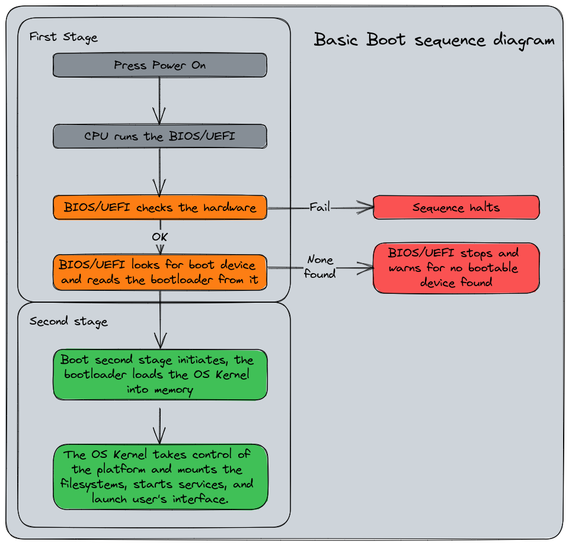

+++

title = "System administration with systemd"
description = "Practical introduction to systemd"
outputs = ["Reveal"]

[reveal_hugo.custom_theme_options]
targetPath = "css/custom-theme.css"
enableSourceMap = true

+++

# System administration with systemd

Giovanni Ciatto

---

## References

- [`systemd` on ArchLinux Wiki](https://wiki.archlinux.org/title/Systemd)
- [DigitalOcean's tutorial on `systemd`](https://www.digitalocean.com/community/tutorials/systemd-essentials-working-with-services-units-and-the-journal)
- [Lucas Nussbaum's tutorial on `systemd`](https://www.slideshare.net/slideshow/systemd-46731240/46731240)
- ["Linux explained part 2 : Bootloader, Init and Shell"](https://zedas.fr/posts/linux-explained-2-init-and-shell/)
- ["The current state of init systems"](https://phndiaye.github.io/the-current-state-of-init-systems.html)
- Also the English [Wikipedia page on systemd](https://en.wikipedia.org/wiki/Systemd) is quite informative

---

## What is `systemd`? (pt. 1)

> `systemd` $\approx$ today's most common __init system__ for Linux systems

- but what's an _init system_ in the first place?

---

## What happens when you boot a Linux system?

### Overview



---

## What happens when you boot a Linux system?

### The role of the _init system_

{}
{}

{}
{}
The init system is the _first process_ started by the _kernel_
<br>
(this is why it has __PID=1__)

###
### Responsibilities

- _Starting_ all other _processes_ (namely, the __services__):
    + including the _display server_ (e.g. X, Wayland)
    + including the _window manager_ (e.g. Gnome, KDE)
    + including _daemons_ and _services_ (e.g. `sshd`, `httpd`)

- _Mounting_ the __file systems__
    + e.g. the _home_ partition, the _swap_ partition, etc.

- _Setting up_ the __network__
    + e.g. starting the _network manager_, hence connecting to the _default networks_, etc.

- Suspending/hibernating (and resuming), rebooting, and shutting down the system
{}
{}

---

## What happens when you boot a Linux system?

### Once the system is up and running...

{}
{}

{}
{}
The init system has:
1. started all the system services
1. mounted all the file systems
1. set up the network
1. started the display server
1. started the window manager
1. started the user session
{}
{}

---

## Init systems

- [SysVinit](https://en.wikipedia.org/wiki/Init) (1980s—early 2000s) first family of init systems for Unix-like systems

- [Upstart](https://en.wikipedia.org/wiki/Upstart_(software)) (2006—2014) developed by Canonical for Ubuntu

- [runit](https://en.wikipedia.org/wiki/Runit) (2004—present) used by niche Linux distributions

- [OpenRC](https://en.wikipedia.org/wiki/OpenRC) (2007—present) used by Gentoo and Alpine Linux

- [launchd](https://en.wikipedia.org/wiki/Launchd) (2005—present) used by macOS, developed by Apple

- [systemd](https://en.wikipedia.org/wiki/Systemd) (2010—present) inspired by `launchd`, used by most Linux distributions nowadays

- Comparison here: <https://wiki.gentoo.org/wiki/Comparison_of_init_systems>

---

## What is systemd? (pt. 2)

> __systemd__ is a _suite_ of system management __daemons__, __libraries__, and __utilities__ designed as a _central management and configuration platform_ for the Linux OS



---

## systemd's utilities suite

The systemd __suite__ includes the following _command-line_ utilities (corresponding to relevant _daemon_ services):

* `systemctl` controls the `systemd` daemon, from which system- and user-level _services_ can be managed

* `journalctl` queries messages from the `journald` daemon, which collects and stores _log messages_ from the kernel and services

* `hostnamectl` controls the `hostnamed` daemon, from which the _name of the host_ on the network can be read/set

* `loginctl` controls the `logind` daemon, which manages _user sessions_ and _seats_

* `timedatectl` controls the `timedated` daemon, which manages the _system clock_ and _time zone_

* `localectl` controls the `localed` daemon, which manages the _system locale_ and _keyboard layout_

* `busctl` controls the `bus-proxyd` daemon, which provides a _D-Bus_ interface to the system bus

* `networkctl` controls the `networkd` daemon, which manages _network configurations_

* `resolvectl` controls the `resolved` daemon, which manages _DNS_ configurations

---

## Remarks

> This lecture is about the usage of systemd as the __service manager__ for Linux
> <br>(i.e., put simply, how to use `systemctl` and `journalctl`)

- ... but the systemd suite is much more than that!

- Overall, systemd is a set of tool for _system administration_ 
    + you can control most aspects of a Linux system using systemd's utilities

{}
### Beware!

- systemd is a __controversial__ piece of software inside the _FOSS_ community
    + it has been criticized because it [arguably violates](https://www.zdnet.com/article/linus-torvalds-and-others-on-linuxs-systemd/) the [Unix philosophy](https://en.wikipedia.org/wiki/Unix_philosophy)
    + it has been criticized as a _mission creep_ (i.e., it does too much) and as a _feature creep_ (i.e., it has too many features)
    + yet, it is the _de facto_ standard for most (and most relevant) [Linux distributions](https://en.wikipedia.org/wiki/Systemd#Adoption)

- Yet, __do not expect__ all distros to implement/support all the features of the systemd suite
{}

---

{}

# A taste of the systemd suite

before delving into the details of `systemctl` and `journalctl`

---

## A taste of the systemd suite (pt. 1)

### Hostname Management

<br>

{}
{}
1. Get an overview with `hostnamectl --help`
    ```bash
    hostnamectl [OPTIONS...] COMMAND ...

    Query or change system hostname.

    Commands:
      status                 Show current hostname settings
      hostname [NAME]        Get/set system hostname
      icon-name [NAME]       Get/set icon name for host
      chassis [NAME]         Get/set chassis type for host
      deployment [NAME]      Get/set deployment environment for host
      location [NAME]        Get/set location for host
    ```
{}
{}
2. See information about the _current hostname_ with `hostnamectl status`
    ```bash
     Static hostname: lubuntu2410-vm
           Icon name: computer-vm
             Chassis: vm 🖴
          Machine ID: 7fc69dab56a64d73b4f2ae5077df58a0
             Boot ID: 7b52bffe735b47a18135db49790a4cc9
      Virtualization: oracle
    Operating System: Ubuntu 24.10                    
              Kernel: Linux 6.11.0-9-generic
        Architecture: x86-64
     Hardware Vendor: innotek GmbH
      Hardware Model: VirtualBox
    Firmware Version: VirtualBox
       Firmware Date: Fri 2006-12-01
        Firmware Age: 17y 11month 1w 4d 
    ```
{}
{}

3. Update the system _hostname_ with `hostnamectl hostname my-new-hostname`

---

## A taste of the systemd suite (pt. 2)

### User Login and Session Management

1. Get an overview with `loginctl --help` (sub-commands are organized in _Session_, _User_, and _Seat_ commands)
    ```bash
    loginctl [OPTIONS...] COMMAND ...

    Send control commands to or query the login manager.

    Session Commands:
    list-sessions            List sessions
    session-status [ID...]   Show session status
    show-session [ID...]     Show properties of sessions or the manager
    activate [ID]            Activate a session
    lock-session [ID...]     Screen lock one or more sessions
    unlock-session [ID...]   Screen unlock one or more sessions
    lock-sessions            Screen lock all current sessions
    unlock-sessions          Screen unlock all current sessions
    terminate-session ID...  Terminate one or more sessions
    kill-session ID...       Send signal to processes of a session

    User Commands:
    list-users               List users
    user-status [USER...]    Show user status
    show-user [USER...]      Show properties of users or the manager
    enable-linger [USER...]  Enable linger state of one or more users
    disable-linger [USER...] Disable linger state of one or more users
    terminate-user USER...   Terminate all sessions of one or more users
    kill-user USER...        Send signal to processes of a user

    Seat Commands:
    list-seats               List seats
    seat-status [NAME...]    Show seat status
    show-seat [NAME...]      Show properties of seats or the manager
    attach NAME DEVICE...    Attach one or more devices to a seat
    flush-devices            Flush all device associations
    terminate-seat NAME...   Terminate all sessions on one or more seats
    ```

---

## A taste of the systemd suite (pt. 2)

### User Login and Session Management

2. Get an overview of the current situation with `loginctl` (no args):
    ```bash
    SESSION  UID USER SEAT  LEADER CLASS   TTY   IDLE SINCE
        527 1000 user -     16410  manager -     no   -    
        529 1000 user seat0 16591  user    tty2  no   -    
        531 1000 user -     17051  user    pts/1 no   -    
    ```

3. A bit of nomenclature:
    - __Session__: a _login session_ (e.g., a _TTY_ session, an _SSH_ session)
    - __User__: a _user account_ (e.g., `root`, `user`)
    - __Seat__: a _physical or virtual seat_ (e.g., a _display_, a _keyboard_, a _mouse_)
    - __Leader__: the _PID_ of the _session leader_ (i.e., the _process_ that started the session)

---

## A taste of the systemd suite (pt. 3)

### Time and Date Management

<br>

{}
{}
1. Get an overview with `timedatectl --help`
    ```bash
    timedatectl [OPTIONS...] COMMAND ...

    Query or change system time and date settings.

    Commands:
      status                 Show current time settings
      set-time TIME          Set system time
      set-timezone ZONE      Set system time zone
      list-timezones         Show known time zones
      set-local-rtc BOOL     Control whether RTC is in local time
      set-ntp BOOL           Control whether NTP is enabled

      timesync-status       Show status of systemd-timesyncd
      show-timesync         Show properties of systemd-timesyncd
      ntp-servers INTERFACE SERVER…
                            Set the interface specific NTP servers
      revert INTERFACE      Revert the interface specific NTP servers
    ```
{}
{}
2. See information about the _current time (zone)_ with `timedatectl status`
    ```bash
                   Local time: lun 2024-11-11 10:56:28 CET
               Universal time: lun 2024-11-11 09:56:28 UTC
                     RTC time: lun 2024-11-11 09:56:27
                    Time zone: Europe/Rome (CET, +0100)
    System clock synchronized: yes
                  NTP service: active
              RTC in local TZ: no
    ```

3. Show time-sync status with `timedatectl timesync-status`
    ```bash
           Server: 185.125.190.57 (ntp.ubuntu.com)
    Poll interval: 34min 8s (min: 32s; max 34min 8s)
             Leap: normal
          Version: 4
          Stratum: 2
        Reference: 11FD1CFB
        Precision: 1us (-25)
    Root distance: 846us (max: 5s)
           Offset: +4.710ms
            Delay: 36.168ms
           Jitter: 1.689122s
     Packet count: 130
        Frequency: -53,092ppm
    ```
{}
{}

---

## A taste of the systemd suite (pt. 4)

### Locale Management

> __Locale__ $\approx$ a set of _cultural conventions_ that determine how _dates_, _times_, _numbers_, and _currency_ are __formatted__.
> _Keyboard layouts_ are locale-specific too.

<br>

{}
{}
1. Get an overview with `localectl --help`
    ```bash
    localectl [OPTIONS...] COMMAND ...

    Query or change system locale and keyboard settings.

    Commands:
      status                   Show current locale settings
      set-locale LOCALE...     Set system locale
      list-locales             Show known locales
      set-keymap MAP [MAP]     Set console and X11 keyboard mappings
      list-keymaps             Show known virtual console keyboard mappings
      set-x11-keymap LAYOUT [MODEL [VARIANT [OPTIONS]]]
                               Set X11 and console keyboard mappings
      list-x11-keymap-models   Show known X11 keyboard mapping models
      list-x11-keymap-layouts  Show known X11 keyboard mapping layouts
      list-x11-keymap-variants [LAYOUT]
                               Show known X11 keyboard mapping variants
      list-x11-keymap-options  Show known X11 keyboard mapping options
    ```
{}
{}
2. See information about the _current locale_ with `localectl status`
    ```bash
    System Locale: LANG=it_IT.UTF-8
        VC Keymap: (unset)         
       X11 Layout: it
        X11 Model: pc105
    ```
{}
{}


---

## A taste of the systemd suite (pt. 5)

### Network Management

<br>

{}
{}
1. Get an overview with `networkctl --help`
    ```bash
    networkctl [OPTIONS...] COMMAND
    
    Query and control the networking subsystem.
    
    Commands:
      list [PATTERN...]      List links
      status [PATTERN...]    Show link status
      lldp [PATTERN...]      Show LLDP neighbors
      label                  Show current address label entries in the kernel
      delete DEVICES...      Delete virtual netdevs
      up DEVICES...          Bring devices up
      down DEVICES...        Bring devices down
      renew DEVICES...       Renew dynamic configurations
      forcerenew DEVICES...  Trigger DHCP reconfiguration of all connected clients
      reconfigure DEVICES... Reconfigure interfaces
      reload                 Reload .network and .netdev files
      edit FILES|DEVICES...  Edit network configuration files
      cat [FILES|DEVICES...] Show network configuration files
      mask FILES...          Mask network configuration files
      unmask FILES...        Unmask network configuration files
      persistent-storage BOOL
                             Notify systemd-networkd if persistent storage is ready
    ```
{}
{}
2. Get the available _connections_ with `networkctl list`
    ```bash
    systemd-networkd is not running, output might be incomplete.
    IDX LINK   TYPE     OPERATIONAL SETUP    
      1 lo     loopback -           unmanaged
      2 enp0s3 ether    -           unmanaged
    ```

    - `unmanaged` $\approx$ the network is not managed by `networkd`
    - the warning means that the `networkd` is not running
        * _Ubuntu-based systems use `NetworkManager` instead_
            + to be controlled via the `nmcli` command   

3. Get the _status_ of a specific _connection_ with <br> `networkctl status LINK`

4. Use `networkctl up/down LINK` to affect the _connection_
    - which implies _connecting_ (up) or _disconnecting_ (down)
{}
{}

---

## A taste of the systemd suite (pt. 6)

### DNS Management

{}
{}
1. Get an overview with `resolvectl --help`
    ```bash
    resolvectl [OPTIONS...] COMMAND ...

    Send control commands to the network name resolution manager, or
    resolve domain names, IPv4 and IPv6 addresses, DNS records, and services.

    Commands:
      query HOSTNAME|ADDRESS...    Resolve domain names, IPv4 and IPv6 addresses
      service [[NAME] TYPE] DOMAIN Resolve service (SRV)
      openpgp EMAIL@DOMAIN...      Query OpenPGP public key
      tlsa DOMAIN[:PORT]...        Query TLS public key
      status [LINK...]             Show link and server status
      statistics                   Show resolver statistics
      reset-statistics             Reset resolver statistics
      flush-caches                 Flush all local DNS caches
      reset-server-features        Forget learnt DNS server feature levels
      monitor                      Monitor DNS queries
      show-cache                   Show cache contents
      show-server-state            Show servers state
      dns [LINK [SERVER...]]       Get/set per-interface DNS server address
      domain [LINK [DOMAIN...]]    Get/set per-interface search domain
      default-route [LINK [BOOL]]  Get/set per-interface default route flag
      llmnr [LINK [MODE]]          Get/set per-interface LLMNR mode
      mdns [LINK [MODE]]           Get/set per-interface MulticastDNS mode
      dnsovertls [LINK [MODE]]     Get/set per-interface DNS-over-TLS mode
      dnssec [LINK [MODE]]         Get/set per-interface DNSSEC mode
      nta [LINK [DOMAIN...]]       Get/set per-interface DNSSEC NTA
      revert LINK                  Revert per-interface configuration
      log-level [LEVEL]            Get/set logging threshold for systemd-resolved
    ```
{}
{}
2. Get the IP corresponding to some _domain_ with <br> `resolvectl query DOMAIN`
    ```bash
    $ resolvectl query www.google.it
    www.google.it: 142.251.209.35                  -- link: enp0s3
                   2a00:1450:4002:411::2003        -- link: enp0s3

    -- Information acquired via protocol DNS in 74.5ms.
    -- Data is authenticated: no; Data was acquired via local or encrypted transport: no
    -- Data from: network
    ```

3. Get which protocols are being used with `resolvectl status`
    ```bash
    Global
             Protocols: -LLMNR -mDNS -DNSOverTLS DNSSEC=no/unsupported
      resolv.conf mode: stub

    Link 2 (enp0s3)
        Current Scopes: DNS
             Protocols: +DefaultRoute -LLMNR -mDNS -DNSOverTLS DNSSEC=no/unsupported
    Current DNS Server: 10.0.2.3
           DNS Servers: 10.0.2.3
    ```

4. Show DNS caches with `sudo resolvectl show-cache`
    ```bash
    Scope protocol=dns ifindex=2 ifname=enp0s3
    www.google.it IN A 142.251.209.35
    www.google.it IN AAAA 2a00:1450:4002:411::2003
    ```
{}
{}

{}

---

## Examples

- Timer: duckdns
- SSHD service
- DockerD service
